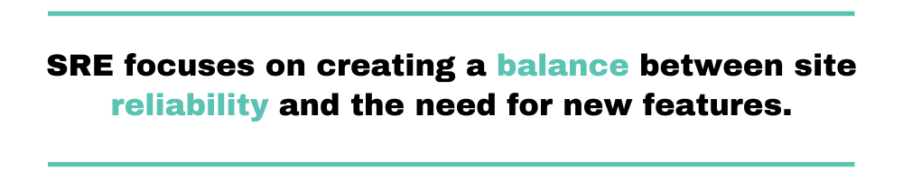
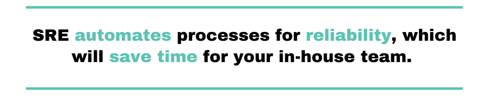
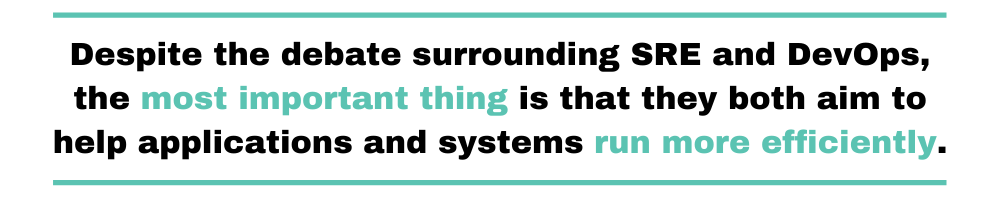
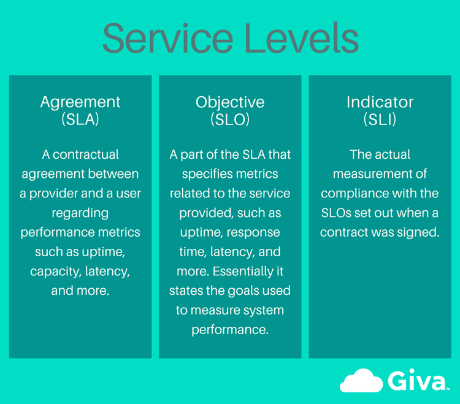
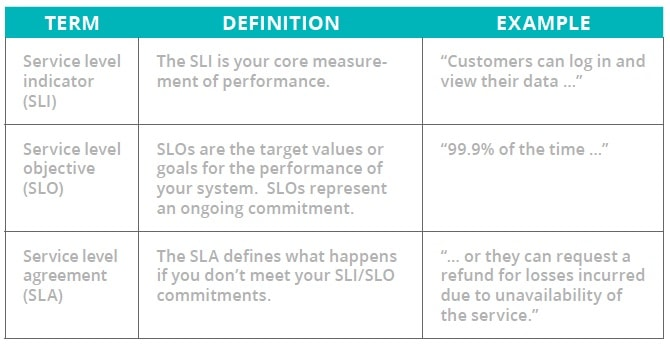
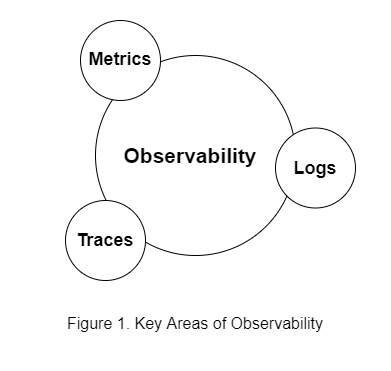

# ROLES OF SRE

:dart: Site reliability engineers collaborate with other engineers, product owners, and customers to come up with targets and measures. This helps ensure system availability. You easily know when action should be taken once you’ve agreed upon a system’s uptime and availability. This is done through service level indicators (SLIs) and service level objectives (SLOs).

:dart: SRE introduces error budgets that help you measure risk and consequently balance availability and feature development. Having an error budget means that failure is accepted as normal and that requiring 100 percent availability is not necessary. With no unrealistic reliability targets set, a team has the flexibility to deliver updates and improvements to a system.

:dart: SRE believes in reducing toil. Therefore, it aims at automating tasks that require a human operator to manually work on a system. For instance, Google expects that only 50 percent of each site reliability engineer’s time goes to coding. The other 50 percent is for the feeding and daily care of existing applications.

:dart: A site reliability engineer should have a holistic understanding of the systems as well as the connections between the systems.

:dart: Site reliability engineers have the task of ensuring the early discovery of problems to reduce the cost of failure.

:dart: Since the goal of SRE is to solve problems between teams, the expectation is that both the SRE teams and the development teams have a holistic view of libraries, front end, back end, storage, and other components. And shared ownership means that any one team can’t jealously own single components.

:dart: Performance is another area that an SRE can help improve. SRE teams can act proactively and help organizations uncover performance bottlenecks across the system. That way, they can be solved before they make into production and cause frustration for the end-users.

:dart: To improve availability and also to uncover and fix performance issues, SREs need to know what’s happening with their systems. That’s why monitoring is a key aspect of SRE. Thanks to monitoring, SRE teams can have a comprehensive and up to date view of how their systems are behaving and how healthy they are.

:dart: Incident response is a key component of SRE, which is also facilitated by an efficient monitoring strategy.

# What is SRE (site reliability engineering)?

### Overview
Site reliability engineering (SRE) is a software engineering approach to IT operations. SRE teams use software as a tool to manage systems, solve problems, and automate operations tasks.

SRE takes the tasks that have historically been done by operations teams, often manually, and instead gives them to engineers or ops teams who use software and automation to solve problems and manage production systems. 

SRE is a valuable practice when creating scalable and highly reliable software systems. It helps you manage large systems through code, which is more scalable and sustainable for sysadmins managing thousands or hundreds of thousands of machines. 

The concept of site reliability engineering comes from the Google engineering team and is credited to Ben Treynor Sloss. 

SRE helps teams find a balance between releasing new features and making sure that they are reliable for users.

Standardization and automation are 2 important components of the SRE model. Site reliability engineers should always be looking for ways to enhance and automate operations tasks.

In this way, SRE helps to improve the reliability of a system today, while also improving it as it grows over time.

### What does a site reliability engineer do?
A site reliability engineer is a unique role that requires either a background as a software developer with additional operations experience, or as a sysadmin or in an IT operations role that also has software development skills. 

SRE teams are responsible for how code is deployed, configured, and monitored, as well as the availability, latency, change management, emergency response, and capacity management of services in production.

With SRE, 100% reliability is not expected; failure is planned for and accepted. 

Site reliability engineers split their time between operations tasks and project work. According to SRE best practices from Google, a site reliability engineer can only spend a maximum of 50% of their time on operations, which should be monitored to ensure they don’t go over. 

The rest of the time should be spent on development tasks like creating new features, scaling the system, and implementing automation.

Excess operational work and poorly performing services can be redirected back to the dev team to run instead of the site reliability engineer spending too much time on the operations of an application or service. 

Automation is an important part of the site reliability engineer’s role. If they are dealing with a problem repeatedly then they will automate a solution. This also helps ensure that operations work remains at half of their workload. 

Maintaining the balance between operations and development work is a key component of SRE. 

SRE is different because it relies on site reliability engineers within the development team who also have an operations background to remove communication and workflow problems.

The site reliability engineer role itself combines the skillset of dev teams and operations teams by requiring an ov
erlap in responsibilities. 

# SLA: Service Level Agreements

### What is an SLA?
An SLA (service level agreement) is an agreement between provider and client about measurable metrics like uptime, responsiveness, and responsibilities. 

These agreements are typically drawn up by a company’s new business and legal teams and they represent the promises you’re making to customers—and the consequences if you fail to live up to those promises. Typically, consequences include financial penalties, service credits, or license extensions.

### The challenge of SLAs
SLAs are notoriously difficult to measure, report on, and meet. These agreements—generally written by people who aren’t in the tech trenches themselves—often make promises that are difficult for teams to measure, don’t always align with current and ever-evolving business priorities, and don’t account for nuance. 

# SLO: Service Level Objectives

### What is an SLO?
An SLO (service level objective) is an agreement within an SLA about a specific metric like uptime or response time. So, if the SLA is the formal agreement between you and your customer, SLOs are the individual promises you’re making to that customer. SLOs are what set customer expectations and tell IT and DevOps teams what goals they need to hit and measure themselves against.

# SLI: Service Level Indicator

### What is an SLI?
An SLI (service level indicator) measures compliance with an SLO (service level objective). So, for example, if your SLA specifies that your systems will be available 99.95% of the time, your SLO is likely 99.95% uptime and your SLI is the actual measurement of your uptime. Maybe it’s 99.96%. Maybe 99.99%. To stay in compliance with your SLA, the SLI will need to meet or exceed the promises made in that document.

### What is an error budget?

An error budget is the maximum amount of time that a technical system can fail without contractual consequences. 
### an error budget—time that your team can use to take risks.

If your SLA promises 99.95% uptime, your error budget is four hours, 22 minutes, and 48 seconds. And with an SLA promise of 99.9% uptime, your error budget is eight hours, 46 minutes, and 12 seconds.

##### “The development team can ‘spend’ this error budget in any way they like. If the product is currently running flawlessly, with few or no errors, they can launch whatever they want, whenever they want. Conversely, if they have met or exceeded the error budget and are operating at or below the defined SLA, all launches are frozen until they reduce the number of errors to a level that allows the launch to proceed.”

| SLA target  | Yearly allowed downtime | Monthly allowed downtime | 
| ------------- | ------------- | ------ | 
| 99.99% uptime | 52 minutes, 35 seconds  |4 minutes, 23 seconds | 
| 99.95% uptime  | 4 hours, 22 minutes, 48 seconds  |21 minutes, 54 seconds | 
| 99.9% uptime  | 8 hours, 45 minutes, 57 seconds |43 minutes, 50 seconds | 

# Error Budget
Error budget is generall the budget you can spend on pushing features. Let's say you have an uptime of 90% for your application or service. This means that you can have a downtime of 36.5 days per year, this is a downtime of 72 hours per month. You can either spend this downtime on fixing errors or you build your system reliable and spend it on pushing new features. It's fully up to you. You should just make sure that you freeze new features until your error budget has recovered. This has several advantages:

:white_check_mark: Your Software Engineers will try to build your application as much as stable. Because if your application is unstable they will need their error budget for fixing these errors instead of pushing new features.

:white_check_mark: If you have a stable application you are free to push new features as much as your error budget allows you to.

:white_check_mark: Your uptime will be consistent to your SLA. Nobody wants to get sued, trust me.

# Toil
“Toil is the kind of work that tends to be manual, repetitive, automatable, tactical, devoid of enduring value, and that scales linearly as a service grows.”
Few more examples of toil are manual releases, physically connecting to infrastructure to check something, doing regular password resets, testing over and over, acknowledging the same alerts every day, creating users, manual resets, on-call response, extracting data, manual scaling of infrastructure, etc.

Some examples of toil may include:

    Handling quota requests

    Applying database schema changes

    Reviewing non-critical monitoring alerts

    Copying and pasting commands from a playbook

A common thread in all of these examples is that they do not require an engineer’s human judgment. The work is easy but it’s not very rewarding, and it interrupts us from making progress on engineering work to scale services and launch features.

Here’s how to take your team through the process of identifying, measuring, and eliminating toil.

# Observability 

Observability is instrumenting your systems with tools to collect actionable data to know when the errors occur—but more importantly, why they happen. It’s an approach to understanding multilayer architectures to find what is broken and what requires improvement for better performance.

## There are three observability pillars. 

## Metrics 
The foundation of monitoring - metrics are aggregated data about the performance of a service. It usually consists of a single number that is tracked over time. Traditionally, system-level metrics such as CPU, memory, and disk performance were used for tracking. That includes data such as:

Counter: the number of queries by a particular time frame

Distribution: latency associated with service requests or queries 

Gauge: CPU load.

The challenge here is that while this gives enough information about the system, it doesn’t tell you about the user experience or how to improve your code’s performance. To tackle the issue, some modern monitoring services also offer APM (Application Performance Monitoring) - features to track application-level metrics. These metrics include requests per minute and error rates with each metric tracking only one variable, which can be relatively cheap to store and send. 

The DevOps, Ops, or SRE team usually determines the best set of metrics to watch for, which can vary depending on the service itself and its overall maturity. Often teams watch metrics dashboards when code changes occur or when a new fix or release is shipped.

## Logs
Logs represent the output from your code, sometimes referred to as events that are immutable, time-stamped records that can be used to identify certain patterns in a system. All processes in a system emit logs that usually include information such as records of individual user queries and debugging information generically associated with the service. 

Logs can be any arbitrary string. However, programming languages and frameworks use libraries to generate logs from the running code with relevant data at various levels of specificity (e.g. INFO vs. DEBUG mode). Among programming communities, there’s no standard about what should be included on various log levels. 

## Traces
In a distributed system, a trace displays the operation flow from the parent event to the child event where both events are timestamped. When individual events form a trace, they are referred to as spans. Each span stores the following information: start time, duration, and parent-id. Without the parent-id, spans are rendered as root spans.

Traces allow individual execution flows to be traced through the system that helps teams figure out which component or set of code is causing a potential system error. Teams can use dedicated tracing tools to look into the details of a certain request. By looking at trace spans and waterfall views that show multiple spans in your system, you can run queries to examine timing (latency), errors, and dependency details. 

Many observability tools provide tracing capabilities as part of their offerings.
