# Kubernetes - Kubernetes is Greek for pilot or helmsman (the person holding the ship’s steering wheel). 

# Difference between Docker and Kubernetes

Docker is a containerization platform, and Kubernetes is a container orchestrator for container platforms like Docker. 

| Kubernetes    | Docker        |
| ------------- |-------------|
| It requires a series of manual steps to setup Kubernetes Master and worker nodes components in a cluster of nodes      | Installing Docker is a matter of one-liner command on Linux Platform like Debian, Ubuntu, and CentOS. |
| Kubernetes can run on various platforms: from your laptop, to VMs on a cloud provider, to a rack of bare metal servers. For setting up a single node K8s cluster, one can use Minikube.      | To install a single-node Docker Swarm or Kubernetes cluster, one can deploy Docker for Mac & Docker for Windows.      |
| Kubernetes support for Windows server is under beta phase. | Docker has official support for Windows 10 and Windows Server 2016 and 1709.     |
| Kubernetes Client and Server packages need to be upgraded manually on all the systems. | It’s so easy to upgrade Docker Engine under Docker for Mac & Windows via just 1 click.|
| **Pod** is the smallest unit of deployment in Kubernates      | **Container** is the smallest unit of deployment in Docker  |

# Kubernetes architecture and its components

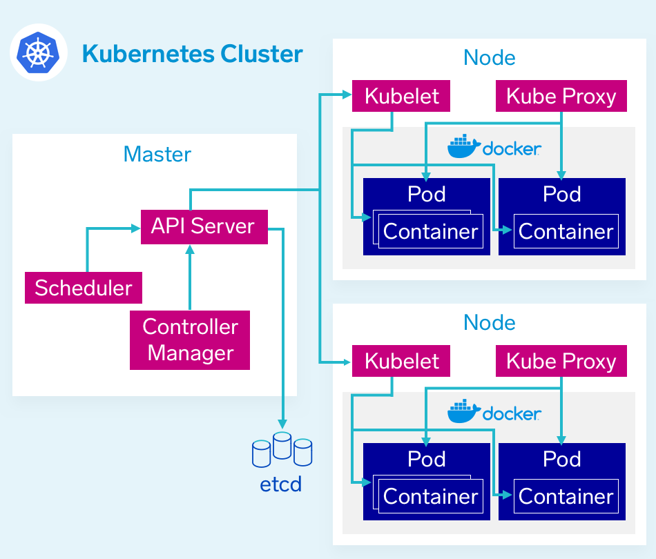

---------------------------------------------------------------------------------------------------------------------------------------------------------------

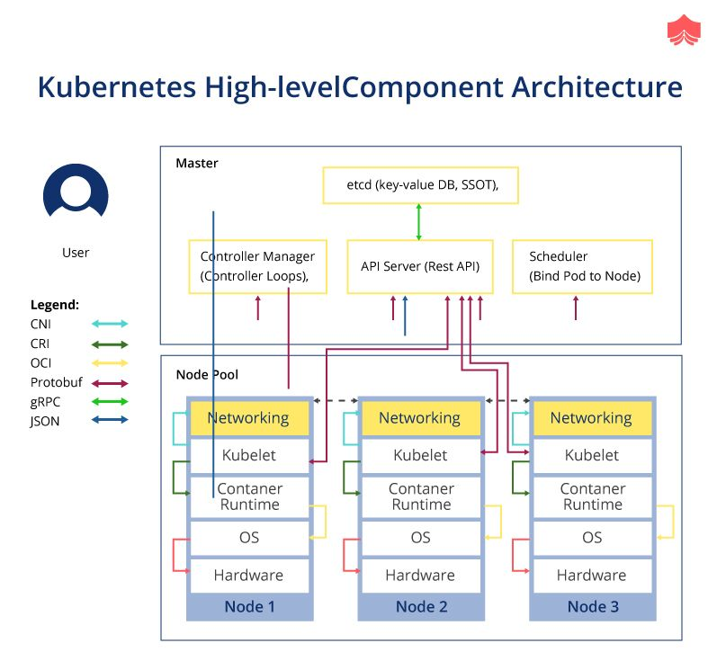

---------------------------------------------------------------------------------------------------------------------------------------------------------------

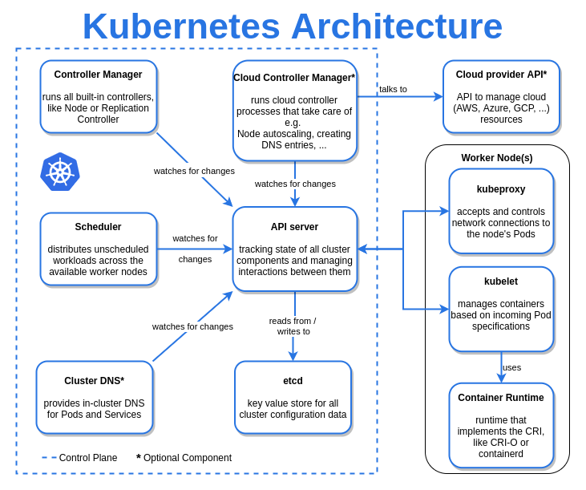

# Kubernetes Notes

## Master Node Components
1. API Server 2. Controller Manager 3. ETCD 4. Scheduler

## Kubernetes Scheduler

kube-scheduler – helps schedule the pods (a co-located group of containers inside which our application processes are running) on the various nodes based on resource utilization. It reads the service’s operational requirements and schedules it on the best fit node. For example, if the application needs 1GB of memory and 2 CPU cores, then the pods for that application will be scheduled on a node with at least those resources. The scheduler runs each time there is a need to schedule pods. The scheduler must know the total resources available as well as resources allocated to existing workloads on each node.

kube-apiserver – Kubernetes API server is the central management entity that receives all REST requests for modifications (to pods, services, replication sets/controllers and others), serving as frontend to the cluster. Also, this is the only component that communicates with the etcd cluster, making sure data is stored in etcd and is in agreement with the service details of the deployed pods.

## Kubernetes Controller Manager

kube-controller-manager – runs a number of distinct controller processes in the background (for example, replication controller controls number of replicas in a pod, endpoints controller populates endpoint objects like services and pods, and others) to regulate the shared state of the cluster and perform routine tasks. When a change in a service configuration occurs (for example, replacing the image from which the pods are running, or changing parameters in the configuration yaml file), the controller spots the change and starts working towards the new desired state.

There are various controllers in a Kubernetes ecosystem that drive the states of endpoints (pods and services), tokens and service accounts (namespaces), nodes, and replication (autoscaling). The controller manager—sometimes called cloud controller manager or simply controller—is a daemon which runs the Kubernetes cluster using several controller functions.

The controller watches the objects it manages in the cluster as it runs the Kubernetes core control loops. It observes them for their desired state and current state via the API server. If the current and desired states of the managed objects don’t match, the controller takes corrective steps to drive object status toward the desired state. The Kubernetes controller also performs core lifecycle functions.

## ETCD

etcd cluster – a simple, distributed key value storage which is used to store the Kubernetes cluster data (such as number of pods, their state, namespace, etc), API objects and service discovery details. It is only accessible from the API server for security reasons. etcd enables notifications to the cluster about configuration changes with the help of watchers

## Kubernetes Node Components
1.  Docker  2.  Container Runtime 3.  Kubelet 4.  Kubernetes Proxy Service

## Nodes

A Kubernetes cluster must have at least one compute node, although it may have many, depending on the need for capacity. Pods orchestrated and scheduled to run on nodes, so more nodes are needed to scale up cluster capacity.

Nodes do the work for a Kubernetes cluster. They connect applications and networking, compute, and storage resources.

Nodes may be cloud-native virtual machines (VMs) or bare metal servers in data centers.

Container Runtime Engine

Each compute node runs and manages container life cycles using a container runtime engine. Kubernetes supports Open Container Initiative-compliant runtimes such as Docker, CRI-O, and rkt.

## Kubelet service

Each compute node includes a kubelet, an agent that communicates with the master or control plane to ensure the containers in a pod are running. When the control plane requires a specific action happen in a node, the kubelet receives the pod specifications through the API server and executes the action. It then ensures the associated containers are healthy and running.

### Kubelet is an agent process that runs of each worker node

# Its job includes

> Register a node as a worker node

> Creats/Destroy/Runs the PODs on the worker nodes based on the POD specs received from API-Server

> Reports the status of PODs and Nodes to the API-Server regularly

### What is kubelet?
Kubelet is an agent or program which runs on each node. This is responsible for all the communications between the Kubernetes control plane [group of programs which control kubernetes] and the nodes where the actual workload runs. Below are the exact tasks of the kubelet.

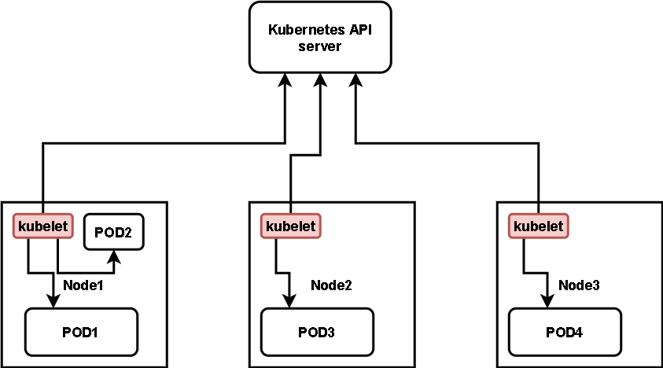

Joining the cluster.
With help of kubelet a node can join the cluster and tell the cluster that it is available to run the workload.

Running and health check of the containers
Kubelet talks to the control plane to get the pods list that needs to run on the node and runs the pod. It also does a health check on containers and tells the status back to API server.

Reporting status of Node
Kubelet is also responsible for reporting the status of the node back to the Kubernetes to make an informed decision.

Kubelet works on pod spec which is supplied to it from api server. In pod spec, it is defined that what pod needs to be launched and what all containers need to be launched. Apart from it there is other information like health check etc. Below is a small example for pod spec.

		apiVersion: v1
		kind: Pod
		metadata:
		  name: nginx
		  labels:
		    env: test
		spec:
		  containers:
		  - name: nginx
		    image: nginx
		    imagePullPolicy: IfNotPresent
		  nodeSelector:
		    disktype: ssd

## Kube-proxy service

Each compute node contains a network proxy called a kube-proxy that facilitates Kubernetes networking services. The kube-proxy either forwards traffic itself or relies on the packet filtering layer of the operating system to handle network communications both outside and inside the cluster.

The kube-proxy runs on each node to ensure that services are available to external parties and deal with individual host subnetting. It serves as a network proxy and service load balancer on its node, managing the network routing for UDP and TCP packets. In fact, the kube-proxy routes traffic for all service endpoints.

### Kube-proxy runs in three modes: userspace, iptables, and ipvs. (Userspace is old, slow and not recommended.)

### What is the job of kube-proxy?
The main task of Kube-proxy is making configurations so that packets can reach their destination when you call a service and not routing the packets. This must be clear to you, in the very basic configuration, when you talk about kube-proxy it doesn’t route the packets, it makes configuration so that packet can reach the destination.

# Kube-Proxy Redirects the traffic to the Pods that matches Service label selector

### What configuration does it make?

	Kube-proxy creates iptables rules for the services that are created.

Kube proxy runs on each node and talks to api-server to get the details of the services and endpoints present. Based on this information, kube-proxy creates entries in iptables, which then routes the packets to the correct destination.

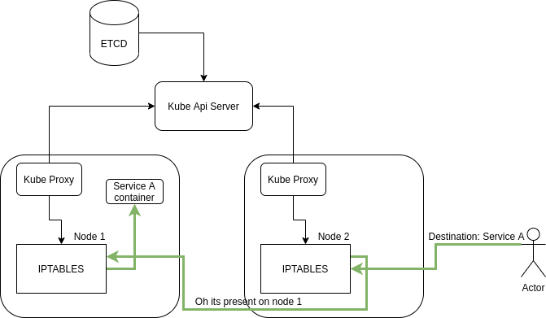

When you create any service in Kubernetes, the traffic can come on any of the nodes, and then its iptables will route the packet to the correct node and after that, it can reach the correct pod.

## Pods

Until now, we have covered concepts that are internal and infrastructure-focused. In contrast, pods are central to Kubernetes because they are the key outward facing construct that developers interact with.

A pod represents a single instance of an application, and the simplest unit within the Kubernetes object model. However, pods are central and crucial to Kubernetes. Each pod is composed of a container or tightly coupled containers in a series that logically go together, along with rules that control how the containers run.

Pods have a limited lifespan and eventually die after upgrading or scaling back down. However, although they are ephemeral, pods can run stateful applications by connecting to persistent storage.

Pods are also capable of horizontal autoscaling, meaning they can grow or shrink the number of instances running. They can also perform rolling updates and canary deployments.

Pods run together on nodes, so they share content and storage and can reach other pods via localhost. Containers may span multiple machines, so pods may as well. One node can run multiple pods, each collecting multiple containers.

The pod is the core unit of management in the Kubernetes ecosystem and acts as the logical boundary for containers that share resources and context. Differences in virtualization and containerization are mitigated by the pod grouping mechanism, which enables running multiple dependent processes together.

Achieve scaling in pods at runtime by creating replica sets, which deliver availability by constantly maintaining a predefined set of pods, ensuring that the deployment always runs the desired number. Services can expose a single pod or a replica set to external or internal consumers.

Services associate specific criteria with pods to enable their discovery. Pods and services are associated through key-value pairs called selectors and labels. Any new match between a pod label and selector will be discovered automatically by the service.

--------------------------------------------------------------------------------------------------------------------------------------------------------------------

## The Control plane (master)
The Control plane is made up of the kube-api server, kube scheduler, cloud-controller-manager and kube-controller-manager. 
Kube proxies and kubelets live on each node, talking to the API and managing the workload of each node.

Cloud-controller-manager
The cloud-controller-manager runs in the control plane as a replicated set of processes (typically, these would be containers in Pods). 
The cloud-controller-manager is what allows you to connect your clusters with the cloud provider’s API and only runs controllers specific to the cloud provider you’re using.

Just note: If you’re running Kubernetes on-prem, your cluster won’t have a cloud-controller-manager.

## Etcd
etcd is a distributed key-value store and the primary datastore of Kubernetes. It stores and replicates the Kubernetes cluster state.

To run etcd, you first need to have a Kubernetes cluster and the command-line tool configured to communicate with said cluster.

## Kubelet
The kubelet functions as an agent within nodes and is responsible for the runnings of pod cycles within each node. Its functionality is watching for new or changed pod specifications from master nodes and ensuring that pods within the node that it resides in are healthy, and the state of pods matches the pod specification.

Kubelet is an agent process that runs of each worker node

Its job includes

> Register a node as a worker node
> Creats/Destroy/Runs the PODs on the worker nodes based on the POD specs received from API-Server
> Reports the status of PODs and Nodes to the API-Server regularly

## Kube-proxy
Kube-proxy is a network proxy that runs on each node. It maintains network rules, which allow for network communication to Pods from network sessions inside or outside of a cluster. Kube-proxy is used to reach kubernetes services in addition to load balancing of services.

## Kube-controller-manager
The Kubernetes controller manager is a collection of controllers bundled within a single binary and run in a single process. The following controllers are present within this manager:

>  **NODE CONTROLLER**:            Responsible for identifying changes in nodes within the cluste

>  **REPLICATION CONTROLLER**:     Responsible for maintaining replications of objects in the cluster (such as replicasets)

>  **ENDPOINT CONTROLLER**:        Responsible for provisioning of endpoints (such as service endpoints)

>  **Service account and token controllers**: Responsible the management of service accounts within each namespace, as well as API access tokens

## Features which Kubernetes provides - 

Service Discovery and load balancing: Kubernetes has a feature which assigns the containers with their own IP addresses and a unique DNS name, which can be used to balance the load on them.

- [x] Planning & Placement: Placement of the containers on the node is a crucial feature on which makes the decision based on the resources it requires and other restrictions.
- [x] Auto Scaling: Based on the CPU usage, the vertical scaling of applications is automatically triggered using the command line.
- [x] Self Repair: This is a unique feature in the Kubernetes which will restart the container automatically when it fails. If the Node dies, then containers are replaced or re-planned on the other Nodes. You can stop the containers if they don't respond to the health checks.
- [x] Storage Orchestration: This feature of Kubernetes enables the user to mount the network storage system as a local file system.
- [x] Batch execution: Kubernetes manages both batch and CI workloads along with replacing containers that fail.
- [x] Deployments and Automatic Rollbacks: During the configuration changes for the application hosted on the Kubernetes, progressively monitors the health to ensure that it does not terminate all the instances at once, it makes an automatic rollback only in the case of failure.
- [x] Configuration Management and Secrets: All classifies information like keys and passwords are stored under module called Secrets in Kubernetes. These Secrets are used especially while configuring the application without having to reconstruct the image.

## KUBERNETES CLI-COMMANDS

### install hyperhit and minikube

    brew update

    brew install hyperkit

    brew install minikube

    kubectl

    minikube

### create minikube cluster

    minikube start --vm-driver=hyperkit

    kubectl get nodes

    minikube status

    kubectl version

### delete cluster and restart in debug mode

    minikube delete

    minikube start --vm-driver=hyperkit --v=7 --alsologtostderr

minikube status

### kubectl commands
    
    kubectl get po -o wide --show-labels
    NAME        READY   STATUS              RESTARTS   AGE   IP       NODE       NOMINATED NODE   READINESS GATES   LABELS
    first-pod   0/1     ContainerCreating   0          3s    <none>   minikube   <none>           <none>            type=web
     
    kubectl explain pod --recursive | less
    
    kubectl get pod -o yaml | less
    kubectl get pod -o json | less

    $ kubectl get pod -o wide --show-labels
    NAME        READY   STATUS    RESTARTS   AGE     IP           NODE       NOMINATED NODE   READINESS GATES   LABELS
    first-pod   1/1     Running   0          2m50s   172.18.0.6   minikube   <none>           <none>            type=web
    $ 
    $ kubectl label pod first-pod env=dev
    pod/first-pod labeled
    $ kubectl get pod -o wide --show-labels
    NAME        READY   STATUS    RESTARTS   AGE     IP           NODE       NOMINATED NODE   READINESS GATES   LABELS
    first-pod   1/1     Running   0          3m29s   172.18.0.6   minikube   <none>           <none>            env=dev,type=web
    
    **Delete Label**
    
    $ kubectl label pod first-pod env-
    pod/first-pod labeled
    $ kubectl get pod -o wide --show-labels
    NAME        READY   STATUS    RESTARTS   AGE     IP           NODE       NOMINATED NODE   READINESS GATES   LABELS
    first-pod   1/1     Running   0          4m10s   172.18.0.6   minikube   <none>           <none>            type=web
    
    
    kubectl get nodes

    kubectl get pod

    kubectl get services

    kubectl create deployment nginx-depl --image=nginx

    kubectl get deployment

    kubectl get replicaset

    kubectl edit deployment nginx-depl

### debugging

    kubectl logs {pod-name}

    kubectl exec -it {pod-name} -- bin/bash

### create mongo deployment

    kubectl create deployment mongo-depl --image=mongo

    kubectl logs mongo-depl-{pod-name}

    kubectl describe pod mongo-depl-{pod-name}

### delete label

	kubectl label service my-service app-			(To delete the label ‘app’ from service ‘my-service’)
	kubectl label namespaces default namespace-		(To delete a label ‘namespace’ from namespace ‘default’)

### delete deplyoment

    kubectl delete deployment mongo-depl

    kubectl delete deployment nginx-depl

### create or edit config file

    vim nginx-deployment.yaml

    kubectl apply -f nginx-deployment.yaml

    kubectl get pod

    kubectl get deployment

### delete with config

    kubectl delete -f nginx-deployment.yaml

### Metrics

    kubectl top 

The kubectl top command returns current CPU and memory usage for a cluster’s pods or nodes, or for a particular pod or node if specified.

### kubectl apply commands in order
    
    kubectl apply -f mongo-secret.yaml
    kubectl apply -f mongo.yaml
    kubectl apply -f mongo-configmap.yaml 
    kubectl apply -f mongo-express.yaml

### kubectl get commands

    kubectl get pod
    kubectl get pod --watch
    kubectl get pod -o wide
    kubectl get service
    kubectl get secret
    kubectl get all | grep mongodb

### kubectl debugging commands

    kubectl describe pod mongodb-deployment-xxxxxx
    kubectl describe service mongodb-service
    kubectl logs mongo-express-xxxxxx

### Kubectl context and configuration

	kubectl config view # Show Merged kubeconfig settings.

	# use multiple kubeconfig files at the same time and view merged config
	KUBECONFIG=~/.kube/config:~/.kube/kubconfig2 

	kubectl config view

	# get the password for the e2e user
	kubectl config view -o jsonpath='{.users[?(@.name == "e2e")].user.password}'

	kubectl config view -o jsonpath='{.users[].name}'    # display the first user
	kubectl config view -o jsonpath='{.users[*].name}'   # get a list of users
	kubectl config get-contexts                          # display list of contexts 
	kubectl config current-context                       # display the current-context
	kubectl config use-context my-cluster-name           # set the default context to my-cluster-name

	# add a new user to your kubeconf that supports basic auth
	kubectl config set-credentials kubeuser/foo.kubernetes.com --username=kubeuser --password=kubepassword

	# permanently save the namespace for all subsequent kubectl commands in that context.
	kubectl config set-context --current --namespace=ggckad-s2

	# set a context utilizing a specific username and namespace.
	kubectl config set-context gce --user=cluster-admin --namespace=foo \
	  && kubectl config use-context gce

	kubectl config unset users.foo                       # delete user foo

### Creating objects

	kubectl apply -f ./my-manifest.yaml            # create resource(s)
	kubectl apply -f ./my1.yaml -f ./my2.yaml      # create from multiple files
	kubectl apply -f ./dir                         # create resource(s) in all manifest files in dir
	kubectl apply -f https://git.io/vPieo          # create resource(s) from url
	kubectl create deployment nginx --image=nginx  # start a single instance of nginx

	# create a Job which prints "Hello World"
	kubectl create job hello --image=busybox -- echo "Hello World" 

	# create a CronJob that prints "Hello World" every minute
	kubectl create cronjob hello --image=busybox   --schedule="*/1 * * * *" -- echo "Hello World"    

	kubectl explain pods                           # get the documentation for pod manifests

	# Create multiple YAML objects from stdin
	cat <<EOF | kubectl apply -f -
	apiVersion: v1
	kind: Pod
	metadata:
	  name: busybox-sleep
	spec:
	  containers:
	  - name: busybox
	    image: busybox
	    args:
	    - sleep
	    - "1000000"
	---
	apiVersion: v1
	kind: Pod
	metadata:
	  name: busybox-sleep-less
	spec:
	  containers:
	  - name: busybox
	    image: busybox
	    args:
	    - sleep
	    - "1000"
	EOF

	# Create a secret with several keys
	cat <<EOF | kubectl apply -f -
	apiVersion: v1
	kind: Secret
	metadata:
	  name: mysecret
	type: Opaque
	data:
	  password: $(echo -n "s33msi4" | base64 -w0)
	  username: $(echo -n "jane" | base64 -w0)
	EOF

### Viewing, finding resources

	# Get commands with basic output
	kubectl get services                          # List all services in the namespace
	kubectl get pods --all-namespaces             # List all pods in all namespaces
	kubectl get pods -o wide                      # List all pods in the current namespace, with more details
	kubectl get deployment my-dep                 # List a particular deployment
	kubectl get pods                              # List all pods in the namespace
	kubectl get pod my-pod -o yaml                # Get a pod's YAML

	# Describe commands with verbose output
	kubectl describe nodes my-node
	kubectl describe pods my-pod

	# List Services Sorted by Name
	kubectl get services --sort-by=.metadata.name

	# List pods Sorted by Restart Count
	kubectl get pods --sort-by='.status.containerStatuses[0].restartCount'

	# List PersistentVolumes sorted by capacity
	kubectl get pv --sort-by=.spec.capacity.storage

	# Get the version label of all pods with label app=cassandra
	kubectl get pods --selector=app=cassandra -o \
	  jsonpath='{.items[*].metadata.labels.version}'

	# Retrieve the value of a key with dots, e.g. 'ca.crt'
	kubectl get configmap myconfig \
	  -o jsonpath='{.data.ca\.crt}'

	# Get all worker nodes (use a selector to exclude results that have a label
	# named 'node-role.kubernetes.io/master')
	kubectl get node --selector='!node-role.kubernetes.io/master'

	# Get all running pods in the namespace
	kubectl get pods --field-selector=status.phase=Running

	# Get ExternalIPs of all nodes
	kubectl get nodes -o jsonpath='{.items[*].status.addresses[?(@.type=="ExternalIP")].address}'

	# List Names of Pods that belong to Particular RC
	# "jq" command useful for transformations that are too complex for jsonpath, it can be found at https://stedolan.github.io/jq/
	sel=${$(kubectl get rc my-rc --output=json | jq -j '.spec.selector | to_entries | .[] | "\(.key)=\(.value),"')%?}
	echo $(kubectl get pods --selector=$sel --output=jsonpath={.items..metadata.name})

	# Show labels for all pods (or any other Kubernetes object that supports labelling)
	kubectl get pods --show-labels

	# Check which nodes are ready
	JSONPATH='{range .items[*]}{@.metadata.name}:{range @.status.conditions[*]}{@.type}={@.status};{end}{end}' \
	 && kubectl get nodes -o jsonpath="$JSONPATH" | grep "Ready=True"

	# Output decoded secrets without external tools
	kubectl get secret my-secret -o go-template='{{range $k,$v := .data}}{{"### "}}{{$k}}{{"\n"}}{{$v|base64decode}}{{"\n\n"}}{{end}}'

	# List all Secrets currently in use by a pod
	kubectl get pods -o json | jq '.items[].spec.containers[].env[]?.valueFrom.secretKeyRef.name' | grep -v null | sort | uniq

	# List all containerIDs of initContainer of all pods
	# Helpful when cleaning up stopped containers, while avoiding removal of initContainers.
	kubectl get pods --all-namespaces -o jsonpath='{range .items[*].status.initContainerStatuses[*]}{.containerID}{"\n"}{end}' | cut -d/ -f3

	# List Events sorted by timestamp
	kubectl get events --sort-by=.metadata.creationTimestamp

	# Compares the current state of the cluster against the state that the cluster would be in if the manifest was applied.
	kubectl diff -f ./my-manifest.yaml

	# Produce a period-delimited tree of all keys returned for nodes
	# Helpful when locating a key within a complex nested JSON structure
	kubectl get nodes -o json | jq -c 'path(..)|[.[]|tostring]|join(".")'

	# Produce a period-delimited tree of all keys returned for pods, etc
	kubectl get pods -o json | jq -c 'path(..)|[.[]|tostring]|join(".")'

	# Produce ENV for all pods, assuming you have a default container for the pods, default namespace and the `env` command is supported.
	# Helpful when running any supported command across all pods, not just `env`
	for pod in $(kubectl get po --output=jsonpath={.items..metadata.name}); do echo $pod && kubectl exec -it $pod -- env; done

### Updating resources

	kubectl set image deployment/frontend www=image:v2               # Rolling update "www" containers of "frontend" deployment, updating the image
	kubectl rollout history deployment/frontend                      # Check the history of deployments including the revision 
	kubectl rollout undo deployment/frontend                         # Rollback to the previous deployment
	kubectl rollout undo deployment/frontend --to-revision=2         # Rollback to a specific revision
	kubectl rollout status -w deployment/frontend                    # Watch rolling update status of "frontend" deployment until completion
	kubectl rollout restart deployment/frontend                      # Rolling restart of the "frontend" deployment

	cat pod.json | kubectl replace -f -                              # Replace a pod based on the JSON passed into std

	# Force replace, delete and then re-create the resource. Will cause a service outage.
	kubectl replace --force -f ./pod.json

	# Create a service for a replicated nginx, which serves on port 80 and connects to the containers on port 8000
	kubectl expose rc nginx --port=80 --target-port=8000

	# Update a single-container pod's image version (tag) to v4
	kubectl get pod mypod -o yaml | sed 's/\(image: myimage\):.*$/\1:v4/' | kubectl replace -f -

	kubectl label pods my-pod new-label=awesome                      # Add a Label
	kubectl annotate pods my-pod icon-url=http://goo.gl/XXBTWq       # Add an annotation
	kubectl autoscale deployment foo --min=2 --max=10                # Auto scale a deployment "foo"

### Scaling resources

	kubectl scale --replicas=3 rs/foo                                 # Scale a replicaset named 'foo' to 3
	kubectl scale --replicas=3 -f foo.yaml                            # Scale a resource specified in "foo.yaml" to 3
	kubectl scale --current-replicas=2 --replicas=3 deployment/mysql  # If the deployment named mysql's current size is 2, scale mysql to 3
	kubectl scale --replicas=5 rc/foo rc/bar rc/baz                   # Scale multiple replication controllers

### Deleting resources

	kubectl delete -f ./pod.json                                      # Delete a pod using the type and name specified in pod.json
	kubectl delete pod unwanted --now                                 # Delete a pod with no grace period
	kubectl delete pod,service baz foo                                # Delete pods and services with same names "baz" and "foo"
	kubectl delete pods,services -l name=myLabel                      # Delete pods and services with label name=myLabel
	kubectl -n my-ns delete pod,svc --all                             # Delete all pods and services in namespace my-ns,
	# Delete all pods matching the awk pattern1 or pattern2
	kubectl get pods  -n mynamespace --no-headers=true | awk '/pattern1|pattern2/{print $1}' | xargs  kubectl delete -n mynamespace pod

### Interacting with running Pods

	kubectl logs my-pod                                 # dump pod logs (stdout)
	kubectl logs -l name=myLabel                        # dump pod logs, with label name=myLabel (stdout)
	kubectl logs my-pod --previous                      # dump pod logs (stdout) for a previous instantiation of a container
	kubectl logs my-pod -c my-container                 # dump pod container logs (stdout, multi-container case)
	kubectl logs -l name=myLabel -c my-container        # dump pod logs, with label name=myLabel (stdout)
	kubectl logs my-pod -c my-container --previous      # dump pod container logs (stdout, multi-container case) for a previous instantiation of a container
	kubectl logs -f my-pod                              # stream pod logs (stdout)
	kubectl logs -f my-pod -c my-container              # stream pod container logs (stdout, multi-container case)
	kubectl logs -f -l name=myLabel --all-containers    # stream all pods logs with label name=myLabel (stdout)
	kubectl run -i --tty busybox --image=busybox -- sh  # Run pod as interactive shell
	kubectl run nginx --image=nginx -n mynamespace      # Start a single instance of nginx pod in the namespace of mynamespace
	kubectl run nginx --image=nginx                     # Run pod nginx and write its spec into a file called pod.yaml
	--dry-run=client -o yaml > pod.yaml

	kubectl attach my-pod -i                            # Attach to Running Container
	kubectl port-forward my-pod 5000:6000               # Listen on port 5000 on the local machine and forward to port 6000 on my-pod
	kubectl exec my-pod -- ls /                         # Run command in existing pod (1 container case)
	kubectl exec --stdin --tty my-pod -- /bin/sh        # Interactive shell access to a running pod (1 container case) 
	kubectl exec my-pod -c my-container -- ls /         # Run command in existing pod (multi-container case)
	kubectl top pod POD_NAME --containers               # Show metrics for a given pod and its containers
	kubectl top pod POD_NAME --sort-by=cpu              # Show metrics for a given pod and sort it by 'cpu' or 'memory'

### Copy files and directories to and from containers

	kubectl cp /tmp/foo_dir my-pod:/tmp/bar_dir            # Copy /tmp/foo_dir local directory to /tmp/bar_dir in a remote pod in the current namespace
	kubectl cp /tmp/foo my-pod:/tmp/bar -c my-container    # Copy /tmp/foo local file to /tmp/bar in a remote pod in a specific container
	kubectl cp /tmp/foo my-namespace/my-pod:/tmp/bar       # Copy /tmp/foo local file to /tmp/bar in a remote pod in namespace my-namespace
	kubectl cp my-namespace/my-pod:/tmp/foo /tmp/bar       # Copy /tmp/foo from a remote pod to /tmp/bar locally

### Interacting with Deployments and Services

	kubectl logs deploy/my-deployment                         # dump Pod logs for a Deployment (single-container case)
	kubectl logs deploy/my-deployment -c my-container         # dump Pod logs for a Deployment (multi-container case)

	kubectl port-forward svc/my-service 5000                  # listen on local port 5000 and forward to port 5000 on Service backend
	kubectl port-forward svc/my-service 5000:my-service-port  # listen on local port 5000 and forward to Service target port with name <my-service-port>

	kubectl port-forward deploy/my-deployment 5000:6000       # listen on local port 5000 and forward to port 6000 on a Pod created by <my-deployment>
	kubectl exec deploy/my-deployment -- ls                   # run command in first Pod and first container in Deployment (single- or multi-container cases)

### Interacting with Nodes and cluster

	kubectl cordon my-node                                                # Mark my-node as unschedulable
	kubectl drain my-node                                                 # Drain my-node in preparation for maintenance
	kubectl uncordon my-node                                              # Mark my-node as schedulable
	kubectl top node my-node                                              # Show metrics for a given node
	kubectl cluster-info                                                  # Display addresses of the master and services
	kubectl cluster-info dump                                             # Dump current cluster state to stdout
	kubectl cluster-info dump --output-directory=/path/to/cluster-state   # Dump current cluster state to /path/to/cluster-state

	# If a taint with that key and effect already exists, its value is replaced as specified.
	kubectl taint nodes foo dedicated=special-user:NoSchedule

### Resource types

List all supported resource types along with their shortnames, API group, whether they are namespaced, and Kind:

	kubectl api-resources
	
Other operations for exploring API resources:	

	kubectl api-resources --namespaced=true      # All namespaced resources
	kubectl api-resources --namespaced=false     # All non-namespaced resources
	kubectl api-resources -o name                # All resources with simple output (only the resource name)
	kubectl api-resources -o wide                # All resources with expanded (aka "wide") output
	kubectl api-resources --verbs=list,get       # All resources that support the "list" and "get" request verbs
	kubectl api-resources --api-group=extensions # All resources in the "extensions" API group
### give a URL to external service in minikube

    minikube service mongo-express-service
    
# Create yaml file using command

## --dry-run -o yaml

		kubectl run firstPod --generator=run-pod/v1 --image=coolgourav147/nginx-custom --dry-run -o yaml
		
		Output:
		
		apiVersion: v1
		kind: Pod
		metadata:
		  creationTimestamp: null
		  labels:
		    run: firstPod
		  name: firstPod
		spec:
		  containers:
		  - image: coolgourav147/nginx-custom
		    imagePullPolicy: IfNotPresent    
		    name: firstPod
		    resources: {}
		  dnsPolicy: ClusterFirst
		  restartPolicy: Always
		status: {}

Pod	--generator=run-pod/v1 OR --restart=Never			kubectl run --generator=run-pod/v1 www-1 --image=nginx:1.16
Job	--restart=OnFailure  OR --generator=job/v1			kubectl run hello --image=hello-world --restart=OnFailure
Deployment	--restart=Always
Cron Job	--schedule=<cron>

# Deployment(s) in Kubernetes

In Kubernetes, a deployment is a method of launching a pod with containerized applications and ensuring that the necessary number of replicas is always running on the cluster. 

In Kubernetes, most service-style applications use Deployments to run applications on Kubernetes. Using Deployments, you can describe how to run your application container as a Pod in Kubernetes and how many replicas of the application to run. Kubernetes will then take care of running as many replicas as specified.

Here’s an example deployment manifest in YAML format for running three instances of a simple hello world web app:

    apiVersion: apps/v1
    kind: Deployment
    metadata:
      labels:
        app: myapp
      name: myapp
    spec:
      replicas: 3
      selector:
        matchLabels:
          app: myapp
      template:
        metadata:
          labels:
            app: myapp
        spec:
          containers:
          - image: polarsquad/hello-world-app:master
            name: hello-world
            ports:
            - containerPort: 3000
One of the key features of Deployments is how it manages application updates. By default, updating the Deployment manifest in Kubernetes causes the application to be updated in a rolling fashion. This way you’ll have the previous version of the deployment running while the new one is brought up. In the Deployment manifest, you can specify how many replicas to bring up and down at once during updates.

For example, we can add a rolling update strategy to the spec section of the manifest where we bring one replica up at a time, and make sure there are no missing healthy replicas at any point during the upgrade.

    spec:
     strategy:
       type: RollingUpdate
       rollingUpdate:
         maxUnavailable: 0
         maxSurge: 1

**maxSurge**: The number of pods that can be created above the desired amount of pods during an update.Again this can be an absolute number or a percentage of the replicas                 count; the default is 25%

**maxUnavailable**: The number of pods that can be unavailable during the update process

        apiVersion: apps/v1
        kind: Deployment
        metadata:
          name: hello-dep
          namespace: default
        spec:
          replicas: 2
          strategy:
          type: RollingUpdate
          rollingUpdate:
            maxSurge: 1
            maxUnavailable: 25%
          selector:
            matchLabels:
              app: hello-dep
          template:
            metadata:
              labels:
                app: hello-dep
            spec:
              containers:
              - image: gcr.io/google-samples/hello-app:2.0
                imagePullPolicy: Always
                name: hello-dep
                ports:
                - containerPort: 8080
                readinessProbe:
                  httpGet:
                     path: /
                     port: 8080
                     initialDelaySeconds: 5
                     periodSeconds: 5
                     successThreshold: 1

To automate the process, you might choose to deploy your app in your CI pipeline using kubectl.
 
    kubectl apply -f deployment.yaml

Kubectl apply does not verify that your application even starts.

In order to properly check that the update proceeds as expected, we need assistance from another kubectl command.

This is where kubectl’s rollout command becomes handy! We can use it to check how our deployment is doing.

By default, the command waits until all of the Pods in the deployment have been started successfully. When the deployment succeeds, the command exits with return code zero to indicate success.

    $ kubectl rollout status deployment myapp
    Waiting for deployment "myapp" rollout to finish: 0 of 3 updated replicas are available…
    Waiting for deployment "myapp" rollout to finish: 1 of 3 updated replicas are available…
    Waiting for deployment "myapp" rollout to finish: 2 of 3 updated replicas are available…
    deployment "myapp" successfully rolled out

#   Kubernetes deployment strategies

In Kubernetes there are a few different ways to release an application, it is necessary to choose the right strategy to make your infrastructure reliable during an application update.

    apiVersion: apps/v1
    kind: Deployment
    metadata:
      name: nginx-deployment
      labels:
        app: nginx
    spec:
      replicas: 3
      selector:
        matchLabels:
          app: nginx
      template:
        metadata:
          labels:
            app: nginx
        spec:
          containers:
          - name: nginx
            image: nginx:1.14.2
            ports:
            - containerPort: 80

Command to run the deployment.yml file - 

    kubectl apply -f deployment.yml
    
    kubectl get deployments
    
    NAME               READY   UP-TO-DATE   AVAILABLE   AGE
    nginx-deployment   3/3     3            3           18s
    
    kubectl get rs
    
    NAME                          DESIRED   CURRENT   READY   AGE
    nginx-deployment-75675f5897   3         3         3       18s
    
    kubectl get pods --show-labels
    
    NAME                                READY     STATUS    RESTARTS   AGE       LABELS
    nginx-deployment-75675f5897-7ci7o   1/1       Running   0          18s       app=nginx,pod-template-hash=3123191453
    nginx-deployment-75675f5897-kzszj   1/1       Running   0          18s       app=nginx,pod-template-hash=3123191453
    nginx-deployment-75675f5897-qqcnn   1/1       Running   0          18s       app=nginx,pod-template-hash=3123191453
    
#   Deployment Strategy
    
**recreate**: terminate the old version and release the new one

**ramped or Rolling update** : release a new version on a rolling update fashion, one after the other

**blue/green**: release a new version alongside the old version then switch traffic

**canary**: release a new version to a subset of users, then proceed to a full rollout

# Deployment Status

ReplicaSet output shows the following fields:

**NAME** lists the names of the ReplicaSets in the namespace.
**DESIRED** displays the desired number of replicas of the application, which you define when you create the Deployment. This is the desired state.
**CURRENT** displays how many replicas are currently running.
**READY** displays how many replicas of the application are available to your users.
**AGE** displays the amount of time that the application has been running.

# Service(s) in Kubernetes

A Kubernetes service is a logical abstraction for a deployed group of pods in a cluster (which all perform the same function).

Since pods are ephemeral, a service enables a group of pods, which provide specific functions (web services, image processing, etc.) to be assigned a name and unique IP address (clusterIP). As long as the service is running that IP address, it will not change. Services also define policies for their acces

    apiVersion: v1
    kind: Service
    metadata:
      name: mongo-express-service
    spec:
      selector:
        app: mongo-express
      type: LoadBalancer  
      ports:
        - protocol: TCP
          port: 8081
          targetPort: 8081
          nodePort: 30000

# In Kubernetes, what is the difference between a service and a deployment?

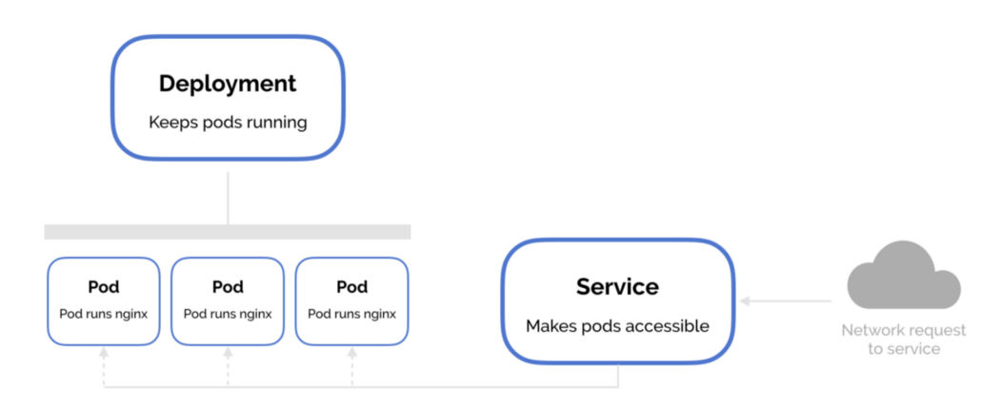

   In Kubernetes, a deployment is a method of launching a pod with containerized applications and ensuring that the necessary number of replicas is always running on the  cluster. 

   On the other hand, a service is responsible for exposing an interface to those pods, which enables network access from either within the cluster or between external processes and the service.

#   Types of Kubernetes services

 
**ClusterIP**.  Exposes a service which is only accessible from within the cluster.

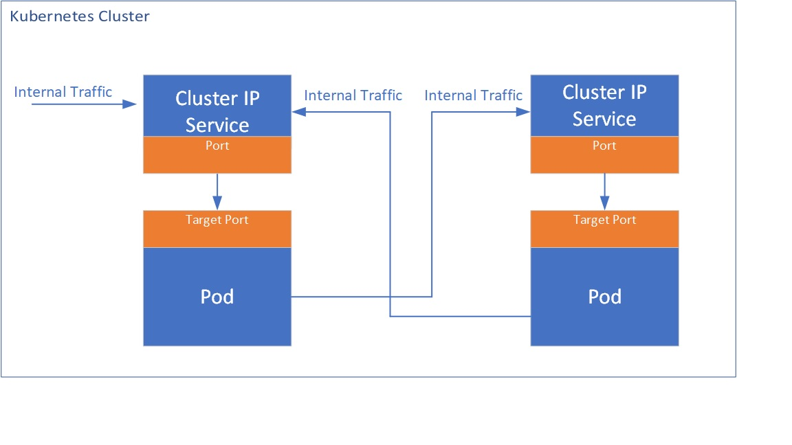

**NodePort**.   Exposes a service via a static port on each node’s IP. (NodePorts are in the 30000-32767 range by default, which means a NodePort is unlikely to match a service’s intended port (for example, 8080 may be exposed as 31020).

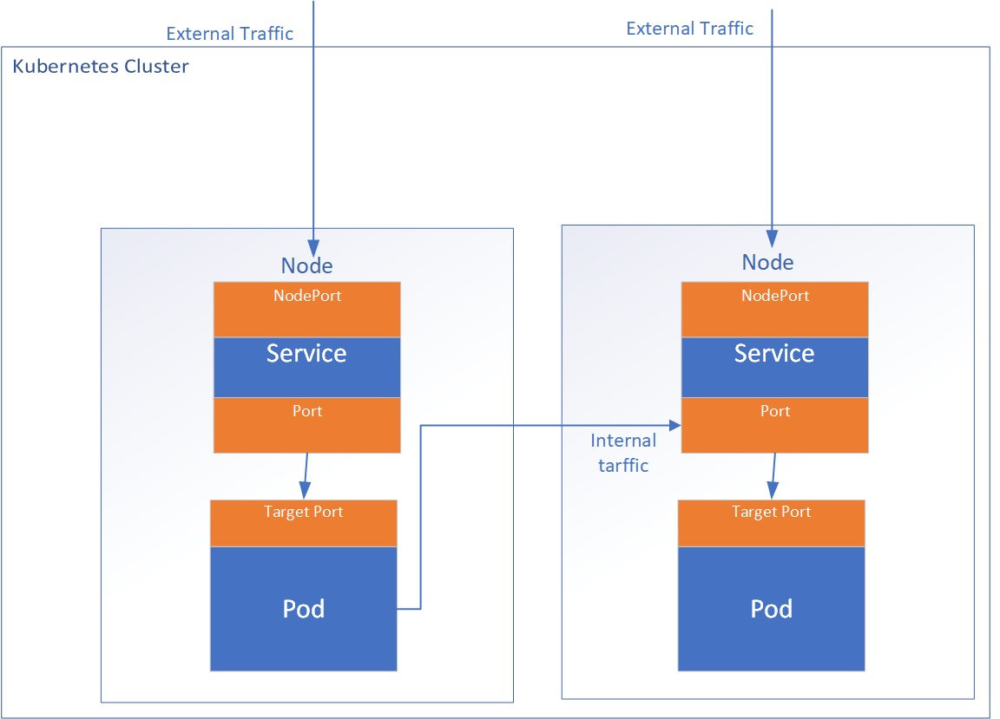

**LoadBalancer**. Exposes the service via the cloud provider’s load balancer.

**ExternalName**. Maps a service to a predefined externalName field by returning a value for the CNAME record.

**Ingress**. This service allows the routing of HTTP(S) traffic according to defined rules like path-based routings. This can be associated with one or more service objects where these services are further associated with Pods. The ingress controller creates HTTP(S) load balancer Layer 7 load balancer which are configured automatically using the definition in the Ingress object.

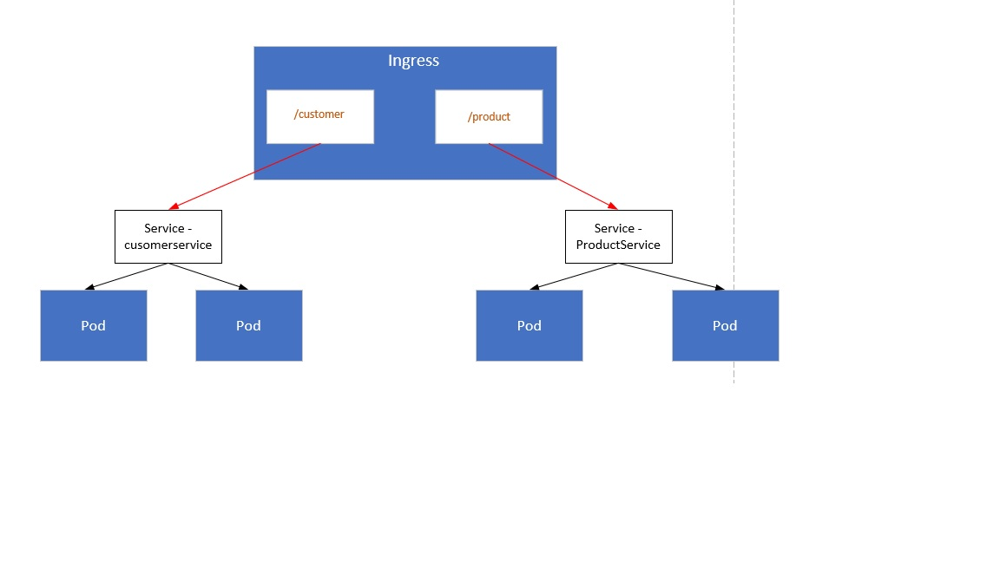

----------------

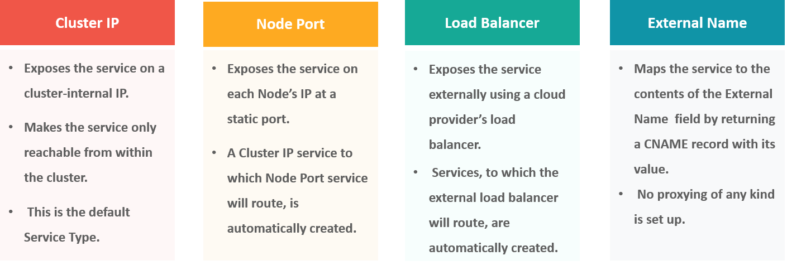

### INGRESS

## What is an Ingress?

In Kubernetes, an Ingress is an object that allows access to your Kubernetes services from outside the Kubernetes cluster. You configure access by creating a collection of rules that define which inbound connections reach which services.

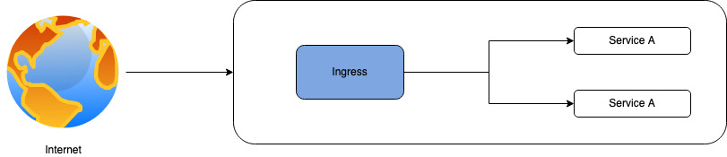

This lets you consolidate your routing rules into a single resource. For example, you might want to send requests to example.com/api/v1/ to an api-v1 service, and requests to example.com/api/v2/ to the api-v2 service. With an Ingress, you can easily set this up without creating a bunch of LoadBalancers or exposing each service on the Node.

## Ingress Controllers

Ingress controllers in Kubernetes are resources that accept traffic from the internet and load balance it to applications (usually in the form of running pods). Ingress controllers abstract away the complexity of routing traffic to applications running within a Kubernetes cluster.

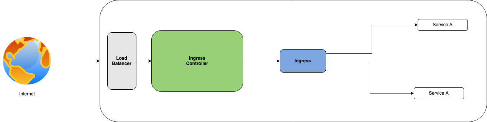

An Ingress controller is a daemon running in a Pod that watches the /ingresses endpoint on the API server. When a new endpoint is created, the daemon uses the configured set of rules to allow traffic into a service.

A controller uses Ingress Rules to handle traffic to and from outside the cluster.

A few popular examples of ingress controllers include:

Traefik: This is known as a simple and reliable open source Kubernetes ingress controller designed for connecting Kubernetes with external applications.
AWS ALB: This commonly used ingress controller leverages AWS Application Load Balancers to handle ingress resource requests.
Nginx: This controller uses open source Nginx to implement ingress resources.

## Installation 

	kubectl apply -f https://raw.githubusercontent.com/kubernetes/ingress-nginx/master/deploy/mandatory.yaml
	minikube addons enable ingress
	kubectl get pods --all-namespaces -l app=ingress-nginx

## Creating a Kubernetes Ingress

	kind: Pod
	apiVersion: v1
	metadata:
	  name: apple-app
	  labels:
	    app: apple
	spec:
	  containers:
	    - name: apple-app
	      image: hashicorp/http-echo
	      args:
		- "-text=apple"

	---

	kind: Service
	apiVersion: v1
	metadata:
	  name: apple-service
	spec:
	  selector:
	    app: apple
	  ports:
	    - port: 5678 # Default port for image

-------------------------------------------------------------------------------------------------------

	kind: Pod
	apiVersion: v1
	metadata:
	  name: banana-app
	  labels:
	    app: banana
	spec:
	  containers:
	    - name: banana-app
	      image: hashicorp/http-echo
	      args:
		- "-text=banana"

	---

	kind: Service
	apiVersion: v1
	metadata:
	  name: banana-service
	spec:
	  selector:
	    app: banana
	  ports:
	    - port: 5678 # Default port for image
	    
Create the resources

	$ kubectl apply -f apple.yaml
	$ kubectl apply -f banana.yaml
	
Now, declare an Ingress to route requests to /apple to the first service, and requests to /banana to second service. Check out the Ingress’ rules field that declares how requests are passed along.

	apiVersion: extensions/v1beta1
	kind: Ingress
	metadata:
	  name: example-ingress
	  annotations:
	    ingress.kubernetes.io/rewrite-target: /
	spec:
	  rules:
	  - http:
	      paths:
		- path: /apple
		  backend:
		    serviceName: apple-service
		    servicePort: 5678
		- path: /banana
		  backend:
		    serviceName: banana-service
		    servicePort: 5678

# What is a headless service?

A headless service is a service with a service IP but instead of load-balancing it will return the IPs of our associated Pods. This allows us to interact directly with the Pods instead of a proxy. It's as simple as specifying None for .spec.clusterIP and can be utilized with or without selectors

    apiVersion: v1
    kind: Service
    metadata:
      name: my-headless-service
    spec:
      clusterIP: None # <--
      selector:
        app: test-app
      ports:
        - protocol: TCP
          port: 80
          targetPort: 3000 

Create the Ingress in the cluster

	kubectl create -f ingress.yaml

Perfect! Let’s check that it’s working. If you’re using Minikube, you might need to replace localhost with 192.168.99.100.

	$ curl -kL http://localhost/apple
	apple

	$ curl -kL http://localhost/banana
	banana

	$ curl -kL http://localhost/notfound
	default backend - 404

--------------------------------------------------------------

Headless-services allow us to reach each Pod directly, rather than the service acting as a load-balancer or prox

# Use Cases of Headless Service-
- [x] Create Stateful service
- [x] Deploying RabbitMQ to Kubernetes requires a stateful set for RabbitMQ cluster nodes.
- [x] Deployment of Relational databases

#   How do Kubernetes services work

   Services simply point to pods using labels. Since services are not node-specific, a service can point to a pod regardless of where it runs in the cluster at any given moment in time. By exposing a service IP address as well as a DNS service name, the application can be reached by either method as long as the service exists.
    
#   Creating service using yml file
    
   Services are defined in YAML, as are all Kubernetes objects. Suppose you deployed pods running a back-end service to process data coming from a web front end. To expose a service named ‘service-backend’ on the deployment ‘deployment-backend’ you would use:
    
    apiVersion: v1
    kind: Service
    metadata:
    name: service-backend
    spec:
    ports:
    - port: 4000
    protocol: TCP
    targetPort: 333
    selector:
    run: deployment-backend
    type: ClusterIP
    
   The service ‘service-backend’ will be created, and any pod in the cluster can access it on their port 333 via http://service-backend:4000, or at the cluster’s IP address using port 4000.

   Kubernetes services can also be created using the ‘kubectl expose’ command, which does not require a YAML file. The same service can be created using the command:

#   Creating service using command

    kubectl expose deployment deployment-backend  - - port=333- - target-port=4000    - - name=service-backend
   
#   Access a Kubernetes service
   
   There are two ways to discover a Kubernetes service:
   
   **DNS (most common)**: The DNS method is the recommended method of discovering services. To use this method, a DNS server must first be installed on the cluster. The DNS server monitors the Kubernetes API, and when a new service is created its name becomes available for easy resolution for requesting applications. 
    
   **ENV variable**: This method relies on the kubelet adding environment variables for each active service for every node a pod is running on.

#   Pause Container

Pause Container holds the network namespace for the pod. Kubernetes creates pause containers to acquire the respective pod’s IP address and set up the network namespace for all other containers that join that pod.

 Pause container make sure that there is a network stack to map, and it doesn’t change. Pause containers are a pod implementation detail where one pause container is used for each pod and shouldn’t be shown when listing containers that are members of pods

Pause containers hold the cgroups, reservations, and namespaces of a pod before its individual containers are created. The pause container’s image is always present, so the allocation of the pod’s resources is instantaneous.

 By default, pause containers are hidden, but you can see them by running docker ps -a.
 
 $ docker ps | grep web
 
0982367c3387        nginx                  "/docker-entrypoint.…"   3 minutes ago       Up 3 minutes                            k8s_web_web-f6fbdd86c-xjrt7_default_13cec700-6c86-4255-bdc8-34ebea5343dc_0

80d25b853faf        k8s.gcr.io/pause:3.1   "/pause"                 3 minutes ago       Up 3 minutes                            k8s_POD_web-f6fbdd86c-xjrt7_default_13cec700-6c86-4255-bdc8-34ebea5343dc_0

Whenever we create a pod, a pause container image such as gcr.io/google_containers/pause:0.8.0 is implicitly required. What is that pause container’s purpose? The pause container essentially holds the network namespace for the pod. It does nothing useful and its container image (see its Dockerfile) basically contains a simple binary that goes to sleep and never wakes up (see its code). However, when the top container such as nginx container dies and gets restarted by kubernetes, all the network setup will still be there. Normally, if the last process in a network namespace dies, the namespace will be destroyed. Restarting nginx container without pause would require creating all new network setup. With pause, you will always have that one last thing in the namespace.

------------------------------------------------------------------------------------------------------------------------

The 'pause' container is a container which holds the network namespace for the pod. Kubernetes creates pause containers to acquire the respective pod’s IP address and set up the network namespace for all other containers that join that pod.

Yes, the pause container is part of each pod that is responsible to create shared network, assign ip address within the pod for all business containers inside this pod, also the pause container shared the volume for entire pod. If the pause container is dead, kubernetes consider the pod died and kill it and reschedule a new one.

Pause is a secret container that runs on every pod in Kubernetes. This container’s primary job is to keep the namespace open in case all the other containers on the pod die.

----------------------------------------------------------------------------------------------------------------------------

# Sidecar containers

Sidecar containers are the containers that should run along with the main container in the pod. This sidecar pattern extends and enhances the functionality of current containers without changing it

Imagine that you have the pod with a single container working very well and you want to add some functionality to the current container without touching or changing, how can you add the additional functionality or extending the current functionality? This sidecar container pattern really helps exactly in that situation.

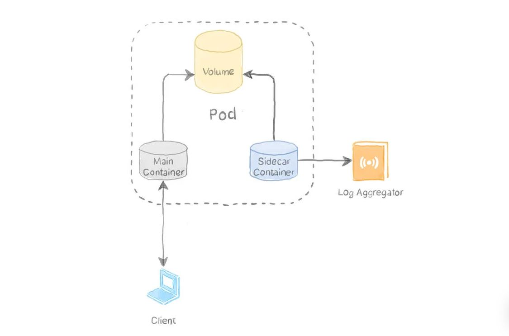

Sidecar containers “help” the main container. Some examples include log or data change watchers, monitoring adapters, and so on. A log watcher, for example, can be built once by a different team and reused across different applications. Another example of a sidecar container is a file or data loader that generates data for the main container.

Sample Code

	# Example YAML configuration for the sidecar pattern.

	# It defines a main application container which writes
	# the current date to a log file every five seconds.

	# The sidecar container is nginx serving that log file.
	# (In practice, your sidecar is likely to be a log collection
	# container that uploads to external storage.)

	# To run:
	#   kubectl apply -f pod.yaml

	# Once the pod is running:
	#   
	#   (Connect to the sidecar pod)
	#   kubectl exec pod-with-sidecar -c sidecar-container -it bash
	#   
	#   (Install curl on the sidecar)
	#   apt-get update && apt-get install curl
	#   
	#   (Access the log file via the sidecar)
	#   curl 'http://localhost:80/app.txt'

	apiVersion: v1
	kind: Pod
	metadata:
	  name: pod-with-sidecar
	spec:
	  # Create a volume called 'shared-logs' that the
	  # app and sidecar share.
	  volumes:
	  - name: shared-logs 
	    emptyDir: {}

	  # In the sidecar pattern, there is a main application
	  # container and a sidecar container.
	  containers:

	  # Main application container
	  - name: app-container
	    # Simple application: write the current date
	    # to the log file every five seconds
	    image: alpine # alpine is a simple Linux OS image
	    command: ["/bin/sh"]
	    args: ["-c", "while true; do date >> /var/log/app.txt; sleep 5;done"]

	    # Mount the pod's shared log file into the app 
	    # container. The app writes logs here.
	    volumeMounts:
	    - name: shared-logs
	      mountPath: /var/log

	  # Sidecar container
	  - name: sidecar-container
	    # Simple sidecar: display log files using nginx.
	    # In reality, this sidecar would be a custom image
	    # that uploads logs to a third-party or storage service.
	    image: nginx:1.7.9
	    ports:
	      - containerPort: 80

	    # Mount the pod's shared log file into the sidecar
	    # container. In this case, nginx will serve the files
	    # in this directory.
	    volumeMounts:
	    - name: shared-logs
	      mountPath: /usr/share/nginx/html # nginx-specific mount path

#   Short Names
        netops@arg048vmlinuxdev:~$ kubectl api-resources
        NAME                              SHORTNAMES   APIVERSION                             NAMESPACED   KIND
        bindings                                       v1                                     true         Binding
        componentstatuses                 cs           v1                                     false        ComponentStatus
        configmaps                        cm           v1                                     true         ConfigMap
        endpoints                         ep           v1                                     true         Endpoints
        events                            ev           v1                                     true         Event
        limitranges                       limits       v1                                     true         LimitRange
        namespaces                        ns           v1                                     false        Namespace
        nodes                             no           v1                                     false        Node
        persistentvolumeclaims            pvc          v1                                     true         PersistentVolumeClaim
        persistentvolumes                 pv           v1                                     false        PersistentVolume
        pods                              po           v1                                     true         Pod
        podtemplates                                   v1                                     true         PodTemplate
        replicationcontrollers            rc           v1                                     true         ReplicationController
        resourcequotas                    quota        v1                                     true         ResourceQuota
        secrets                                        v1                                     true         Secret
        serviceaccounts                   sa           v1                                     true         ServiceAccount
        services                          svc          v1                                     true         Service
        mutatingwebhookconfigurations                  admissionregistration.k8s.io/v1        false        MutatingWebhookConfiguration
        validatingwebhookconfigurations                admissionregistration.k8s.io/v1        false        ValidatingWebhookConfiguration
        customresourcedefinitions         crd,crds     apiextensions.k8s.io/v1                false        CustomResourceDefinition
        apiservices                                    apiregistration.k8s.io/v1              false        APIService
        controllerrevisions                            apps/v1                                true         ControllerRevision
        daemonsets                        ds           apps/v1                                true         DaemonSet
        deployments                       deploy       apps/v1                                true         Deployment
        replicasets                       rs           apps/v1                                true         ReplicaSet
        statefulsets                      sts          apps/v1                                true         StatefulSet
        tokenreviews                                   authentication.k8s.io/v1               false        TokenReview
        localsubjectaccessreviews                      authorization.k8s.io/v1                true         LocalSubjectAccessReview
        selfsubjectaccessreviews                       authorization.k8s.io/v1                false        SelfSubjectAccessReview
        selfsubjectrulesreviews                        authorization.k8s.io/v1                false        SelfSubjectRulesReview
        subjectaccessreviews                           authorization.k8s.io/v1                false        SubjectAccessReview
        horizontalpodautoscalers          hpa          autoscaling/v1                         true         HorizontalPodAutoscaler
        cronjobs                          cj           batch/v1                               true         CronJob
        jobs                                           batch/v1                               true         Job
        certificatesigningrequests        csr          certificates.k8s.io/v1                 false        CertificateSigningRequest
        leases                                         coordination.k8s.io/v1                 true         Lease
        endpointslices                                 discovery.k8s.io/v1                    true         EndpointSlice
        events                            ev           events.k8s.io/v1                       true         Event
        ingresses                         ing          extensions/v1beta1                     true         Ingress
        flowschemas                                    flowcontrol.apiserver.k8s.io/v1beta1   false        FlowSchema
        prioritylevelconfigurations                    flowcontrol.apiserver.k8s.io/v1beta1   false        PriorityLevelConfiguration
        ingressclasses                                 networking.k8s.io/v1                   false        IngressClass
        ingresses                         ing          networking.k8s.io/v1                   true         Ingress
        networkpolicies                   netpol       networking.k8s.io/v1                   true         NetworkPolicy
        runtimeclasses                                 node.k8s.io/v1                         false        RuntimeClass
        poddisruptionbudgets              pdb          policy/v1                              true         PodDisruptionBudget
        podsecuritypolicies               psp          policy/v1beta1                         false        PodSecurityPolicy
        clusterrolebindings                            rbac.authorization.k8s.io/v1           false        ClusterRoleBinding
        clusterroles                                   rbac.authorization.k8s.io/v1           false        ClusterRole
        rolebindings                                   rbac.authorization.k8s.io/v1           true         RoleBinding
        roles                                          rbac.authorization.k8s.io/v1           true         Role
        priorityclasses                   pc           scheduling.k8s.io/v1                   false        PriorityClass
        csidrivers                                     storage.k8s.io/v1                      false        CSIDriver
        csinodes                                       storage.k8s.io/v1                      false        CSINode
        csistoragecapacities                           storage.k8s.io/v1beta1                 true         CSIStorageCapacity
        storageclasses                    sc           storage.k8s.io/v1                      false        StorageClass
        volumeattachments                              storage.k8s.io/v1                      false        VolumeAttachment
        netops@arg048vmlinuxdev:~$

#   What are Init Containers?

In Kubernetes, an init container is the one that starts and executes before other containers in the same Pod. It’s meant to perform initialization logic for the main application hosted on the Pod. For example, create the necessary user accounts, perform database migrations, create database schemas and so on.

Each Init Container must complete successfully before the next one is started. So, Init Containers provide an easy way to block or delay the startup of app containers until some set of preconditions are met.

Init Containers run before the main container runs. Normally init containers are used to ensure the server environment is ready for your application to start to run.

#   Some of its properties are :

It contains utilities or setup scripts not present in an app image ( making images light-weight)
They always run to completion
Init container executes sequentially and each of the init containers must succeed before the next can run.
They support all the fields and features of app containers, including resource limits, volumes, and security settings.

#   Init Containers Design Considerations

- [x] They always get executed before other containers in the Pod. So, they shouldn’t contain complex logic that takes a long time to complete.
- [x] Init containers are started and executed in sequence. An init container is not invoked unless its predecessor is completed successfully. Hence, if the startup task is very long, you may consider breaking it into a number of steps, each handled by an init container so that you know which steps fail.
- [x] If any of the init containers fail, the whole Pod is restarted (unless you set restartPolicy to Never). Restarting the Pod means re-executing all the containers again including any init containers. 
- [x] An init container is a good candidate for delaying the application initialization until one or more dependencies are available.
- [x] Init containers cannot use health and readiness probes as application containers do. The reason is that they are meant to start and exit successfully, much like how Jobs and CronJobs behave.

# Scenario-1 (Seeding a Database)

In this scenario, we are serving a MySQL database. This database is used for testing an application. It doesn’t have to contain real data, but it must be seeded with enough data so that we can test the application's query speed. We use an init container to handle downloading the SQL dump file and restore it to the database, which is hosted in another container

    apiVersion: v1
    kind: Pod
    metadata:
      name: mydb
      labels:
        app: db
    spec:
      initContainers:
        - name: fetch
          image: mwendler/wget
          command: ["wget","--no-check-certificate","https://sample-videos.com/sql/Sample-SQL-File-1000rows.sql","-O","/docker-entrypoint-initdb.d/dump.sql"]
          volumeMounts:
            - mountPath: /docker-entrypoint-initdb.d
              name: dump
      containers:
        - name: mysql
          image: mysql
          env:
            - name: MYSQL_ROOT_PASSWORD
              value: "example"
          volumeMounts:
            - mountPath: /docker-entrypoint-initdb.d
              name: dump
      volumes:
        - emptyDir: {}
          name: dump

#   Scenario-2 (Delaying The Application Launch Until The Dependencies Are Ready)

Another common use case for init containers is when you need your application to wait until another service is full running (responding to requests)

    apiVersion: v1
    kind: Pod
    metadata:
      name: myapp-pod
      labels:
        app: myapp
    spec:
      initContainers:
      - name: init-myservice
        image: busybox:1.28
        command: ['sh', '-c', 'until nslookup myservice; do echo waiting for myservice; sleep 2; done;']
      containers:
      - name: myapp-container
        image: busybox:1.28
        command: ['sh', '-c', 'echo The app is running! && sleep 3600']

For completeness, this is the definition file for myservice:

        apiVersion: v1
        kind: Service
        metadata:
          name: myservice
        spec:
          ports:
          - protocol: TCP
            port: 80
            targetPort: 9376

### What are they used for?

These containers are used to prepare the pod to run the main application containers. These tasks can be changing permissions of some files to changing some specific environments. They can also be used as a precheck to verify if the application can be run on this pod.

There may be some tasks that only the root user can do. And since you never want to run your application as a root user as this is a security threat. Init containers can do the task for you that you wanted to run as a root user.

Below is the workflow of how they look like.

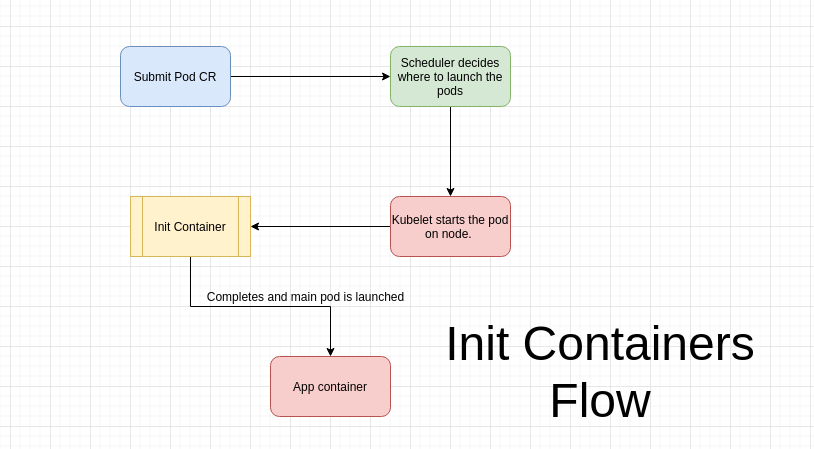

# Deployment & Rollback

    kubectl set image deployment/frontend www=image:v2               # Rolling update "www" containers of "frontend" deployment, updating the image
    kubectl rollout history deployment/frontend                      # Check the history of deployments including the revision 
    kubectl rollout undo deployment/frontend                         # Rollback to the previous deployment
    kubectl rollout undo deployment/frontend --to-revision=2         # Rollback to a specific revision
    kubectl rollout status -w deployment/frontend                    # Watch rolling update status of "frontend" deployment until completion
    kubectl rollout restart deployment/frontend                      # Rolling restart of the "frontend" deployment
--------------------------------------------------------------------------------------------------------------------------------------------------------------

    $ cat d1.yml 
    apiVersion: apps/v1
    kind: Deployment
    metadata:
      name: dep-web
      labels:
        type: web
    spec:
      minReadySeconds: 30
      replicas: 10
      selector:
        matchLabels:
          type: web
      strategy:
        type: RollingUpdate
        rollingUpdate:
          maxSurge: 2
          maxUnavailable: 0
      template:
        metadata:
          labels:
            type: web
        spec:
          containers:
            - name: nginx
              image: coolgourav147/nginx-custom
              ports:
                - containerPort: 80
    
 # $ kubectl apply -f d1.yml 
    deployment.apps/dep-web created
    $ ^C
    $ kubectl get deploy -w
    NAME      READY   UP-TO-DATE   AVAILABLE   AGE
    dep-web   4/10    10           0           9s
    dep-web   5/10    10           0           10s
    dep-web   6/10    10           0           11s
    dep-web   7/10    10           0           13s
    dep-web   8/10    10           0           14s
    dep-web   9/10    10           0           15s
    dep-web   10/10   10           0           16s
    ^C$ 
 # $ kubectl rollout history deployment.apps/dep-web
    deployment.apps/dep-web 
    REVISION  CHANGE-CAUSE
    1         <none>

 # $ kubectl get deploy -o wide --show-labels
    NAME      READY   UP-TO-DATE   AVAILABLE   AGE   CONTAINERS   IMAGES                       SELECTOR   LABELS
    dep-web   10/10   10           10          89s   nginx        coolgourav147/nginx-custom   type=web   type=web
    $ 
 # $ kubectl set image deployment.apps/dep-web nginx=coolgourav147/nginx-custom:v1
    deployment.apps/dep-web image updated
 # $ kubectl get deploy -o wide
    NAME      READY   UP-TO-DATE   AVAILABLE   AGE    CONTAINERS   IMAGES                          SELECTOR
    dep-web   12/10   2            10          2m8s   nginx        coolgourav147/nginx-custom:v1   type=web
 # $ kubectl get deploy -w
    NAME      READY   UP-TO-DATE   AVAILABLE   AGE
    dep-web   12/10   2            10          2m17s
    dep-web   12/10   2            12          2m32s
    dep-web   10/10   2            10          2m32s
    dep-web   10/10   4            10          2m32s
    dep-web   11/10   4            10          2m36s
    dep-web   12/10   4            10          2m37s
    ^C$ kubectl rollout history deployment.apps/dep-web
    deployment.apps/dep-web 
    REVISION  CHANGE-CAUSE
    1         <none>
    2         <none>

 # $ kubectl get deploy -w
    NAME      READY   UP-TO-DATE   AVAILABLE   AGE
    dep-web   12/10   6            10          3m20s
    dep-web   12/10   6            12          3m41s
    dep-web   10/10   6            10          3m41s
    dep-web   10/10   8            10          3m42s
    dep-web   11/10   8            10          3m45s
    dep-web   12/10   8            10          3m46s
 # $ kubectl get deploy -o wide
    NAME      READY   UP-TO-DATE   AVAILABLE   AGE    CONTAINERS   IMAGES                          SELECTOR
    dep-web   12/10   8            10          4m9s   nginx        coolgourav147/nginx-custom:v1   type=web
    $ kubectl get deploy -o wide -w
    NAME      READY   UP-TO-DATE   AVAILABLE   AGE     CONTAINERS   IMAGES                          SELECTOR
    dep-web   12/10   8            10          4m16s   nginx        coolgourav147/nginx-custom:v1   type=web
    dep-web   12/10   8            12          4m16s   nginx        coolgourav147/nginx-custom:v1   type=web
    dep-web   10/10   8            10          4m16s   nginx        coolgourav147/nginx-custom:v1   type=web
    dep-web   10/10   10           10          4m16s   nginx        coolgourav147/nginx-custom:v1   type=web
    dep-web   11/10   10           10          4m19s   nginx        coolgourav147/nginx-custom:v1   type=web
    dep-web   12/10   10           10          4m20s   nginx        coolgourav147/nginx-custom:v1   type=web
    ^C$ 
 # $ kubectl rollout history deployment.apps/dep-web
    deployment.apps/dep-web 
    REVISION  CHANGE-CAUSE
    1         <none>
    2         <none>

 # $ kubectl get  deployment.apps/dep-web
    NAME      READY   UP-TO-DATE   AVAILABLE   AGE
    dep-web   10/10   10           10          7m56s
 # $ kubectl get replicaset
    NAME                 DESIRED   CURRENT   READY   AGE
    dep-web-5f7b676786   10        10        10      6m23s
    dep-web-64bf7df7b5   0         0         0       8m21s
    $ 
    $ 
 # $ kubectl get pod --selector type=web
    NAME                       READY   STATUS    RESTARTS   AGE
    dep-web-5f7b676786-75xvh   1/1     Running   0          5m8s
    dep-web-5f7b676786-795kh   1/1     Running   0          6m51s
    dep-web-5f7b676786-994nb   1/1     Running   0          4m33s
    dep-web-5f7b676786-mkdmn   1/1     Running   0          6m17s
    dep-web-5f7b676786-tk47b   1/1     Running   0          6m17s
    dep-web-5f7b676786-tvrs7   1/1     Running   0          5m8s
    dep-web-5f7b676786-v7gj2   1/1     Running   0          5m42s
    dep-web-5f7b676786-vjfvv   1/1     Running   0          5m42s
    dep-web-5f7b676786-x7xbt   1/1     Running   0          6m51s
    dep-web-5f7b676786-xwhg5   1/1     Running   0          4m33s
 # $ kubectl set image deployment.apps/dep-web nginx=coolgourav147/nginx-custom:v2 --record
    deployment.apps/dep-web image updated
 # $ kubectl get  deployment.apps/dep-web
    NAME      READY   UP-TO-DATE   AVAILABLE   AGE
    dep-web   12/10   2            10          11m
 # $ kubectl rollout history deployment.apps/dep-web
    deployment.apps/dep-web 
    REVISION  CHANGE-CAUSE
    1         <none>
    2         <none>
    3         kubectl set image deployment.apps/dep-web nginx=coolgourav147/nginx-custom:v2 --record=true

 # $ kubectl set image deployment.apps/dep-web nginx=coolgourav147/nginx-custom:v1 --record
    deployment.apps/dep-web image updated
 # $ kubectl rollout history deployment.apps/dep-web
    deployment.apps/dep-web 
    REVISION  CHANGE-CAUSE
    1         <none>
    3         kubectl set image deployment.apps/dep-web nginx=coolgourav147/nginx-custom:v2 --record=true
    4         kubectl set image deployment.apps/dep-web nginx=coolgourav147/nginx-custom:v1 --record=true

 # $ kubectl get deploy -o wide 
    NAME      READY   UP-TO-DATE   AVAILABLE   AGE   CONTAINERS   IMAGES                          SELECTOR
    dep-web   10/10   10           10          12m   nginx        coolgourav147/nginx-custom:v1   type=web
 # $ kubectl rollout history deployment.apps/dep-web  --revision=3
    deployment.apps/dep-web with revision #3
    Pod Template:
      Labels:       pod-template-hash=58857bdc59
            type=web
      Annotations:  kubernetes.io/change-cause: kubectl set image deployment.apps/dep-web nginx=coolgourav147/nginx-custom:v2 --record=true
      Containers:
       nginx:
        Image:      coolgourav147/nginx-custom:v2
        Port:       80/TCP
        Host Port:  0/TCP
        Environment:        <none>
        Mounts:     <none>
      Volumes:      <none>

 # $ kubectl rollout history deployment.apps/dep-web  --revision=4
    deployment.apps/dep-web with revision #4
    Pod Template:
      Labels:       pod-template-hash=5f7b676786
            type=web
      Annotations:  kubernetes.io/change-cause: kubectl set image deployment.apps/dep-web nginx=coolgourav147/nginx-custom:v1 --record=true
      Containers:
       nginx:
        Image:      coolgourav147/nginx-custom:v1
        Port:       80/TCP
        Host Port:  0/TCP
        Environment:        <none>
        Mounts:     <none>
      Volumes:      <none>

 # $ kubectl rollout history deployment.apps/dep-web
    deployment.apps/dep-web 
    REVISION  CHANGE-CAUSE
    1         <none>
    3         kubectl set image deployment.apps/dep-web nginx=coolgourav147/nginx-custom:v2 --record=true
    4         kubectl set image deployment.apps/dep-web nginx=coolgourav147/nginx-custom:v1 --record=true

 # $ kubectl rollout history deployment.apps/dep-web  --revision=4
    deployment.apps/dep-web with revision #4
    Pod Template:
      Labels:       pod-template-hash=5f7b676786
            type=web
      Annotations:  kubernetes.io/change-cause: kubectl set image deployment.apps/dep-web nginx=coolgourav147/nginx-custom:v1 --record=true
      Containers:
       nginx:
        Image:      coolgourav147/nginx-custom:v1
        Port:       80/TCP
        Host Port:  0/TCP
        Environment:        <none>
        Mounts:     <none>
      Volumes:      <none>

 # $ kubectl rollout undo deployment.apps/dep-web --to-revision=1
    deployment.apps/dep-web rolled back
 # $ kubectl rollout history deployment.apps/dep-web
    deployment.apps/dep-web 
    REVISION  CHANGE-CAUSE
    3         kubectl set image deployment.apps/dep-web nginx=coolgourav147/nginx-custom:v2 --record=true
    4         kubectl set image deployment.apps/dep-web nginx=coolgourav147/nginx-custom:v1 --record=true
    5         <none>

 # $ kubectl get deploy -o wide
    NAME      READY   UP-TO-DATE   AVAILABLE   AGE   CONTAINERS   IMAGES                       SELECTOR
    dep-web   12/10   2            10          16m   nginx        coolgourav147/nginx-custom   type=web
 # $ kubectl rollout undo deployment.apps/dep-web --to-revision=3
    deployment.apps/dep-web rolled back
 # $ kubectl get deploy -o wide
    NAME      READY   UP-TO-DATE   AVAILABLE   AGE   CONTAINERS   IMAGES                          SELECTOR
    dep-web   10/10   2            10          16m   nginx        coolgourav147/nginx-custom:v2   type=web
 
 # $ kubectl rollout history deployment.apps/dep-web
    deployment.apps/dep-web 
    REVISION  CHANGE-CAUSE
    4         kubectl set image deployment.apps/dep-web nginx=coolgourav147/nginx-custom:v1 --record=true
    5         <none>
    6         kubectl set image deployment.apps/dep-web nginx=coolgourav147/nginx-custom:v2 --record=true

# Rollback Deployment

    $ kubectl rollout history deployment.apps/dep-web
    deployment.apps/dep-web 
    REVISION  CHANGE-CAUSE
    1         <none>
    2         kubectl set image deployment.apps/dep-web nginx=wordpress --record=true
    5         kubectl set image deployment.apps/dep-web nginx=coolgourav147/nginx-custom:v2 --record=true
    6         kubectl set image deployment.apps/dep-web nginx=apache --record=true
    7         kubectl set image deployment.apps/dep-web nginx=coolgourav147/nginx-custom --record=true
    8         kubectl set image deployment.apps/dep-web nginx=coolgourav147/nginx-custom:v1 --record=true

    $ kubectl get deploy -o wide
    NAME      READY   UP-TO-DATE   AVAILABLE   AGE   CONTAINERS   IMAGES                          SELECTOR
    dep-web   10/10   10           10          34m   nginx        coolgourav147/nginx-custom:v1   type=web
    $ kubectl rollout undo deployment.apps/dep-web --to-revision=5
    deployment.apps/dep-web rolled back
    $ kubectl get deploy -o wide
    NAME      READY   UP-TO-DATE   AVAILABLE   AGE   CONTAINERS   IMAGES                          SELECTOR
    dep-web   10/10   2            10          34m   nginx        coolgourav147/nginx-custom:v2   type=web
    
    $ kubectl rollout history deployment.apps/dep-web
    deployment.apps/dep-web 
    REVISION  CHANGE-CAUSE
    1         <none>
    2         kubectl set image deployment.apps/dep-web nginx=wordpress --record=true
    6         kubectl set image deployment.apps/dep-web nginx=apache --record=true
    7         kubectl set image deployment.apps/dep-web nginx=coolgourav147/nginx-custom --record=true
    8         kubectl set image deployment.apps/dep-web nginx=coolgourav147/nginx-custom:v1 --record=true
    9         kubectl set image deployment.apps/dep-web nginx=coolgourav147/nginx-custom:v2 --record=true

    $ kubectl rollout undo deployment.apps/dep-web --to-revision=7
    deployment.apps/dep-web rolled back
    $ kubectl get deploy -w
    NAME      READY   UP-TO-DATE   AVAILABLE   AGE
    dep-web   10/10   3            10          36m
    dep-web   11/10   3            11          36m
    dep-web   11/10   3            11          36m
    dep-web   11/10   3            11          36m
    dep-web   10/10   3            10          36m
    dep-web   10/10   4            10          36m
    dep-web   11/10   4            11          36m
    dep-web   11/10   4            11          36m
    dep-web   10/10   4            10          36m
    dep-web   10/10   5            10          36m
    dep-web   11/10   5            11          36m
    dep-web   11/10   5            11          36m
    dep-web   11/10   5            11          36m
    dep-web   10/10   6            10          36m
    dep-web   11/10   6            11          36m
    dep-web   11/10   7            11          36m
    dep-web   10/10   7            10          36m
    dep-web   11/10   7            11          36m
    dep-web   11/10   7            11          36m
    dep-web   11/10   7            11          36m
    dep-web   10/10   7            10          36m
    dep-web   10/10   8            10          36m
    dep-web   11/10   8            11          36m
    dep-web   11/10   8            11          36m
    dep-web   11/10   8            11          36m
    dep-web   10/10   9            10          36m
    dep-web   11/10   9            11          36m
    dep-web   11/10   10           11          36m
    dep-web   10/10   10           10          36m
    dep-web   11/10   10           11          37m
    dep-web   11/10   10           11          37m
    dep-web   10/10   10           10          37m
    dep-web   11/10   10           11          37m
    dep-web   10/10   10           10          37m
    ^C$ kubectl get deploy -o wide
    NAME      READY   UP-TO-DATE   AVAILABLE   AGE   CONTAINERS   IMAGES                       SELECTOR
    dep-web   10/10   10           10          37m   nginx        coolgourav147/nginx-custom   type=web
    $ 

# Annotations in kubernetes

Annotations allow you to add non-identifying metadata to Kubernetes objects.  Annotations can hold any kind of information that is useful and can provide context to DevOps teams

# Difference between label and annotation kubernetes

Differentiate between Kubernetes labels vs annotations. ... Kubernetes labels allow you to identify, select and operate on Kubernetes objects. Annotations are non-identifying metadata and do none of these things. Annotations allow you to add non-identifying metadata to Kubernetes objects

# Naming Deployment ( annotations )    

    apiVersion: apps/v1
    kind: Deployment
    metadata:
      name: dep-web
      labels:
        type: web
      annotations:
        kubernetes.io/change-cause: rollout coolgourav147/nginx-custom
    spec:
      minReadySeconds: 30
      replicas: 10
      selector:
        matchLabels:
          type: web
      strategy: 
        rollingUpdate:
          maxSurge: 0
          maxUnavailable: 1
      template:
        metadata:
          labels:
            type: web
        spec:
          containers:
            - name: nginx
              image: coolgourav147/nginx-custom
              ports:
                - containerPort: 80
       
 # kubectl rollout history deployment.apps/dep-web
        deployment.apps/dep-web 
        REVISION  CHANGE-CAUSE
        1         <none>
        2         rollout coolgourav147/nginx-custom
        
        $ kubectl apply -f d.yml
        
        $ kubectl rollout history deployment.apps/dep-web
        deployment.apps/dep-web 
        
        REVISION  CHANGE-CAUSE
        1         <none>
        2         rollout coolgourav147/nginx-custom
        3         rollout coolgourav147/nginx-custom:v1

# Rollback Deployment

# kubectl rollout undo deployment.apps/dep-web --to-revision=2

    REVISION  CHANGE-CAUSE
    1         <none>
    3         rollout coolgourav147/nginx-custom:v1
    4         rollout coolgourav147/nginx-custom:v2
    5         rollout coolgourav147/nginx-custom
    
# Apply VS Create

**apply (declarative )** - makes incremental changes to an existing object
kubectl apply works with directories and its sub directories containing object configuration yaml files.
Multiple object configuration files from directories can be picked up. 

    kubectl apply -f directory/

## kubectl apply: declarative management

***In the declarative approach, we need to specify what to do but not how to do it.***

kubectl apply is part of the declarative management approach, where changes that you may have applied to a live object (i.e. through scale) will be "maintained" even if you apply other changes to the object.

In simpler words, apply - makes incremental changes to an existing object by defining what we need.

If you want to version control the k8s object then it's better to use declarative way (kubectl apply) which helps to determine the accuracy of data in k8s objects.

## NOTE: Both kubectl create and apply approaches accepts JSON and YAML file formats. If you want to add a version control to your Kubernetes object, then it’s better to use kubectl apply , which helps determine the accuracy of data in Kubernetes objects.If you want to create a resource for troubleshooting, learning, or interactive experimentation, go with kubectl create.

## These are declarative object config

    kubectl diff -f configs/

    kubectl apply -f configs/

**create (imperative )** - creates a whole new object (previously non-existing / deleted)
kubectl create can work with one object configuration file at a time

## kubectl create: Imperative management

***In the imperative approach, we need to specify what and how to perform a task.***

kubectl create is what we call imperative management. On this approach you tell the Kubernetes API what you want to create, replace or delete.

In simpler words, create creates a whole new object (previously non-existing or deleted).If a resource already exists, it will raise an error.

If you want to just create some resource for troubleshooting, learning or interactive experimentation purpose go with imperative approach (kubectl create).

## These are imperative object config:

    kubectl create -f your-object-config.yaml

    kubectl delete -f your-object-config.yaml

    kubectl replace -f your-object-config.yaml

        kubectl create -f .\my-deployment.yml
        
        deployment.apps "dep-web" created
        
        kubectl create -f .\my-deployment.yml
        
        Error from server (AlreadyExists): error when creating ".\\my-deployment.yml": deployments.apps "dep-web" already exists
        
        kubectl apply -f .\my-deployment.yml 
        
        Warning: kubectl apply should be used on resource created by either kubectl create --save-config or kubectl apply
        
        deployment.apps "dep-web" configured
        
        kubectl delete -f .\my-deployment.yml
        
        deployment.apps "dep-web" deleted
        

    --------------------------------------------------------------------------------------------------------------------------------------------------------------
    
# Port-Forwarding

### What Is Port Forwarding?

Port forwarding redirects a single system’s IP address and port number to another system

### Basic kubectl port-forward Commands

		kubectl port-forward TYPE/NAME [options] LOCAL_PORT:REMOTE_PORT
		kubectl port-forward pod/mongo-db-r3pl1ka3 8080:5762
		
The Kubernetes API now listens on local port 8080 and forwards data to port 5762 on the defined pod.		
		
The port-forward command establishes a tunnel from the target pod to your localhost. The command requires you to define the type or name of the resource as well as local and remote port numbers

		kubectl port-forward service/mongo 28015:27017

Any of the above commands works. The output is similar to this:

		Forwarding from 127.0.0.1:28015 -> 27017
		Forwarding from [::1]:28015 -> 27017
		
# MY DEPLOYMENT

    $ cat deploy.yml 
    apiVersion: apps/v1
    kind: Deployment
    metadata:
      name: dep-web
      labels:
        type: web
      annotations:
        kubernetes.io/change-cause: rollout nginx
    spec:
      minReadySeconds: 30
      replicas: 1
      selector:
        matchLabels:
          type: web
      strategy: 
        rollingUpdate:
          maxSurge: 0
          maxUnavailable: 1
      template:
        metadata:
          labels:
            type: web
        spec:
          containers:
            - name: nginx
              image: nginx
              ports:
                - containerPort: 80
              # resources:
              #   limits:
              #     memory: 200Mi
              #     cpu: 1
              #   requests:
              #     memory: 100Mi
              #     cpu: 0.5
    $ cat service.yml 
    apiVersion: v1
    kind: Service
    metadata:
      name: svc-web
    spec:
      type: ClusterIP
      selector:
        type: web
      ports:
        - name: container-web
          port: 8080
          targetPort: 80
    $ 
    $ 
    $ kubectl get all
    NAME                           READY   STATUS    RESTARTS   AGE
    pod/dep-web-59f557c6bf-qsmzc   1/1     Running   0          112s

    NAME                 TYPE        CLUSTER-IP      EXTERNAL-IP   PORT(S)    AGE
    service/kubernetes   ClusterIP   10.96.0.1       <none>        443/TCP    3m21s
    service/svc-web      ClusterIP   10.96.193.252   <none>        8080/TCP   112s

    NAME                      READY   UP-TO-DATE   AVAILABLE   AGE
    deployment.apps/dep-web   1/1     1            1           112s

    NAME                                 DESIRED   CURRENT   READY   AGE
    replicaset.apps/dep-web-59f557c6bf   1         1         1       112s
    $ 
    $ 
    $ curl 10.96.193.252:8080
    <!DOCTYPE html>
    <html>
    <head>
    <title>Welcome to nginx!</title>
    
    </head>
    <body>
    <h1>Welcome to nginx!</h1>
    
If you see this page, the nginx web server is successfully installed and
    working. Further configuration is required.

    
For online documentation and support please refer to
    <a href="http://nginx.org/">nginx.org</a>. 
    Commercial support is available at
    <a href="http://nginx.com/">nginx.com</a>.

    
<em>Thank you for using nginx.</em>

    </body>
    </html>
    $ 

    $ cat pod.yml 
    apiVersion: v1
    kind: Pod
    metadata:
      name: pod-web
      labels:
        type: web
    spec:
      containers:
        - name: container-cool
          image: coolgourav147/nginx-custom
          imagePullPolicy: Always
    
    $ curl 10.96.193.252:8080
    <!DOCTYPE html>
    <html>
    <head>
    <title>Welcome to nginx!</title>
    
    </head>
    <body>
    <h1>Welcome to nginx!</h1>
    
If you see this page, the nginx web server is successfully installed and
    working. Further configuration is required.

    
For online documentation and support please refer to
    <a href="http://nginx.org/">nginx.org</a>. 
    Commercial support is available at
    <a href="http://nginx.com/">nginx.com</a>.

    
<em>Thank you for using nginx.</em>

    </body>
    </html>
    
    $ curl 10.96.193.252:8080
    <!DOCTYPE html>
    <html>
    <head>
    <link rel="stylesheet" href="https://cdnjs.cloudflare.com/ajax/libs/font-awesome/4.7.0/css/font-awesome.min.css">
    
    <title>Gaurav Sharma</title>
    </head>
    <body>

    <h2 style="text-align:center">User Profile Card-latest</h2>

    

      
      <h1>Gourav Sharma</h1>
      
Software Engineer

      
Rajasthan

      

        <a href="https://www.linkedin.com/in/crgaurav/" target="_blank"><i class="fa fa-linkedin"></i></a>  
        <a href="https://www.facebook.com/coolgaurav147" target="_blank"><i class="fa fa-facebook"></i></a>
        <a href="https://www.youtube.com/gouravsharma" target="_blank"><i class="fa fa-youtube"></i></a> 
        <a href="https://t.me/crgaurav" target="_blank"><i class="fa fa-telegram"></i></a>
        <a href="skype:gaurav.sharma6421?chat" target="_blank"><i class="fa fa-skype"></i></a>
      

      
<button>Contact</button>

    

    </body>
    </html>
    $ 

# What is a Kubernetes Namespace?

Namespaces are a way to organize clusters into virtual sub-clusters — they can be helpful when different teams or projects share a Kubernetes cluster. Any number of namespaces are supported within a cluster, each logically separated from others but with the ability to communicate with each other. Namespaces cannot be nested within each other.

Any resource that exists within Kubernetes exists either in the default namespace or a namespace that is created by the cluster operator. **Only nodes and persistent storage volumes exist outside of the namespace;** these low-level resources are always visible to every namespace in the clus

# What is the “default” namespace in Kubernetes?

Kubernetes comes with three namespaces out-of-the-box. They are:

default: As its name implies, this is the namespace that is referenced by default for every Kubernetes command, and where every Kubernetes resource is located by default. Until new namespaces are created, the entire cluster resides in ‘default’.

kube-system: Used for Kubernetes components and should be avoided.

kube-public: Used for public resources. Not recommended for use by users.

# Why use Kubernetes namespaces?

There are many use cases for Kubernetes namespaces, including:

Allowing teams or projects to exist in their own virtual clusters without fear of impacting each other’s work. 
Enhancing role-based access controls (RBAC) by limiting users and processes to certain namespaces. 
Enabling the dividing of a cluster’s resources between multiple teams and users via resource quotas.
Providing an easy method of separating development, testing, and deployment of containerized applications enabling the entire lifecycle to take place on the same cluster.

# How do you switch between Kubernetes namespaces?

    $ kubectl config set-context --current --namespace=ns-dev
    Context "minikube" modified.
    
    $ kubectl config set-context --current --namespace=ns-dev
    Context "minikube" modified.
    $ kubectl delete ns ns-dev
    namespace "ns-dev" deleted

# How to check current namespace

	$ kubectl config view --minify | grep namespace
    		namespace: ns-dev

# Inter-Namespace communication

Namespaces are isolated from each other, but service in one namespace can still talk to a service in another namespace.

For example, consider frontend and backend as services in different namespaces need to communicate with each other.

In this case, you can use the built-in DNS service discovery provided by Kubernetes and just point your app by its FQDN (fully qualified domain name).

**curl svc-web.default.svc.cluster.local**

Syntax for it :

    <service-name>.<namespace>.svc.cluster.local
    
    $ ls -lrt
    total 16
    drwxr-xr-x 2 root root 4096 Mar  1  2020 Desktop
    -rw-r--r-- 1 root root   62 Aug 17 05:02 ns.yml
    -rw-r--r-- 1 root root  192 Aug 17 05:02 pod.yml
    -rw-r--r-- 1 root root  202 Aug 17 05:02 service.yml
    $ 
    $ k get all
    NAME                 TYPE        CLUSTER-IP   EXTERNAL-IP   PORT(S)   AGE
    service/kubernetes   ClusterIP   10.96.0.1    <none>        443/TCP   2m
    $ k get po -o wide -show-labels
    Unable to connect to the server: dial tcp: lookup how-labels on 8.8.8.8:53: no such host
    $ k get po -o wide --show-labels
    No resources found in default namespace.
    $ 
    $ k get svc -o wide --show-labels
    NAME         TYPE        CLUSTER-IP   EXTERNAL-IP   PORT(S)   AGE     SELECTOR   LABELS
    kubernetes   ClusterIP   10.96.0.1    <none>        443/TCP   2m41s   <none>     component=apiserver,provider=kubernetes
    $ 
    $ cat ns.yml 
    apiVersion: v1
    kind: Namespace
    metadata:
      name: ns-dev
    spec:
    $ cat pod.yml 
    apiVersion: v1
    kind: Pod
    metadata:
      name: pod-web
      labels:
        type: web
    spec:
      containers:
        - name: container-cool
          image: coolgourav147/nginx-custom
          imagePullPolicy: Always
    $ cat service.yml 
    apiVersion: v1
    kind: Service
    metadata:
      name: svc-web
    spec:
      type: NodePort

      selector:
        type: web
      ports:
        - name: container-web
          port: 80
          targetPort: 80
          nodePort: 30032
    $ 

    $ k apply -f .
    namespace/ns-dev configured
    pod/pod-web unchanged
    service/svc-web created
    $ 
    $ k get all
    NAME          READY   STATUS    RESTARTS   AGE
    pod/pod-web   1/1     Running   0          40s

    NAME                 TYPE        CLUSTER-IP     EXTERNAL-IP   PORT(S)        AGE
    service/kubernetes   ClusterIP   10.96.0.1      <none>        443/TCP        7m2s
    service/svc-web      NodePort    10.103.91.40   <none>        80:30032/TCP   16s
    $ k get po -o wide --show-labels
    NAME      READY   STATUS    RESTARTS   AGE   IP           NODE       NOMINATED NODE   READINESS GATES   LABELS
    pod-web   1/1     Running   0          47s   172.18.0.6   minikube   <none>           <none>            type=web
    $ k get svc -o wide --show-labels
    NAME         TYPE        CLUSTER-IP     EXTERNAL-IP   PORT(S)        AGE     SELECTOR   LABELS
    kubernetes   ClusterIP   10.96.0.1      <none>        443/TCP        7m19s   <none>     component=apiserver,provider=kubernetes
    svc-web      NodePort    10.103.91.40   <none>        80:30032/TCP   33s     type=web   <none>
    $ 
    $ k get ns
    NAME                   STATUS   AGE
    default                Active   7m22s
    kube-node-lease        Active   7m24s
    kube-public            Active   7m24s
    kube-system            Active   7m24s
    kubernetes-dashboard   Active   7m16s
    ns-dev                 Active   60s
    $ 
    $ k get svc -n ns-dev
    No resources found in ns-dev namespace.
    $ k get pod -n ns-dev
    No resources found in ns-dev namespace.
    $ 
    $ k apply -f pod.yml  -n ns-dev
    pod/pod-web created
    $ k get pod -n ns-dev
    NAME      READY   STATUS    RESTARTS   AGE
    pod-web   1/1     Running   0          3s
    $ 
    $ k exec -it pod-web -- bash -n ns-dev
    bash: ns-dev: No such file or directory
    command terminated with exit code 127
    $ k exec -it pod-web -n ns-dev -- bash
    root@pod-web:/# 
    root@pod-web:/# curl svc-web.default.svc.cluster.local
    <!DOCTYPE html>
    <html>
    <head>
    <link rel="stylesheet" href="https://cdnjs.cloudflare.com/ajax/libs/font-awesome/4.7.0/css/font-awesome.min.css">
    
    <title>Gaurav Sharma</title>
    </head>
    <body>

    <h2 style="text-align:center">User Profile Card-latest</h2>

    

      
      <h1>Gourav Sharma</h1>
      
Software Engineer

      
Rajasthan

      

        <a href="https://www.linkedin.com/in/crgaurav/" target="_blank"><i class="fa fa-linkedin"></i></a>  
        <a href="https://www.facebook.com/coolgaurav147" target="_blank"><i class="fa fa-facebook"></i></a>
        <a href="https://www.youtube.com/gouravsharma" target="_blank"><i class="fa fa-youtube"></i></a> 
        <a href="https://t.me/crgaurav" target="_blank"><i class="fa fa-telegram"></i></a>
        <a href="skype:gaurav.sharma6421?chat" target="_blank"><i class="fa fa-skype"></i></a>
      

      
<button>Contact</button>

    

    </body>
    </html>
    root@pod-web:/#     

# Kubernetes Applying Namespace Resource Quota and Limits for Pods

The resource quota is the total available resources for a particular namespace, while limit range is used to assign limits for containers(Pods) running inside the namespace.

# Namespace ResourceQuotas

After creating Namespaces, we can use the ResourceQuota object to limit down the total amount of resource used by the namespace. We can use ResourceQuota to set limits for different object types that can be created within a namespace along with setting quotas for resources like CPU and memory.

A ResourceQuota for setting quota on resources looks like this:

    apiVersion: v1
    kind: ResourceQuota
    metadata:
      name: quota
    spec:
      hard:
        limits.cpu: "2"
        limits.memory: 2Gi
        requests.cpu: ".5"
        requests.memory: 1Gi
        pods: "2"

### Following are the resource quotas set:

**limits.cpu** is the maximum CPU cores limit for all the containers(Pods) in the Namespace, i.e. the entire namespace.

**limits.memory** is the maximum Memory limit for all containers(Pods) in the Namespace, i.e. the entire namespace.

**requests.cpu** is the maximum CPU millicores allocated for all the containers(Pods) in the Namespace. As per the above YAML, we can have 5 containers with 600m requests, 10 containers with 300m requests, etc. The total requested CPU in the Namespace should be less than 3000m.

**requests.memory** is the maximum Memory allocated for all the containers(Pods) in the Namespace. As per the above YAML, we can have 5 containers with 200MiB requests, 10 containers with 100MiB CPU requests, or 1 container with a 1000MiB or 1Gi request.

**pods** is the maximum number of pods allowed in the namespace.

# LimitRange for Containers(Pods)

We can also create a LimitRange object in our Namespace which can be used to set limits on resources on containers(Pods) running within the namespace. This is used to provide default limit values for Pods which do not specify this value themeselves to equally distribute resources within a namespace.

A LimitRange provides constraints that can:

Apply minimum and maximum cpu resources usage limit per Pod or Container in a namespace.

Apply minimum and maximum memory request limit per PersistentVolumeClaim in a namespace.

Set a ratio between request and limit for a resource in a namespace.

Set default request/limit for resources within a namespace and then automatically set the limits to Containers at runtime

Here is a sample LimitRange YAML file:

    apiVersion: v1
    kind: LimitRange
    metadata:
      name: sample
    spec:
      limits:
      - max:
          cpu: 1000m
          memory: 1Gi
        min:
          cpu: 10m
          memory: 10Mi
        default:
          cpu: 600m
          memory: 100Mi
        defaultRequest:
          cpu: 100m
          memory: 50Mi
        type: Container

The above YAML file has 4 sections, max, min, default, and defaultRequest.

The default section will set up the default limits for a container in a pod. Any container with no limits defined will get these values assigned as default.

The defaultRequest section will set up the default requests for a container in a pod. Any container with no requests defined will get these values assigned as default.

The max section will set up the maximum limits that a container in a Pod can set. The value specified in the default section cannot be higher than this value. Also, limits set on a container cannot be higher than this value. One important point to note here is that if max value is set and the default section is not set, then any containers that don't explicitly set these values themselves will get the max values assigned to it as the limit.

The min section will set up the minimum Requests that a container in a Pod can set. The value specified in the defaultRequest section cannot be lower than this value. Similarly, requests set on a container cannot be lower than this value. One important point to note here is that if min value is set and the defaultRequest section is not set, then the min value becomes the defaultRequest value too.

    kubectl describe ns ns-dev
    Name:         ns-dev
    Labels:       kubernetes.io/metadata.name=ns-dev
    Annotations:  <none>
    Status:       Active

    Resource Quotas
      Name:            quo-ns-dev
      Resource         Used  Hard
      --------         ---   ---
      pods             1     2
      Name:            quota
      Resource         Used  Hard
      --------         ---   ---
      limits.cpu       0     2
      limits.memory    0     2Gi
      pods             1     2
      requests.cpu     0     500m
      requests.memory  0     1Gi

    Resource Limits
     Type       Resource  Min   Max  Default Request  Default Limit  Max Limit/Request Ratio
     ----       --------  ---   ---  ---------------  -------------  -----------------------
     Container  cpu       10m   1    100m             600m           -
     Container  memory    10Mi  1Gi  50Mi             100Mi          -

# Readiness and Liveness Probes in Kubernetes

Kubernetes automatically checks if a pod is healthy and also when it is ready to accept traffic. These checks are done using a readiness probe and liveness probe respectively.

# Liveness Probe

Kubernetes regularly checks whether a pod is still alive or not. To check that, Kubernetes sends a request to the URL and port configured in the liveness section of the deployment. If the request returns an HTTP code greater or equal to 200 but less than 400, the pod is considered healthy. In every other case, the pod is considered dead and will be restarted. A liveness probe looks as follows:

    livenessProbe:
      httpGet:
        path: /health
        port: http

# Readiness Probe

The readiness probe works the same way as the liveness probe except that it is only executed to determine whether a pod is ready to receive traffic after startup. A readiness probe looks as follows:

    readinessProbe:
      httpGet:
        path: /health
        port: http
        
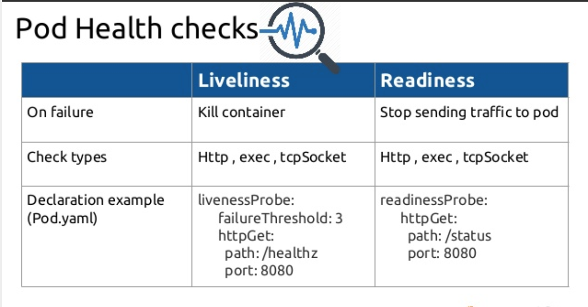        

# Node Affinity

### What is Node Affinity?
Node affinity is objectively used to perform the same task as nodeSelector where it allows you to constrain which nodes your pod is eligible to be scheduled on, based on labels on the node. But it differs in its ability to make this constraint become more expressive
The affinity language in node affinity offers the protocols or matching rule based on logical OR/ AND operation, NOT operations, etc..

Let’s write the Pod definition

	   apiVersion: v1
	   kind: Pod
	   metadata:
	     name: node-affinity-demo
	     labels:
	       env: staging
	   spec:
	     containers:
	      - name: node-affinity-demo
		image: nginx
	     affinity:
	      nodeAffinity:
		requiredDuringSchedulingIgnoredDuringExecution:
		  nodeSelectorTerms:
		  - matchExpressions:
		    - key: size
		      operator: In
		      values:
		      - large
		    -   small
            
In node selector, we used nodeSelector field under the Spec, but here in the pod definition, it is replaced by more complex terms as shown below

	   affinity:
	    nodeAffinity:
	      requiredDuringSchedulingIgnoredDuringExecution:
		nodeSelectorTerms:
		- matchExpressions:
		  - key: size
		    operator: In
		    values:
		    - large
		    - small

It has :
key: which defines the parameter like size
operator: here we place the operator: In, it can also have the values like NotIn, Exists. There are more operators which one need to refer to in the Kubernetes doc
value: which defines values for the keys like, large, medium, medium and small, medium or large, only medium, not small, etc..
It can hold multiple values like

# Node selector 

The node selector is one such mechanism or constraint which we can apply to our pod to ensure that it is placed into a particular type of Node. One has to specify the field "nodeSelector"

### Attach Labels To The Node You Want :

     $ kubectl label node minikube size=large

### Create a Pod definition and make use of nodeSelector 

	   apiVersion: v1
	    kind: Pod
	    metadata:
	      name: nginx
	      labels:
		env: staging
	    spec:
	      containers:
	      - name: nginx
		image: nginx

	      nodeSelector:
		size: large

### Limitation - You can not run the pod on a node based on expression (size: large or medium / size: Not Small) 

This type of logical expression type of selection cannot be achieved by nodeSelector, for this one has to use "Node Affinity"

Node affinity is conceptually similar to nodeSelector – it allows you to constrain which nodes your pod is eligible to schedule on, based on labels on the node. There are currently two types of node affinity, called

		requiredDuringSchedulingIgnoredDuringExecution
		preferredDuringSchedulingIgnoredDuringExecution

The new node affinity syntax supports the following operators: In,NotIn,Exists,DoesNotExist,Gt,Lt.

# Node taint

In Kubernetes, node taints and tolerations function in a manner similar to node affinity rules, though they take the almost opposite approach. Affinity rules are set for Pods to attract them to specific nodes. A tainted node repels pods that do not have tolerations for those nodes set. Together, taints and tolerations make sure that pods are not scheduled onto inappropriate nodes.

### Why Use Taints and Tolerations

Kubernetes taints and tolerations allow you to create special nodes that are reserved for specific uses or only run specific processes (Pods) that match the node. You may wish to keep workloads off or your Kubernetes management nodes and tainting nodes so that no workload Pod would have matching tolerations would keep them from being scheduled to those nodes.  You may have nodes with specialized hardware for specific jobs (e.g GPUs) and tainting such nodes can reserve it so that the Pods that specifically need that resource type can be scheduled
to those nodes when needed.

### Why we need Taints and Tolerations?

Taints and tolerations will ensure that a given Pod does not end up on the inappropriate node.

If the taint is applied to a node, only those Pods that have tolerations for this taint can be scheduled onto that node.

The taints and toleration are all about the relationship between the pod and node.
Taints and Toleration will tell what pods can be placed on what nodes.

### Applying Taints and Tolerations

Taints are applied to a node using kubectl, for example:

	kubectl taint nodes machineLearningNode1=computer-vision:NoSchedule

### Node taints are key-value pairs associated with an effect. Here are the available effects/types:

**NoSchedule**: Pods that do not tolerate this taint are not scheduled on the node; existing Pods are not evicted from the node.(PODs will not be scheduled on the node.)

**PreferNoSchedule**: Kubernetes avoids scheduling Pods that do not tolerate this taint onto the node.(Kubernetes will try not to place the pod on the node, but it is not guaranteed.)

**NoExecute**: Pod is evicted from the node if it is already running on the node, and is not scheduled onto the node if it is not yet running on the node.(New pods will not be placed on the node and the existing will be moved out if those could not tolerate the current taint rule.)
Note that some system Pods (for example, kube-proxy and fluent-bit) tolerate all NoExecute and NoSchedule taints, and will not be evicted.

### How to set a Taint on the node?

	kubectl taint nodes [NODE_NAME] [KEY]=[VALUE]:[EFFECT]
	
	
Example — On Master Node:

	root@ip-172–31–56–82:~# kubectl get nodes
	NAME STATUS ROLES AGE VERSION
	ip-172–31–51–231 Ready <none> 34d v1.17.2
	ip-172–31–56–82 Ready master 34d v1.17.2
	root@ip-172–31–56–82:~# kubectl taint node ip-172-31-51-231 app=uber:NoSchedule
	node/ip-172-31-51-231 tainted

How to verify the Taint?	
	
	kubectl describe node <node-name>| grep Taints:

	root@ip-172-31-56-82:~# kubectl describe node ip-172-31-51-231 |grep Taints:
	Taints:             app=uber:NoSchedule	
	
Launch the Nginx POD on the Tainted node and see what happens
In the above section, we had set up Taint on the node “IP-172–31–51–231”. If you try to launch the Nginx POD now, then the POD will go into PENDING state.
On the Master Node:
Create an NGINX pod configuration file,
	
	# vim nginx.yaml
	apiVersion: v1
	kind: Pod
	metadata:
	  name: nginx
	  labels:
	    env: test
	spec:
	  containers:
	  - name: nginx
	    image: nginx
	    imagePullPolicy: IfNotPresent

Save and close the file, and run below command to create the pod,
	
	root@ip-172-31-56-82:~# kubectl get pods
	NAME                       READY   STATUS    RESTARTS   AGE

	nginx                      0/1     Pending   0          5s
	
	
Here, the POD will be in PENDING state, because we have only one worker node, and we tainted the worker node as “NoSchedule” which means no POD can be launched into it unless it has matching toleration.

	Events:
	Type     Reason            Age        From               Message
	----     ------            ----       ----               -------
	Warning  FailedScheduling  <unknown>  default-scheduler  0/2 nodes are available: 2 node(s) had taints that the pod didn't tolerate.
	
If you see logs of the Nginx pod, it says nodes are NOT available, which means both the Master and Worker nodes are Tainted so the Nginx POD cannot be placed in either of them.
Note: By default, Kubernetes Master node will be tainted with the “NoSchedule” effect.

### How to set Toleration?

So in order to launch the Nginx POD, let’s set the Toleration on Nginx POD like below	
	
	# vim nginx.yaml
	apiVersion: v1
	kind: Pod
	metadata:
	  name: nginx
	  labels:
	    env: test
	spec:
	  containers:
	  - name: nginx
	    image: nginx
	  tolerations:
	  - key: "app"
	    operator: "Exists"
	    effect: "NoSchedule"	

Using Value

	tolerations:
	- key: "app"
	  operator: "Equal"
	  value: "uber"
  	  effect: "NoSchedule"

A toleration “matches” a taint if the keys are the same and the effects are the same
	
### Verification:
	
Now check the POD status, it should be placed on the node “ip-172–31–51–231”
	
	root@ip-172-31-56-82:~# kubectl get pods -o wide
	NAME                       READY   STATUS    RESTARTS   AGE     IP            NODE               NOMINATED NODE   READINESS GATES

	nginx                      1/1     Running   0          3m44s   10.244.1.83   ip-172-31-51-231   <none>           <none>

### How to remove Taint on the node?

To remove the taint, you have to use the [KEY] and [EFFECT] ending with [-].
In the above example, we have used KEY=app, VALUE=uber and EFFECT=NoSchedule, so use these values like below to remove the taint
	kubectl taint nodes <node-name> [KEY]:[EFFECT]-
	
	root@ip-172–31–56–82:~# kubectl taint nodes ip-172-31-51-231 app:NoSchedule-
	node/ip-172-31-51-231 untainted
	root@ip-172-31-56-82:~# kubectl describe node ip-172-31-51-231 |grep Taints:
	Taints:             <none>

### Key Points to Remember:
	
Taints are set on ‘Nodes’ and Toleration level is set on ‘Pods’.

By default, pods are not tolerant of Taints.

Taint and Toleration do not tell the POD to go to a particular node instead it tells the NODE to only accept pods with a certain tolerance. So in this case, suppose if a node does not have any taint, then it is possible that a pod that has toleration set will land on the untainted node. There is no guarantee that all pods which have toleration set will land on tainted nodes, it might also land on untainted nodes.

If you want to restrict a POD to specific nodes(Only tainted), then it can be achieved by another concept called ’node affinity’.

Assume node-1 exists and inside that pod-1 and pod-2 is running without any Taint and Toleration. Now if you add Taint to node-1 and set toleration to pod-1, then pod-1 will continue to run on node-1 but pod-2 might become intolerant and will be killed.
	
### Using Multiple Taints

It is possible to apply more than one taint to a single node and more than one toleration to a single Pod. Multiple taints and tolerations are used by Kubernetes like a filter. Taint’s matching a Pod’s tolerations are ignored. The remaining taint effects are then applied to the Pod. Some of the effects include

Kubernetes will not schedule the Pod if at least one non-tolerated taint has a NoSchedule effect.
Kubernetes will try not to schedule the Pod on the node if at least one non-tolerated taint has a PreferNoSchedule effect.
A NoExecute taint will cause Kubernetes to evict the Pod if it is currently running on the node or will not schedule the Pod the node.

***Node affinity is a property of Pods that attracts them to a set of nodes (either as a preference or a hard requirement). Taints are the opposite -- they allow a node to repel a set of pods*** Node affinity is a way to set rules based on which the scheduler can select the nodes for scheduling workload. Node affinity can be thought of as the opposite of taints. Taints repel a certain set of nodes whereas node affinity attracts a certain set of nodes.

# JSONPath

Kubectl supports JSONPath template.

JSONPath template is composed of JSONPath expressions enclosed by curly braces {}. Kubectl uses JSONPath expressions to filter on specific fields in the JSON object and format the output.

Examples using kubectl and JSONPath expressions:

	kubectl get pods -o json
	kubectl get pods -o=jsonpath='{@}'
	kubectl get pods -o=jsonpath='{.items[0]}'
	kubectl get pods -o=jsonpath='{.items[0].metadata.name}'
	kubectl get pods -o=jsonpath="{.items[*]['metadata.name', 'status.capacity']}"
	kubectl get pods -o=jsonpath='{range .items[*]}{.metadata.name}{"\t"}{.status.startTime}{"\n"}{end}'
	
Sample pod manifest

	apiVersion: v1
	 kind: Pod
	 metadata:
	   name: web-server
	   labels:
	     app: web
	 spec:
	   containers:
	     - name: nginx-container
	       image: nginx
	       imagePullPolicy: Always

Expression to extract the name of the pod using JSONpath

	kubectl get pods -o=jsonpath='{.items[0].metadata.name}'
	OUTPUT
	web-server
	

### Best Secure Your Kubernetes Deployment
	1. Enable Kubernetes Role-Based Access Control (RBAC)
	2. Use Third-Party Authentication for API Server
	3. Protect etcd with TLS, Firewall and Encryption
	4. Isolate Kubernetes Nodes
	5. Monitor Network Traffic to Limit Communications
	6. Use Process Whitelisting
	7. Turn on Audit Logging
	8. Keep Kubernetes Version Up to Date
	9. Lock Down Kubelet

### Locking down your container's Linux kernels
Locking it down with AppArmor or SELinux. 	
	
Security-Enhanced Linux (SELinux) is a security architecture for Linux® systems that allows administrators to have more control over who can access the system. It was originally developed by the United States National Security Agency (NSA) as a series of patches to the Linux kernel using Linux Security Modules (LSM).

SELinux defines access controls for the applications, processes, and files on a system. It uses security policies, which are a set of rules that tell SELinux what can or can’t be accessed, to enforce the access allowed by a policy. 

	
If SELinux has been disabled in your environment, you can enable SElinux by editing /etc/selinux/config and setting SELINUX=permissive. Since SELinux was not currently enabled
	
### What is Helm?

Helm is widely known as "the package manager for Kubernetes".	

The path Helm took to solve this issue was to create Helm Charts. Each chart is a bundle with one or more Kubernetes manifests – a chart can have child charts and dependent charts as well.	
	
his means that Helm installs the whole dependency tree of a project if you run the install command for the top-level chart. You just a single command to install your entire application, instead of listing the files to install via kubectl.

Charts allow you to version your manifest files too, just like we do with Node.js or any other package. This lets you install specific chart versions, which means keeping specific configurations for your infrastructure in the form of code.

Helm also keeps a release history of all deployed charts, so you can go back to a previous release if something went wrong.

### How to Create a Helm Chart
	
The first step, of course, would be to create a new chart with a given name:

		helm create hello-world
	
Please note that the name of the chart provided here will be the directory's name where the chart is created and stored.

Let's quickly see the directory structure created for us:

		hello-world /
		  Chart.yaml
		  values.yaml
		  templates /
		  charts /
		  .helmignore
	
Let's understand the relevance of these files and folders created for us:

		Chart.yaml: This is the main file that contains the description of our chart
		values.yaml: this is the file that contains the default values for our chart
		templates: This is the directory where Kubernetes resources are defined as templates
		charts: This is an optional directory that may contain sub-charts
		.helmignore: This is where we can define patterns to ignore when packaging (similar in concept to .gitignore)	
	
### Creating Template

If we see inside the template directory, we'll notice that few templates for common Kubernetes resources have already been created for us:

		hello-world /
		  templates /
		    deployment.yaml
		    service.yaml
		    ingress.yaml
	
we'll create a deployment and service to expose that deployment

Let's edit the file deployment.yaml inside the templates directory to look like:
	
		apiVersion: apps/v1
		kind: Deployment
		metadata:
		  name: {{ include "hello-world.fullname" . }}
		  labels:
		    app.kubernetes.io/name: {{ include "hello-world.name" . }}
		    helm.sh/chart: {{ include "hello-world.chart" . }}
		    app.kubernetes.io/instance: {{ .Release.Name }}
		    app.kubernetes.io/managed-by: {{ .Release.Service }}
		spec:
		  replicas: {{ .Values.replicaCount }}
		  selector:
		    matchLabels:
		      app.kubernetes.io/name: {{ include "hello-world.name" . }}
		      app.kubernetes.io/instance: {{ .Release.Name }}
		  template:
		    metadata:
		      labels:
			app.kubernetes.io/name: {{ include "hello-world.name" . }}
			app.kubernetes.io/instance: {{ .Release.Name }}
		    spec:
		      containers:
			- name: {{ .Chart.Name }}
			  image: "{{ .Values.image.repository }}:{{ .Values.image.tag }}"
			  imagePullPolicy: {{ .Values.image.pullPolicy }}
			  ports:
			    - name: http
			      containerPort: 8080
			      protocol: TCP
	
Similarly, let's edit the file service.yaml to look like:

		apiVersion: v1
		kind: Service
		metadata:
		  name: {{ include "hello-world.fullname" . }}
		  labels:
		    app.kubernetes.io/name: {{ include "hello-world.name" . }}
		    helm.sh/chart: {{ include "hello-world.chart" . }}
		    app.kubernetes.io/instance: {{ .Release.Name }}
		    app.kubernetes.io/managed-by: {{ .Release.Service }}
		spec:
		  type: {{ .Values.service.type }}
		  ports:
		    - port: {{ .Values.service.port }}
		      targetPort: http
		      protocol: TCP
		      name: http
		  selector:
		    app.kubernetes.io/name: {{ include "hello-world.name" . }}
		    app.kubernetes.io/instance: {{ .Release.Name }}
	
Now, with our knowledge of Kubernetes, these template files look quite familiar except for some oddities. Note the liberal usage of text within double parentheses {{}}. This is what is called a template directive.

Helm makes use of the Go template language and extends that to something called Helm template language. During the evaluation, every file inside the template directory is submitted to the template rendering engine. This is where the template directive injects actual values into the templates.
	
### Providing Values
	
We can use the file values.yaml in our chart to pass values to the template rendering engine through the Built-in Object Values. Let's modify the values.yaml to look like:
	
		replicaCount: 1
		image:
		  repository: "hello-world"
		  tag: "1.0"
		  pullPolicy: IfNotPresent
		service:
		  type: NodePort
		  port: 80

### Helm Lint ( helm test)
	
Firstly, this is a simple command that takes the path to a chart and runs a battery of tests to ensure that the chart is well-formed:

		helm lint ./hello-world
		==> Linting ./hello-world
		1 chart(s) linted, no failures
	
The output displays the result of the linting with issues that it identifies.
	
### Helm Template
	
Also, we've this command to render the template locally for quick feedback:

		helm template ./hello-world
		---
		# Source: hello-world/templates/service.yaml
		apiVersion: v1
		kind: Service
		metadata:
		  name: release-name-hello-world
		  labels:
		    app.kubernetes.io/name: hello-world
		    helm.sh/chart: hello-world-0.1.0
		    app.kubernetes.io/instance: release-name
		    app.kubernetes.io/managed-by: Tiller
		spec:
		  type: NodePort
		  ports:
		    - port: 80
		      targetPort: http
		      protocol: TCP
		      name: http
		  selector:
		    app.kubernetes.io/name: hello-world
		    app.kubernetes.io/instance: release-name

		---
		# Source: hello-world/templates/deployment.yaml
		apiVersion: apps/v1
		kind: Deployment
		metadata:
		  name: release-name-hello-world
		  labels:
		    app.kubernetes.io/name: hello-world
		    helm.sh/chart: hello-world-0.1.0
		    app.kubernetes.io/instance: release-name
		    app.kubernetes.io/managed-by: Tiller
		spec:
		  replicas: 1
		  selector:
		    matchLabels:
		      app.kubernetes.io/name: hello-world
		      app.kubernetes.io/instance: release-name
		  template:
		    metadata:
		      labels:
			app.kubernetes.io/name: hello-world
			app.kubernetes.io/instance: release-name
		    spec:
		      containers:
			- name: hello-world
			  image: "hello-world:1.0"
			  imagePullPolicy: IfNotPresent
			  ports:
			    - name: http
			      containerPort: 8080
			      protocol: TCP
	
### Helm Instal	
	
Once we've verified the chart to be fine, finally, we can run this command to install the chart into the Kubernetes cluster:
	
		helm install --name hello-world ./hello-world
		NAME:   hello-world
		LAST DEPLOYED: Mon Feb 25 15:29:59 2019
		NAMESPACE: default
		STATUS: DEPLOYED

		RESOURCES:
		==> v1/Service
		NAME         TYPE      CLUSTER-IP     EXTERNAL-IP  PORT(S)       AGE
		hello-world  NodePort  10.110.63.169  <none>       80:30439/TCP  1s

		==> v1/Deployment
		NAME         DESIRED  CURRENT  UP-TO-DATE  AVAILABLE  AGE
		hello-world  1        0        0           0          1s

		==> v1/Pod(related)
		NAME                          READY  STATUS   RESTARTS  AGE
		hello-world-7758b9cdf8-cs798  0/1    Pending  0         0s	
	
### Helm Get	
	
Now, we would like to see which charts are installed as what release. This command lets us query the named releases:

		helm ls --all
		NAME            REVISION        UPDATED                         STATUS          CHART               APP VERSION NAMESPACE
		hello-world     1               Mon Feb 25 15:29:59 2019        DEPLOYED        hello-world-0.1.0   1.0         default
	
There are several sub-commands available for this command to get the extended information. These include All, Hooks, Manifest, Notes, and Values.	
	
### Helm Upgrade
	
What if we've modified our chart and need to install the updated version? This command helps us to upgrade a release to a specified or current version of the chart or configuration:

		helm upgrade hello-world ./hello-world
		Release "hello-world" has been upgraded. Happy Helming!
		LAST DEPLOYED: Mon Feb 25 15:36:04 2019
		NAMESPACE: default
		STATUS: DEPLOYED

		RESOURCES:
		==> v1/Service
		NAME         TYPE      CLUSTER-IP     EXTERNAL-IP  PORT(S)       AGE
		hello-world  NodePort  10.110.63.169  <none>       80:30439/TCP  6m5s

		==> v1/Deployment
		NAME         DESIRED  CURRENT  UP-TO-DATE  AVAILABLE  AGE
		hello-world  1        1        1           1          6m5s

		==> v1/Pod(related)
		NAME                          READY  STATUS   RESTARTS  AGE
		hello-world-7758b9cdf8-cs798  1/1    Running  0         6m4s	
	
### Helm Rollback	
	
It can always happen that a release went wrong and needs to be taken back. This is the command to roll back a release to the previous versions:

		helm rollback hello-world 1
		Rollback was a success! Happy Helming!
	
We can specify a specific version to roll back to or leave this argument black, in which case it rolls back to the previous version.	
	
### Helm Uninstall	
	
Although less likely, we may want to uninstall a release completely. We can use this command to uninstall a release from Kubernetes:

		helm uninstall hello-world
		release "hello-world" deleted
	
It removes all of the resources associated with the last release of the chart and the release history.	
	
### Distributing Charts	
	
	Firstly, we need to package the charts we've created to be able to distribute them. This is the command to create a versioned archive file of the chart:

	helm package ./hello-world
	Successfully packaged chart and saved it to: \hello-world\hello-world-0.1.0.tgz
	
Note that it produces an archive on our machine that we can distribute manually or through public or private chart repositories. We also have an option to sign the chart archive.

### Helm Repo
	
Finally, we need a mechanism to work with shared repositories to collaborate. There are several sub-commands available within this command that we can use to add, remove, update, list, or index chart repositories. Let's see how we can use them.

We can create a git repository and use that to function as our chart repository. The only requirement is that it should have an index.yaml file.

We can create index.yaml for our chart repo:

		helm repo index my-repo/ --url https://<username>.github.io/my-repo
This generates the index.yaml file, which we should push to the repository along with the chart archives.

After successfully creating the chart repository, subsequently, we can remotely add this repo:

		helm repo add my-repo https://my-pages.github.io/my-repo
	
Now, we should be able to install the charts from our repo directly:	
	
		helm install my-repo/hello-world --name=hello-world
	
There are quite a several commands available to work with the chart repositories.
	
### Helm Search	
	
Finally, we should search for a keyword within a chart that can be present on any public or private chart repositories.

	helm search repo <KEYWORD>
	
There are sub-commands available for this command that allows us to search different locations for charts. For instance, we can search for charts in the Artifact Hub or our own repositories. Further, we can search for a keyword in the charts available in all the repositories we've configured.

# Kubernetes Custom Resource Definition (CRDs)
	
CRD concepts in K8S
To begin to understand what CRD is, we must go over a couple of concepts in Kubernetes:

	A resource is an endpoint in k8s API that allow you to store an API object of any kind.
	A custom resource allows you to create your own API objects and define your own kind just like Pod, Deployment, ReplicaSet, etc.	

Custom Resource allows you to extend Kubernetes capabilities by adding any kind of API object useful for your application. Custom Resource Definition is what you use to define a Custom Resource. This is a powerful way to extend Kubernetes capabilities beyond the default installation.

# How to create a CRD
The manifest below shows an example CRD crd.yaml
	
		apiVersion: apiextensions.k8s.io/v1beta1
		kind: CustomResourceDefinition
		metadata:
		name: appconfigs.stable.example.com
		spec:
		group: stable.example.com
		versions:
		- name: v1
		served: true
		storage: true
		scope: Namespaced
		names:
		plural: appconfigs
		singular: appconfig
		kind: AppConfig
		shortNames:
		- ac	

# CRDs expand Kubernetes
CRD is a way to extend kubernetes allowing us to create a custom resource of our choice and making it declarative with the help of a custom controller.	

# What Are CRDs?
In Kubernetes, a resource is essentially a collection of similar objects, accessible via the Kubernetes API. Kubernetes comes with several resources by default which you are likely familiar with, including Pods, Deployments, ReplicaSets, etc. CRDs are Kubernetes’ way of allowing you to extend the Kubernetes API to store and access your own API objects. This means you can work with them in the same way you would with its core resources	

Creating custom resources in this way has some benefits. CRDs are stored in etcd alongside core resources and can take advantage of the same functionality, such as replication and lifecycle management. This can save a lot of effort in that you don’t have to build it yourself, and you can instead rely on a well-known, stable foundation.

Their primary purpose is to provide a mechanism for creating, storing, and exposing Kubernetes API objects containing data that you have deemed useful. 	

# What is Service Mesh?
Service Mesh manages communication between microservices.
A service mesh is a layer for a microservices application that you can configure. The mesh provides microservice discovery, load balancing, encryption, authentication, and authorization that are flexible, reliable, and fast.	

With a Service Mesh, you can split the business logic of the application from observability and network and security policies. The Service Mesh will enable you to connect, secure, and monitor your microservices.
	
Connect: a Service Mesh provides a way for services to discover and talk to each other. It allows for more effective routing to manage the flow of traffic and API calls between services/endpoints. 

Secure: a Service Mesh offers you reliable communication between services. You can use a Service Mesh to enforce policies to allow or deny the connection. For example, you can configure a system to deny access to production services from a client service running in a development environment.

Monitor: a Service Mesh enables the visibility of your microservices system. Service Mesh can integrate with out-of-the-box monitoring tools such as Prometheus and Jaeger.	

# Service Mesh Options for Kubernetes:
- Consul Connect
- Istio
- Linkerd

# ISTIO	
Istio offers authentication, authorization, load balancing, circuit breaker, time outs, retries, and deployment strategies,Traffic Management, service discovery, and observability.	
	
### Istio has two components which together make up a service mesh.	
	
### Data plane
The data plane is responsible for translating, forwarding, and monitoring every network packet flowing to and from an instance. It owns key features such as health checking, routing, service discovery, load balancing, security, and telemetry. The Istio features can be implemented in any application using proxy instances deployed in a sidecar pattern. Istio uses Envoy proxy alongside each service in a cluster to observe, validate and manage all inbound and outbound requests. All incoming traffic from APIs is directed to an instance of Envoy (called, in this case, an ingress proxy). The proxy then follows rules or policies, specified in the Istio control plane, to decide how, when, or what service to route the traffic. Using these rules, Istio also enables techniques such as fault injections, circuit breaking, and canary deployments without any change to services.

### Control plane
The Istio control plane provides rules and logic to carry out the communication between proxies in the service mesh. Say, when a new service is discovered, the control plane populates the existing list of services, which is then used by other proxies in the mesh to direct traffic. All the logic and configurations related to circuit breaking, retries, timeouts, load balancing, and security information are stored in the control plane. Whenever a new deployment happens, the data plane becomes aware of the new node but the mechanism of routing and shifting traffic will be defined by the control plane. The control plane provides policy, rules and configuration to the data plane without modifying any data in the mesh. Refer to the image below:	

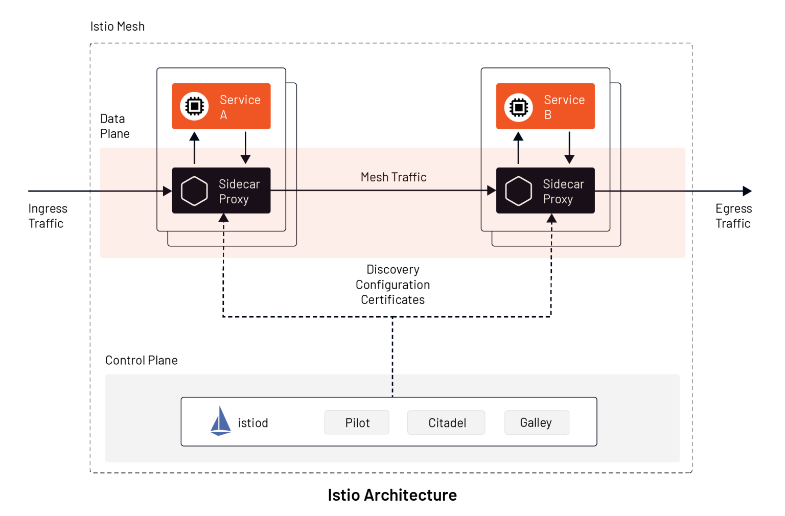

Most of the features stated in the data plane such as routing, health checking, service discovery, load balancing, security, etc, are available in projects such as HAProxy, Nginx, and Envoy. However, the configuration has to be written, deployed, and maintained manually using multiple other tools. Istio combines all these and provides an integrated platform, removing boilerplate configurations and offering durability in the solution.

Under the hood , Istio uses five major tools:

1.	**Envoy Proxy**: Istio uses Envoy proxy as a sidecar proxy in the data plane. Envoy in the data plane is responsible for functionalities like failure handling, health checks, service discovery, and load balancing. Envoy proxies provide detailed information about each service request.
	
2.	**Mixer**: Mixer in the control plane acts as Istio’s telemetry hub, gathering attributes about service requests from Envoy proxies in the mesh. Mixer provides an API to fetch those attributes for monitoring and logging purposes.
	
3.	**Pilot**: Istio uses Pilot in the control plane to provide traffic controls and load balancing based on the service mesh. All the traffic rules can be specified in Istio, and Pilot under the hood can communicate with Kubernetes infrastructure about deployment changes affecting traffic. Istio also uses Pilot to distribute security policies (such as authentication and authorization policies) to all Envoy proxies.
	
4.	**Citadel**: Istio uses Citadel to provide policy-driven and secured communication between Envoy proxies. All the authentication and key-based credential management between sidecar proxies is managed by Citadel.
	
5.	**Galley**: Istio control plane also includes Galley, which is responsible for interpreting user-defined Kubernetes YAML files into a format that Istio understands. Galley stores the user configuration, validates it, and then sends it to Pilot for further action.	
	
	
# Service Mesh Common Capabilities
	
	* API (Kubernetes Custom Resource Definitions (CRD), programmable interface)
	* Communication resiliency (circuit-breaking, retries, rate limiting, timeouts)
	* Load balancing (consistent hashing, least request, zone/latency aware)
	* Observability (alerting, Layer 7 metrics, tracing)
	* Routing control (traffic mirroring, traffic shifting)
	* Security (authorization policies, end-to-end mutual TLS encryption, service level and method level access control)
	* Service discovery (distributed cache)
 
# Problems occur if you do not use Service Mesh

- There is no security between services.
- Tracing a service latency problem is a severe challenge.
- Load balancing is limited.	

# Pod disruption budget	

A typical pdb looks like

	apiVersion: policy/v1
	kind: PodDisruptionBudget
	metadata:
	  name: pdb
	spec:
	  minAvailable: 1
	  selector:
	    matchLabels:
	      app: nginx
If we take a closer look at this sample, we will notice

- It selects other resources based on labels

- It demands that there needs to be at least one pod running.

	
### A DaemonSet container has to service all targeted containers in a cluster node, whereas a Sidecar container can only service focus on containers in its pod.	
# Resource requests and limits

When Kubernetes schedules a Pod, it’s important that the containers have enough resources to actually run. If you schedule a large application on a node with limited resources, it is possible for the node to run out of memory or CPU resources and for things to stop working!

It’s also possible for applications to take up more resources than they should. This could be caused by a team spinning up more replicas than they need to artificially decrease latency (hey, it’s easier to spin up more copies than make your code more efficient!), to a bad configuration change that causes a program to go out of control and use 100% of the available CPU. Regardless of whether the issue is caused by a bad developer, bad code, or bad luck, what’s important is that you be in control.

## Resources Types
	
Kubernetes has only two built-in manageable resources: **CPU** and **memory**. CPU base units are cores, and memory is specified in bytes. These two resources play a critical role in how the scheduler allocates pods to nodes. Memory and CPU can be requested, allocated, and consumed. You should always set the right CPU memory values. You will be in control of your cluster and make sure that a misbehaving application does not impact the capacity available for other pods in your cluster.	
	
## Requests & Limits	
	
Kubernetes uses the requests & limits structure to control resources such as CPU and memory.
	
**Requests** are what the container is guaranteed to get. For example, If a container requests a resource, Kubernetes will only schedule it on a node that can give it that resource.
	
**Limits**, on the other hand, is the resource threshold a container never exceed. The container is only allowed to go up to the limit, and then it is restricted.
	
CPU is a compressible resource, which means that once your container reaches the limit, it will keep running but the operating system will throttle it and keep de-scheduling from using the CPU. Memory, on the other hand, is none compressible resource. Once your container reaches the memory limit, it will be terminated, aka OOM (Out of Memory) killed. If your container keeps OOM killed, Kubernetes will report that it is in a crash loop.

The limit can never be lower than the request. Kubernetes will throw an error and won’t let you run the container if your limit is higher than the request.
	
# QoS - Quality of Service

Quality of Service (QoS) class is a Kubernetes concept which determines the scheduling and eviction priority of pods. QoS class is used by the Kubernetes scheduler to make decisions about scheduling pods onto nodes.
	
QoS class is assigned to pods by Kubernetes itself. DevOps can, however, control the QoS class assigned to a pod by playing around with resource requests and limits for individual containers inside the pod.
	
	

There are three QoS classes in Kubernetes:

**Guaranteed** (These pods are most prior and will not be killed until system exceed resource limit.)
	
**Burstable** (If there is no BestEffort class pod, these pods are killed before Guaranteed class pods when they reached their limit.)
	
**BestEffort** (These classes of pods are lowest prior and will be killed first if system has no memory.)
	
# Guaranteed

## How Can I Assign a QoS class of Guaranteed to a Pod?
	
For a pod to be placed in the Guaranteed QoS class, every container in the pod must have a CPU and memory limit. Kubernetes will automatically assign CPU and memory request values (that are equal to the CPU and memory limit values) to the containers inside this pod and will assign it the Guaranteed QoS class.

Pods with explicit and equal values for both CPU requests and limits and memory requests and limits are also placed in the Guaranteed QoS class.	

## How does the Kubernetes Scheduler Handle Guaranteed Pods?

The Kubernetes scheduler assigns Guaranteed pods only to nodes which have enough resources to fulfil their CPU and memory requests. The Scheduler does this by ensuring that the sum of both memory and CPU requests for all containers (running and newly scheduled) is lower than the total capacity of the node.	

## Create a Pod that gets assigned a QoS class of Guaranteed
For a Pod to be given a QoS class of Guaranteed:

	Every Container in the Pod must have a memory limit and a memory request.
	
	For every Container in the Pod, the memory limit must equal the memory request.
	
	Every Container in the Pod must have a CPU limit and a CPU request.
	
	For every Container in the Pod, the CPU limit must equal the CPU request.
	
	These restrictions apply to init containers and app containers equally.

Here is the configuration file for a Pod that has one Container. The Container has a memory limit and a memory request, both equal to 200 MiB. The Container has a CPU limit and a CPU request, both equal to 700 milliCPU:
	
		apiVersion: v1
		kind: Pod
		metadata:
		  name: qos-demo
		  namespace: qos-example
		spec:
		  containers:
		  - name: qos-demo-ctr
		    image: nginx
		    resources:
		      limits:
			memory: "200Mi"
			cpu: "700m"
		      requests:
			memory: "200Mi"
			cpu: "700m"

The output shows that Kubernetes gave the Pod a QoS class of Guaranteed.The output also verifies that the Pod Container has a memory request that matches its memory limit, and it has a CPU request that matches its CPU limit.
	
		spec:
		  containers:
		    ...
		    resources:
		      limits:
			cpu: 700m
			memory: 200Mi
		      requests:
			cpu: 700m
			memory: 200Mi
		    ...
		status:
		  qosClass: Guaranteed
	
# Burstable

## Create a Pod that gets assigned a QoS class of Burstable
	
A Pod is given a QoS class of Burstable if:

	The Pod does not meet the criteria for QoS class Guaranteed.
	
	At least one Container in the Pod has a memory or CPU request or limit.
	
	Here is the configuration file for a Pod that has one Container. The Container has a memory limit of 200 MiB and a memory request of 100 MiB.

		apiVersion: v1
		kind: Pod
		metadata:
		  name: qos-demo-2
		  namespace: qos-example
		spec:
		  containers:
		  - name: qos-demo-2-ctr
		    image: nginx
		    resources:
		      limits:
			memory: "200Mi"
		      requests:
			memory: "100Mi"
	
# How Can I assign a QoS class of Burstable to a Pod?
	
A pod is assigned a Burstable QoS class if at least one container in that pod has a memory or CPU request.	
	
The output shows that Kubernetes gave the Pod a QoS class of Burstable.
	
	
		spec:
		  containers:
		  - image: nginx
		    imagePullPolicy: Always
		    name: qos-demo-2-ctr
		    resources:
		      limits:
			memory: 200Mi
		      requests:
			memory: 100Mi
		  ...
		status:
		  qosClass: Burstable	

# BestEffort	
	
## Create a Pod that gets assigned a QoS class of BestEffort	
	
For a Pod to be given a QoS class of BestEffort, the Containers in the Pod must not have any memory or CPU limits or requests.

Here is the configuration file for a Pod that has one Container. The Container has no memory or CPU limits or requests:
	
		apiVersion: v1
		kind: Pod
		metadata:
		  name: qos-demo-3
		  namespace: qos-example
		spec:
		  containers:
		  - name: qos-demo-3-ctr
		    image: nginx	

The output shows that Kubernetes gave the Pod a QoS class of BestEffort.
	
		spec:
		  containers:
		    ...
		    resources: {}
		  ...
		status:
		  qosClass: BestEffort	

# The lifecycle of a Kubernetes Pod
	
At the end of the day, these resources requests are used by the Kubernetes scheduler to run your workloads. It is important to understand how this works so you can tune your containers correctly.
Let’s say you want to run a Pod on your Cluster. Assuming the Pod specifications are valid, the Kubernetes scheduler will use round-robin load balancing to pick a Node to run your workload.

Note: The exception to this is if you use a nodeSelector or similar mechanism to force Kubernetes to schedule your Pod in a specific place. The resource checks still occur when you use a nodeSelector, but Kubernetes will only check nodes that have the required label.

Kubernetes then checks to see if the Node has enough resources to fulfill the resources requests on the Pod’s containers. If it doesn’t, it moves on to the next node.

If none of the Nodes in the system have resources left to fill the requests, then Pods go into a “pending” state. By using GKE features such as the Node Autoscaler, Kubernetes Engine can automatically detect this state and create more Nodes automatically. If there is excess capacity, the autoscaler can also scale down and remove Nodes to save you money!

But what about limits? As you know, limits can be higher than the requests. What if you have a Node where the sum of all the container Limits is actually higher than the resources available on the machine?

At this point, Kubernetes goes into something called an “overcommitted state.” Here is where things get interesting. Because CPU can be compressed, Kubernetes will make sure your containers get the CPU they requested and will throttle the rest. Memory cannot be compressed, so Kubernetes needs to start making decisions on what containers to terminate if the Node runs out of memory.

Let’s imagine a scenario where we have a machine that is running out of memory. What will Kubernetes do?

Note: The following is true for Kubernetes 1.9 and above. In previous versions, it uses a slightly different process. See this doc for an in-depth explanation.

Kubernetes looks for Pods that are using more resources than they requested. If your Pod’s containers have no requests, then by default they are using more than they requested, so these are prime candidates for termination. Other prime candidates are containers that have gone over their request but are still under their limit.

If Kubernetes finds multiple pods that have gone over their requests, it will then rank these by the Pod’s priority, and terminate the lowest priority pods first. If all the Pods have the same priority, Kubernetes terminates the Pod that’s the most over its request.

In very rare scenarios, Kubernetes might be forced to terminate Pods that are still within their requests. This can happen when critical system components, like the kubelet or docker, start taking more resources than were reserved for them.

### Here are the possible values for phase:
	
**Pending** -	The Pod has been accepted by the Kubernetes system, but one or more of the Container images has not been created. This includes time before being scheduled as well as time spent downloading images over the network, which could take a while.	
	
**Running** -	The Pod has been bound to a node, and all of the Containers have been created. At least one Container is still running, or is in the process of starting or restarting.	
	
**Succeeded** -	All Containers in the Pod have terminated in success, and will not be restarted.	
	
**Failed** -	All Containers in the Pod have terminated, and at least one Container has terminated in failure. That is, the Container either exited with non-zero status or was terminated by the system.
	
**Unknown** -	For some reason the state of the Pod could not be obtained, typically due to an error in communicating with the host of the Pod.
	
# Pod conditions
	
**PodScheduled**: the Pod has been scheduled to a node;
	
**Ready**: the Pod is able to serve requests and should be added to the load balancing pools of all matching Services;
	
**Initialized**: all init containers have started successfully;
	
**ContainersReady**: all containers in the Pod are ready.

# What are labels
	
**Labels** are nothing more than custom key-value pairs that are attached to objects and are used to describe and manage different Kubernetes resources. Labels can be used by both Kubernetes and homo-sapiens to organize and to select subsets of objects. When dealing with Kubernetes config files, labels are always added under the “metadata” section of the manifest.
	
		Must be 63 characters or less (can be empty),
		Unless empty, must begin and end with an alphanumeric character ([a-z0-9A-Z]),
		Could contain dashes (-), underscores (_), dots (.), and alphanumerics between

### Delete a lable	

To remove the label from any given Kubernetes resource you need to add - at the end of the Label key name.
	
	root@kube-master:~/labels# kubectl label pod lco-label-demo-nginx pod_type-
	
## What are Annotations in Kubernetes?
	
When you want to attach arbitrary non-identifying metadata to Kubernetes objects which can be retrieved later by clients such as tools and libraries.	

Annotations are also defined in a key/value map manner like Labels.
	
		metadata:
		  name: lco-annotations-demo
		  annotations:
		    imageregistry: "https://hub.docker.com/"

# Labels vs annotations

	Annotations are also key-value pairs that are attached to objects and are used to describe Kubernetes resources. Unlike labels, annotations are not used to identify and select resources. 

# Selectors
	
## matchLabels ( Equality-based selectors)	vs matchExpressions (Set-based selectors)
	
matchExpressions is a more expressive label selector in Kubernetes and supports support set-based matching unlike the matchLabels which can only be used for exact matching. This can be used with or without the matchLabels selector.
	
The resources, such as Job, Deployment, ReplicaSet, and DaemonSet, support matchExpressions.

		selector:
		  matchLabels:
		    tier: frontend
		  matchExpressions:
		    - {key: name, operator: In, values: [payroll, web]}
		    - {key: environment, operator: NotIn, values: [dev]}	

### There are four valid operators:

**In**—Label’s value must match one of the specified values.
	
**NotIn**—Label’s value must not match any of the specified values.
	
**Exists**—Pod must include a label with the specified key (the value isn’t important). When using this operator, the values field should not be specified.
	
**NotIn**—Label’s value must not match any of the specified values.
	
**Exists**—Pod must include a label with the specified key (the value isn’t important). When using this operator, the values field should not be specified.
	
**DoesNotExist**—Pod must not include a label with the specified key. The values property must not be specified.

## Kubernetes supports two type of selectors −

Equality-based selectors - They allow filtering by key and value. Operators used as part of this are: =, ==, !=
	
		root@kube-master:~# kubectl get pods --show-labels		
		kubectl get pods -l 'environment = prod'  --show-labels
		# this would return all resources with the `environment = prod` label environment = prod
	
	

Set-based selectors - Set-based selectors allow filtering of keys according to a set of values. Operators used as part of this are: in, notin, exists.
	
		kubectl get pods -l 'environment in (prod,staging)' --show-labels
		kubectl get pods -l 'environment,environment notin (staging)' --show-labels

# Auto-Scaling in Kubernetes
	    
### Autoscaling is one of the key features in Kubernetes cluster. It is a feature in which the cluster is capable of increasing the number of nodes as the demand for service response increases and decrease the number of nodes as the requirement decreases.
	    
# The three dimensions of Kubernetes autoscaling	    
	    
**vertical autoscaling** - Kubernetes can autoscale by adjusting the capacity .
**horizontal autoscaling** - number (horizontal autoscaling) of pods.
**cluster autoscaling** - and/or by adding or removing nodes in a cluster (cluster autoscaling).	    

		Horizontal Pod Autoscaler (HPA):adjusts the number of replicas of an application.
		Cluster Autoscaler:adjusts the number of nodes of a cluster.
		Vertical Pod Autoscaler (VPA):adjusts the resource requests and limits of a container.
	    
## The different autoscalers work at one of two Kubernetes layers

**Pod level**:The HPA and VPA methods take place at the pod level. Both HPA and VPA will scale the available resources or instances of the container.
	    
**Cluster level**:The Cluster Autoscaler falls under the Cluster level, where it scales up or down the number of nodes inside your cluster.	    
# There are two types of pod autoscalers: 
	    
here are three types of K8s autoscalers, each serving a different purpose. They are:

**Horizontal Pod Autoscaler (HPA)**: adjusts the number of replicas of an application. HPA scales the number of pods in a replication controller, deployment, replica set, or stateful set based on CPU utilization. HPA can also be configured to make scaling decisions based on custom or external metrics.

**Cluster Autoscaler (CA)**: adjusts the number of nodes in a cluster. The Cluster Autoscaler automatically adds or removes nodes in a cluster when nodes have insufficient resources to run a pod (adds a node) or when a node remains underutilized, and its pods can be assigned to another node (removes a node).

**Vertical Pod Autoscaler (VPA)**: adjusts the resource requests and limits (which we’ll define in this article) of containers in the cluster.
   
**Vertical Pod Autoscaler (VPA)** can either increase or decrease the CPU and memory allocated to each pod, while the **Horizontal Pod Autoscaler (HPA)** can replicate or terminate pods, thus affecting the total pod count
	 
Affecting the cluster capacity as a whole, the **Cluster Autoscaler (CA)** adds or removes nodes dedicated to the cluster to provide the appropriate amount of computing resources needed to host the desired workloads	    
	    
# How does HPA work?
	    
	
	    
		In simple terms, HPA works in a “check, update, check again” style loop. Here’s how each of the steps in that loop work.
		HPA continuously monitors the metrics server for resource usage.	    
		Based on the collected resource usage, HPA will calculate the desired number of replicas required.	    
		Then, HPA decides to scale up the application to the desired number of replicas.	    
		Finally, HPA changes the desired number of replicas.	    
		Since HPA is continuously monitoring, the process repeats from Step 1.    

# Colling Period in HPA (k8)

3 mins scaling up ( from the last scaling up)
	    
5 mins for scaling down
	    
every 15 sec HPA checks the pod utilization

## scale in and scale out	    
### One of the easiest ways to describe both of these methods is that scaling out generally means building horizontally, while scaling up means building vertically	    
# This is what’s happening under the hood
	    
Control loop checks HPA usage with a period controlled by the controller manager's “--horizontal-pod-autoscaler-sync-period” flag (with a default value of 15 seconds).
	    
    
If “currentMetricValue/desiredMetricValue” is too close to 1, scaling doesn’t happen. This closeness can be set via the “--horizontal-pod-autoscaler-tolerance” flag (with a default value of 0.1 seconds). So, little spikes won't result in unnecessary scaling.
	    
If the result is a downscaling operation, then you can only downscale within a period controlled by the “--horizontal-pod-autoscaler-downscale-stabilization” flag (with a default value of 300 seconds). If this is a scale up operation then it can happen right away.
	    
Scaling happens. How this happens can be controlled by the “behavior” field with 1.18, v2beta2 API. We will discuss this later on.	    

	    
# Using Private Registry
	    
Authenticating Kubernetes with the private Docker registry

We’ll now create a Kubernetes secret of type docker-registry. The Kubernetes secret must be created in the same namespace as the pods we are 
deploying and needs to include the credentials to authenticate against our Artifactory Docker registry.

		➜  ~ kubectl create secret docker-registry regcred \
		--docker-server=my-artifactory.jfrog.io \
		--docker-username=read-only \
		--docker-password=my-super-secret-pass \
		--docker-email=johndoe@example.com \
		-n my-app-ns

		secret/regcred created

Now we need to instruct Kubernetes to use the secret credentials we just created when pulling images for our pods in this namespace. 
There are 2 options to do this:

1.Add an imagePullSecrets section to the pod spec. For example
		➜  ~ kubectl edit deployment my-app -n my-app-ns
			apiVersion: apps/v1
			kind: Deployment
			...
			spec:
			  ...
			  template:
				spec:
				  containers:
				  - image: my-artifactory.jfrog.io/default-docker-virtual/my-app:1.0.1
				  imagePullSecrets:
				  - name: regcred
			  
2.Patch the default service account to include the imagePullSecrets section.
	    
By default a service account named default automatically gets created with each namespace and all workloads will automatically use it. 
You can also patch a custom service account to include the imagePullSecrets section and configure your workload to use it instead of the default.

		➜  ~ kubectl edit serviceaccount default -n my-app-ns
			apiVersion: v1
			kind: ServiceAccount
			imagePullSecrets:
			- name: regcred
			...

The second option is usually preferred. This way all workloads in that namespace that their image is pulled from the private Docker registry 
(ex. my-artifactory.jfrog.io) will be able to do so without having to explicitly configure the imagePullSecrets for each workload.

		kubectl create secret docker-registry imgpullcredentials --docker-username=sendtoanoo --docker-password=guddu1234 --docker-email=sendtoanoo@gmail.com
		-n my-app-ns

		PS D:\kubernetes\Project1> k describe secret imgpullcredentials
		Name:         imgpullcredentials
		Namespace:    default
		Labels:       <none>
		Annotations:  <none>

		Type:  kubernetes.io/dockerconfigjson

		Data
		====
		.dockerconfigjson:  159 bytes

# Please edit the object below. Lines beginning with a '#' will be ignored,
# and an empty file will abort the edit. If an error occurs while saving this file will be
# reopened with the relevant failures.
#
		apiVersion: v1
		data:
		  .dockerconfigjson: eyJhdXRocyI6eyJodHRwczovL2luZGV4LmRvY2tlci5pby92MS8iOnsidXNlcm5hbWUiOiJzZW5kdG9hbm9vIiwicGFzc3dvcmQiOiJndWRkdTEyMzQiLCJlbWFpbCI6InNlbmR0b2Fub29AZ21haWwuY29tIiwiYXV0aCI6ImMyVnVaSFJ2WVc1dmJ6cG5kV1JrZFRFeU16UT0ifX19
		kind: Secret
		metadata:
		  creationTimestamp: "2022-07-11T15:25:59Z"
		  name: imgpullcredentials
		  namespace: default
		  resourceVersion: "202012"
		  uid: 73379959-57fa-4d99-9dcc-057dc4a68fa7
		type: kubernetes.io/dockerconfigjson
