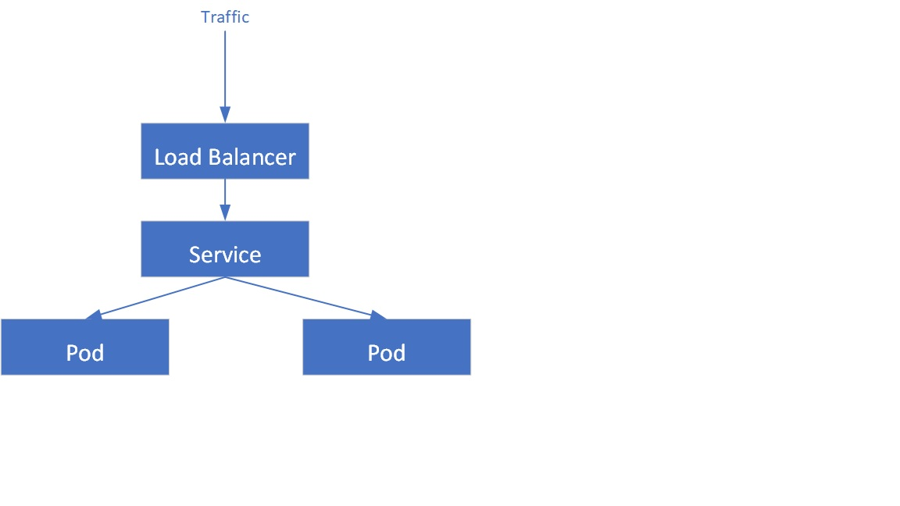

# Difference between Docker and Kubernetes

Docker is a containerization platform, and Kubernetes is a container orchestrator for container platforms like Docker. 

# Kubernetes architecture and its components

---------------------------------------------------------------------------------------------------------------------------------------------------------------

# Kubernetes Notes

## Master Node Components
1. API Server 2. Controller Manager 3. ETCD 4. Scheduler

## Kubernetes Scheduler

kube-scheduler – helps schedule the pods (a co-located group of containers inside which our application processes are running) on the various nodes based on resource utilization. It reads the service’s operational requirements and schedules it on the best fit node. For example, if the application needs 1GB of memory and 2 CPU cores, then the pods for that application will be scheduled on a node with at least those resources. The scheduler runs each time there is a need to schedule pods. The scheduler must know the total resources available as well as resources allocated to existing workloads on each node.

kube-apiserver – Kubernetes API server is the central management entity that receives all REST requests for modifications (to pods, services, replication sets/controllers and others), serving as frontend to the cluster. Also, this is the only component that communicates with the etcd cluster, making sure data is stored in etcd and is in agreement with the service details of the deployed pods.

## Kubernetes Controller Manager

kube-controller-manager – runs a number of distinct controller processes in the background (for example, replication controller controls number of replicas in a pod, endpoints controller populates endpoint objects like services and pods, and others) to regulate the shared state of the cluster and perform routine tasks. When a change in a service configuration occurs (for example, replacing the image from which the pods are running, or changing parameters in the configuration yaml file), the controller spots the change and starts working towards the new desired state.

There are various controllers in a Kubernetes ecosystem that drive the states of endpoints (pods and services), tokens and service accounts (namespaces), nodes, and replication (autoscaling). The controller manager—sometimes called cloud controller manager or simply controller—is a daemon which runs the Kubernetes cluster using several controller functions.

The controller watches the objects it manages in the cluster as it runs the Kubernetes core control loops. It observes them for their desired state and current state via the API server. If the current and desired states of the managed objects don’t match, the controller takes corrective steps to drive object status toward the desired state. The Kubernetes controller also performs core lifecycle functions.

## ETCD

etcd cluster – a simple, distributed key value storage which is used to store the Kubernetes cluster data (such as number of pods, their state, namespace, etc), API objects and service discovery details. It is only accessible from the API server for security reasons. etcd enables notifications to the cluster about configuration changes with the help of watchers

## Kubernetes Node Components
1.  Docker  2.  Container Runtime 3.  Kubelet 4.  Kubernetes Proxy Service

## Nodes

A Kubernetes cluster must have at least one compute node, although it may have many, depending on the need for capacity. Pods orchestrated and scheduled to run on nodes, so more nodes are needed to scale up cluster capacity.

Nodes do the work for a Kubernetes cluster. They connect applications and networking, compute, and storage resources.

Nodes may be cloud-native virtual machines (VMs) or bare metal servers in data centers.

Container Runtime Engine

Each compute node runs and manages container life cycles using a container runtime engine. Kubernetes supports Open Container Initiative-compliant runtimes such as Docker, CRI-O, and rkt.

## Kubelet service

Each compute node includes a kubelet, an agent that communicates with the master or control plane to ensure the containers in a pod are running. When the control plane requires a specific action happen in a node, the kubelet receives the pod specifications through the API server and executes the action. It then ensures the associated containers are healthy and running.

## Kube-proxy service

Each compute node contains a network proxy called a kube-proxy that facilitates Kubernetes networking services. The kube-proxy either forwards traffic itself or relies on the packet filtering layer of the operating system to handle network communications both outside and inside the cluster.

The kube-proxy runs on each node to ensure that services are available to external parties and deal with individual host subnetting. It serves as a network proxy and service load balancer on its node, managing the network routing for UDP and TCP packets. In fact, the kube-proxy routes traffic for all service endpoints.

## Pods

Until now, we have covered concepts that are internal and infrastructure-focused. In contrast, pods are central to Kubernetes because they are the key outward facing construct that developers interact with.

A pod represents a single instance of an application, and the simplest unit within the Kubernetes object model. However, pods are central and crucial to Kubernetes. Each pod is composed of a container or tightly coupled containers in a series that logically go together, along with rules that control how the containers run.

Pods have a limited lifespan and eventually die after upgrading or scaling back down. However, although they are ephemeral, pods can run stateful applications by connecting to persistent storage.

Pods are also capable of horizontal autoscaling, meaning they can grow or shrink the number of instances running. They can also perform rolling updates and canary deployments.

Pods run together on nodes, so they share content and storage and can reach other pods via localhost. Containers may span multiple machines, so pods may as well. One node can run multiple pods, each collecting multiple containers.

The pod is the core unit of management in the Kubernetes ecosystem and acts as the logical boundary for containers that share resources and context. Differences in virtualization and containerization are mitigated by the pod grouping mechanism, which enables running multiple dependent processes together.

Achieve scaling in pods at runtime by creating replica sets, which deliver availability by constantly maintaining a predefined set of pods, ensuring that the deployment always runs the desired number. Services can expose a single pod or a replica set to external or internal consumers.

Services associate specific criteria with pods to enable their discovery. Pods and services are associated through key-value pairs called selectors and labels. Any new match between a pod label and selector will be discovered automatically by the service.

--------------------------------------------------------------------------------------------------------------------------------------------------------------------

## The Control plane (master)
The Control plane is made up of the kube-api server, kube scheduler, cloud-controller-manager and kube-controller-manager. 
Kube proxies and kubelets live on each node, talking to the API and managing the workload of each node.

Cloud-controller-manager
The cloud-controller-manager runs in the control plane as a replicated set of processes (typically, these would be containers in Pods). 
The cloud-controller-manager is what allows you to connect your clusters with the cloud provider’s API and only runs controllers specific to the cloud provider you’re using.

Just note: If you’re running Kubernetes on-prem, your cluster won’t have a cloud-controller-manager.

## Etcd
etcd is a distributed key-value store and the primary datastore of Kubernetes. It stores and replicates the Kubernetes cluster state.

To run etcd, you first need to have a Kubernetes cluster and the command-line tool configured to communicate with said cluster.

## Kubelet
The kubelet functions as an agent within nodes and is responsible for the runnings of pod cycles within each node. Its functionality is watching for new or changed pod specifications from master nodes and ensuring that pods within the node that it resides in are healthy, and the state of pods matches the pod specification.

## Kube-proxy
Kube-proxy is a network proxy that runs on each node. It maintains network rules, which allow for network communication to Pods from network sessions inside or outside of a cluster. Kube-proxy is used to reach kubernetes services in addition to load balancing of services.

## Kube-controller-manager
The Kubernetes controller manager is a collection of controllers bundled within a single binary and run in a single process. The following controllers are present within this manager:

>  **NODE CONTROLLER**:            Responsible for identifying changes in nodes within the cluste

>  **REPLICATION CONTROLLER**:     Responsible for maintaining replications of objects in the cluster (such as replicasets)

>  **ENDPOINT CONTROLLER**:        Responsible for provisioning of endpoints (such as service endpoints)

>  **Service account and token controllers**: Responsible the management of service accounts within each namespace, as well as API access tokens

## Features which Kubernetes provides - 

Service Discovery and load balancing: Kubernetes has a feature which assigns the containers with their own IP addresses and a unique DNS name, which can be used to balance the load on them.

- [x] Planning & Placement: Placement of the containers on the node is a crucial feature on which makes the decision based on the resources it requires and other restrictions.
- [x] Auto Scaling: Based on the CPU usage, the vertical scaling of applications is automatically triggered using the command line.
- [x] Self Repair: This is a unique feature in the Kubernetes which will restart the container automatically when it fails. If the Node dies, then containers are replaced or re-planned on the other Nodes. You can stop the containers if they don't respond to the health checks.
- [x] Storage Orchestration: This feature of Kubernetes enables the user to mount the network storage system as a local file system.
- [x] Batch execution: Kubernetes manages both batch and CI workloads along with replacing containers that fail.
- [x] Deployments and Automatic Rollbacks: During the configuration changes for the application hosted on the Kubernetes, progressively monitors the health to ensure that it does not terminate all the instances at once, it makes an automatic rollback only in the case of failure.
- [x] Configuration Management and Secrets: All classifies information like keys and passwords are stored under module called Secrets in Kubernetes. These Secrets are used especially while configuring the application without having to reconstruct the image.

## KUBERNETES CLI-COMMANDS

### install hyperhit and minikube

    brew update

    brew install hyperkit

    brew install minikube

    kubectl

    minikube

### create minikube cluster

    minikube start --vm-driver=hyperkit

    kubectl get nodes

    minikube status

    kubectl version

### delete cluster and restart in debug mode

    minikube delete

    minikube start --vm-driver=hyperkit --v=7 --alsologtostderr

minikube status

### kubectl commands
    
    kubectl get po -o wide --show-labels
    NAME        READY   STATUS              RESTARTS   AGE   IP       NODE       NOMINATED NODE   READINESS GATES   LABELS
    first-pod   0/1     ContainerCreating   0          3s    <none>   minikube   <none>           <none>            type=web
     
    kubectl explain pod --recursive | less
    
    kubectl get pod -o yaml | less
    kubectl get pod -o json | less

    $ kubectl get pod -o wide --show-labels
    NAME        READY   STATUS    RESTARTS   AGE     IP           NODE       NOMINATED NODE   READINESS GATES   LABELS
    first-pod   1/1     Running   0          2m50s   172.18.0.6   minikube   <none>           <none>            type=web
    $ 
    $ kubectl label pod first-pod env=dev
    pod/first-pod labeled
    $ kubectl get pod -o wide --show-labels
    NAME        READY   STATUS    RESTARTS   AGE     IP           NODE       NOMINATED NODE   READINESS GATES   LABELS
    first-pod   1/1     Running   0          3m29s   172.18.0.6   minikube   <none>           <none>            env=dev,type=web
    
    **Delete Label**
    
    $ kubectl label pod first-pod env-
    pod/first-pod labeled
    $ kubectl get pod -o wide --show-labels
    NAME        READY   STATUS    RESTARTS   AGE     IP           NODE       NOMINATED NODE   READINESS GATES   LABELS
    first-pod   1/1     Running   0          4m10s   172.18.0.6   minikube   <none>           <none>            type=web
    
    
    kubectl get nodes

    kubectl get pod

    kubectl get services

    kubectl create deployment nginx-depl --image=nginx

    kubectl get deployment

    kubectl get replicaset

    kubectl edit deployment nginx-depl

### debugging

    kubectl logs {pod-name}

    kubectl exec -it {pod-name} -- bin/bash

### create mongo deployment

    kubectl create deployment mongo-depl --image=mongo

    kubectl logs mongo-depl-{pod-name}

    kubectl describe pod mongo-depl-{pod-name}

### delete deplyoment

    kubectl delete deployment mongo-depl

    kubectl delete deployment nginx-depl

### create or edit config file

    vim nginx-deployment.yaml

    kubectl apply -f nginx-deployment.yaml

    kubectl get pod

    kubectl get deployment

### delete with config

    kubectl delete -f nginx-deployment.yaml

### Metrics

    kubectl top 

The kubectl top command returns current CPU and memory usage for a cluster’s pods or nodes, or for a particular pod or node if specified.

### kubectl apply commands in order
    
    kubectl apply -f mongo-secret.yaml
    kubectl apply -f mongo.yaml
    kubectl apply -f mongo-configmap.yaml 
    kubectl apply -f mongo-express.yaml

### kubectl get commands

    kubectl get pod
    kubectl get pod --watch
    kubectl get pod -o wide
    kubectl get service
    kubectl get secret
    kubectl get all | grep mongodb

### kubectl debugging commands

    kubectl describe pod mongodb-deployment-xxxxxx
    kubectl describe service mongodb-service
    kubectl logs mongo-express-xxxxxx

### give a URL to external service in minikube

    minikube service mongo-express-service
    
# Deployment(s) in Kubernetes

In Kubernetes, a deployment is a method of launching a pod with containerized applications and ensuring that the necessary number of replicas is always running on the cluster. 

In Kubernetes, most service-style applications use Deployments to run applications on Kubernetes. Using Deployments, you can describe how to run your application container as a Pod in Kubernetes and how many replicas of the application to run. Kubernetes will then take care of running as many replicas as specified.

Here’s an example deployment manifest in YAML format for running three instances of a simple hello world web app:

    apiVersion: apps/v1
    kind: Deployment
    metadata:
      labels:
        app: myapp
      name: myapp
    spec:
      replicas: 3
      selector:
        matchLabels:
          app: myapp
      template:
        metadata:
          labels:
            app: myapp
        spec:
          containers:
          - image: polarsquad/hello-world-app:master
            name: hello-world
            ports:
            - containerPort: 3000
One of the key features of Deployments is how it manages application updates. By default, updating the Deployment manifest in Kubernetes causes the application to be updated in a rolling fashion. This way you’ll have the previous version of the deployment running while the new one is brought up. In the Deployment manifest, you can specify how many replicas to bring up and down at once during updates.

For example, we can add a rolling update strategy to the spec section of the manifest where we bring one replica up at a time, and make sure there are no missing healthy replicas at any point during the upgrade.

    spec:
     strategy:
       type: RollingUpdate
       rollingUpdate:
         maxUnavailable: 0
         maxSurge: 1

**maxSurge**: The number of pods that can be created above the desired amount of pods during an update

**maxUnavailable**: The number of pods that can be unavailable during the update process

        apiVersion: apps/v1
        kind: Deployment
        metadata:
          name: hello-dep
          namespace: default
        spec:
          replicas: 2
          strategy:
          type: RollingUpdate
          rollingUpdate:
            maxSurge: 1
            maxUnavailable: 25%
          selector:
            matchLabels:
              app: hello-dep
          template:
            metadata:
              labels:
                app: hello-dep
            spec:
              containers:
              - image: gcr.io/google-samples/hello-app:2.0
                imagePullPolicy: Always
                name: hello-dep
                ports:
                - containerPort: 8080
                readinessProbe:
                  httpGet:
                     path: /
                     port: 8080
                     initialDelaySeconds: 5
                     periodSeconds: 5
                     successThreshold: 1

To automate the process, you might choose to deploy your app in your CI pipeline using kubectl.
 
    kubectl apply -f deployment.yaml

Kubectl apply does not verify that your application even starts.

In order to properly check that the update proceeds as expected, we need assistance from another kubectl command.

This is where kubectl’s rollout command becomes handy! We can use it to check how our deployment is doing.

By default, the command waits until all of the Pods in the deployment have been started successfully. When the deployment succeeds, the command exits with return code zero to indicate success.

    $ kubectl rollout status deployment myapp
    Waiting for deployment "myapp" rollout to finish: 0 of 3 updated replicas are available…
    Waiting for deployment "myapp" rollout to finish: 1 of 3 updated replicas are available…
    Waiting for deployment "myapp" rollout to finish: 2 of 3 updated replicas are available…
    deployment "myapp" successfully rolled out

#   Kubernetes deployment strategies

In Kubernetes there are a few different ways to release an application, it is necessary to choose the right strategy to make your infrastructure reliable during an application update.

    apiVersion: apps/v1
    kind: Deployment
    metadata:
      name: nginx-deployment
      labels:
        app: nginx
    spec:
      replicas: 3
      selector:
        matchLabels:
          app: nginx
      template:
        metadata:
          labels:
            app: nginx
        spec:
          containers:
          - name: nginx
            image: nginx:1.14.2
            ports:
            - containerPort: 80

Command to run the deployment.yml file - 

    kubectl apply -f deployment.yml
    
    kubectl get deployments
    
    NAME               READY   UP-TO-DATE   AVAILABLE   AGE
    nginx-deployment   3/3     3            3           18s
    
    kubectl get rs
    
    NAME                          DESIRED   CURRENT   READY   AGE
    nginx-deployment-75675f5897   3         3         3       18s
    
    kubectl get pods --show-labels
    
    NAME                                READY     STATUS    RESTARTS   AGE       LABELS
    nginx-deployment-75675f5897-7ci7o   1/1       Running   0          18s       app=nginx,pod-template-hash=3123191453
    nginx-deployment-75675f5897-kzszj   1/1       Running   0          18s       app=nginx,pod-template-hash=3123191453
    nginx-deployment-75675f5897-qqcnn   1/1       Running   0          18s       app=nginx,pod-template-hash=3123191453
    
#   Deployment Strategy
    
**recreate**: terminate the old version and release the new one

**ramped or Rolling update** : release a new version on a rolling update fashion, one after the other

**blue/green**: release a new version alongside the old version then switch traffic

**canary**: release a new version to a subset of users, then proceed to a full rollout

# Deployment Status

ReplicaSet output shows the following fields:

**NAME** lists the names of the ReplicaSets in the namespace.
**DESIRED** displays the desired number of replicas of the application, which you define when you create the Deployment. This is the desired state.
**CURRENT** displays how many replicas are currently running.
**READY** displays how many replicas of the application are available to your users.
**AGE** displays the amount of time that the application has been running.

# Service(s) in Kubernetes

A Kubernetes service is a logical abstraction for a deployed group of pods in a cluster (which all perform the same function).

Since pods are ephemeral, a service enables a group of pods, which provide specific functions (web services, image processing, etc.) to be assigned a name and unique IP address (clusterIP). As long as the service is running that IP address, it will not change. Services also define policies for their acces

    apiVersion: v1
    kind: Service
    metadata:
      name: mongo-express-service
    spec:
      selector:
        app: mongo-express
      type: LoadBalancer  
      ports:
        - protocol: TCP
          port: 8081
          targetPort: 8081
          nodePort: 30000

# In Kubernetes, what is the difference between a service and a deployment?

   In Kubernetes, a deployment is a method of launching a pod with containerized applications and ensuring that the necessary number of replicas is always running on the  cluster. 

   On the other hand, a service is responsible for exposing an interface to those pods, which enables network access from either within the cluster or between external processes and the service.

#   Types of Kubernetes services

 
**ClusterIP**.  Exposes a service which is only accessible from within the cluster.

**NodePort**.   Exposes a service via a static port on each node’s IP. (NodePorts are in the 30000-32767 range by default, which means a NodePort is unlikely to match a service’s intended port (for example, 8080 may be exposed as 31020).

**LoadBalancer**. Exposes the service via the cloud provider’s load balancer.

**ExternalName**. Maps a service to a predefined externalName field by returning a value for the CNAME record.

**Ingress**. This service allows the routing of HTTP(S) traffic according to defined rules like path-based routings. This can be associated with one or more service objects where these services are further associated with Pods. The ingress controller creates HTTP(S) load balancer Layer 7 load balancer which are configured automatically using the definition in the Ingress object.

# What is a headless service?

A headless service is a service with a service IP but instead of load-balancing it will return the IPs of our associated Pods. This allows us to interact directly with the Pods instead of a proxy. It's as simple as specifying None for .spec.clusterIP and can be utilized with or without selectors

    apiVersion: v1
    kind: Service
    metadata:
      name: my-headless-service
    spec:
      clusterIP: None # <--
      selector:
        app: test-app
      ports:
        - protocol: TCP
          port: 80
          targetPort: 3000 

Headless-services allow us to reach each Pod directly, rather than the service acting as a load-balancer or prox

#   How do Kubernetes services work

   Services simply point to pods using labels. Since services are not node-specific, a service can point to a pod regardless of where it runs in the cluster at any given moment in time. By exposing a service IP address as well as a DNS service name, the application can be reached by either method as long as the service exists.
    
#   Creating service using yml file
    
   Services are defined in YAML, as are all Kubernetes objects. Suppose you deployed pods running a back-end service to process data coming from a web front end. To expose a service named ‘service-backend’ on the deployment ‘deployment-backend’ you would use:
    
    apiVersion: v1
    kind: Service
    metadata:
    name: service-backend
    spec:
    ports:
    - port: 4000
    protocol: TCP
    targetPort: 333
    selector:
    run: deployment-backend
    type: ClusterIP
    
   The service ‘service-backend’ will be created, and any pod in the cluster can access it on their port 333 via http://service-backend:4000, or at the cluster’s IP address using port 4000.

   Kubernetes services can also be created using the ‘kubectl expose’ command, which does not require a YAML file. The same service can be created using the command:

#   Creating service using command

    kubectl expose deployment deployment-backend  - - port=333- - target-port=4000    - - name=service-backend
   
#   Access a Kubernetes service
   
   There are two ways to discover a Kubernetes service:
   
   **DNS (most common)**: The DNS method is the recommended method of discovering services. To use this method, a DNS server must first be installed on the cluster. The DNS server monitors the Kubernetes API, and when a new service is created its name becomes available for easy resolution for requesting applications. 
    
   **ENV variable**: This method relies on the kubelet adding environment variables for each active service for every node a pod is running on.

#   Pause Container

Pause Container holds the network namespace for the pod. Kubernetes creates pause containers to acquire the respective pod’s IP address and set up the network namespace for all other containers that join that pod.

 Pause container make sure that there is a network stack to map, and it doesn’t change. Pause containers are a pod implementation detail where one pause container is used for each pod and shouldn’t be shown when listing containers that are members of pods

Pause containers hold the cgroups, reservations, and namespaces of a pod before its individual containers are created. The pause container’s image is always present, so the allocation of the pod’s resources is instantaneous.

 By default, pause containers are hidden, but you can see them by running docker ps -a.
 
 $ docker ps | grep web
 
0982367c3387        nginx                  "/docker-entrypoint.…"   3 minutes ago       Up 3 minutes                            k8s_web_web-f6fbdd86c-xjrt7_default_13cec700-6c86-4255-bdc8-34ebea5343dc_0

80d25b853faf        k8s.gcr.io/pause:3.1   "/pause"                 3 minutes ago       Up 3 minutes                            k8s_POD_web-f6fbdd86c-xjrt7_default_13cec700-6c86-4255-bdc8-34ebea5343dc_0

Whenever we create a pod, a pause container image such as gcr.io/google_containers/pause:0.8.0 is implicitly required. What is that pause container’s purpose? The pause container essentially holds the network namespace for the pod. It does nothing useful and its container image (see its Dockerfile) basically contains a simple binary that goes to sleep and never wakes up (see its code). However, when the top container such as nginx container dies and gets restarted by kubernetes, all the network setup will still be there. Normally, if the last process in a network namespace dies, the namespace will be destroyed. Restarting nginx container without pause would require creating all new network setup. With pause, you will always have that one last thing in the namespace.

------------------------------------------------------------------------------------------------------------------------

The 'pause' container is a container which holds the network namespace for the pod. Kubernetes creates pause containers to acquire the respective pod’s IP address and set up the network namespace for all other containers that join that pod.

Yes, the pause container is part of each pod that is responsible to create shared network, assign ip address within the pod for all business containers inside this pod, also the pause container shared the volume for entire pod. If the pause container is dead, kubernetes consider the pod died and kill it and reschedule a new one.

Pause is a secret container that runs on every pod in Kubernetes. This container’s primary job is to keep the namespace open in case all the other containers on the pod die.

#   Short Names
        netops@arg048vmlinuxdev:~$ kubectl api-resources
        NAME                              SHORTNAMES   APIVERSION                             NAMESPACED   KIND
        bindings                                       v1                                     true         Binding
        componentstatuses                 cs           v1                                     false        ComponentStatus
        configmaps                        cm           v1                                     true         ConfigMap
        endpoints                         ep           v1                                     true         Endpoints
        events                            ev           v1                                     true         Event
        limitranges                       limits       v1                                     true         LimitRange
        namespaces                        ns           v1                                     false        Namespace
        nodes                             no           v1                                     false        Node
        persistentvolumeclaims            pvc          v1                                     true         PersistentVolumeClaim
        persistentvolumes                 pv           v1                                     false        PersistentVolume
        pods                              po           v1                                     true         Pod
        podtemplates                                   v1                                     true         PodTemplate
        replicationcontrollers            rc           v1                                     true         ReplicationController
        resourcequotas                    quota        v1                                     true         ResourceQuota
        secrets                                        v1                                     true         Secret
        serviceaccounts                   sa           v1                                     true         ServiceAccount
        services                          svc          v1                                     true         Service
        mutatingwebhookconfigurations                  admissionregistration.k8s.io/v1        false        MutatingWebhookConfiguration
        validatingwebhookconfigurations                admissionregistration.k8s.io/v1        false        ValidatingWebhookConfiguration
        customresourcedefinitions         crd,crds     apiextensions.k8s.io/v1                false        CustomResourceDefinition
        apiservices                                    apiregistration.k8s.io/v1              false        APIService
        controllerrevisions                            apps/v1                                true         ControllerRevision
        daemonsets                        ds           apps/v1                                true         DaemonSet
        deployments                       deploy       apps/v1                                true         Deployment
        replicasets                       rs           apps/v1                                true         ReplicaSet
        statefulsets                      sts          apps/v1                                true         StatefulSet
        tokenreviews                                   authentication.k8s.io/v1               false        TokenReview
        localsubjectaccessreviews                      authorization.k8s.io/v1                true         LocalSubjectAccessReview
        selfsubjectaccessreviews                       authorization.k8s.io/v1                false        SelfSubjectAccessReview
        selfsubjectrulesreviews                        authorization.k8s.io/v1                false        SelfSubjectRulesReview
        subjectaccessreviews                           authorization.k8s.io/v1                false        SubjectAccessReview
        horizontalpodautoscalers          hpa          autoscaling/v1                         true         HorizontalPodAutoscaler
        cronjobs                          cj           batch/v1                               true         CronJob
        jobs                                           batch/v1                               true         Job
        certificatesigningrequests        csr          certificates.k8s.io/v1                 false        CertificateSigningRequest
        leases                                         coordination.k8s.io/v1                 true         Lease
        endpointslices                                 discovery.k8s.io/v1                    true         EndpointSlice
        events                            ev           events.k8s.io/v1                       true         Event
        ingresses                         ing          extensions/v1beta1                     true         Ingress
        flowschemas                                    flowcontrol.apiserver.k8s.io/v1beta1   false        FlowSchema
        prioritylevelconfigurations                    flowcontrol.apiserver.k8s.io/v1beta1   false        PriorityLevelConfiguration
        ingressclasses                                 networking.k8s.io/v1                   false        IngressClass
        ingresses                         ing          networking.k8s.io/v1                   true         Ingress
        networkpolicies                   netpol       networking.k8s.io/v1                   true         NetworkPolicy
        runtimeclasses                                 node.k8s.io/v1                         false        RuntimeClass
        poddisruptionbudgets              pdb          policy/v1                              true         PodDisruptionBudget
        podsecuritypolicies               psp          policy/v1beta1                         false        PodSecurityPolicy
        clusterrolebindings                            rbac.authorization.k8s.io/v1           false        ClusterRoleBinding
        clusterroles                                   rbac.authorization.k8s.io/v1           false        ClusterRole
        rolebindings                                   rbac.authorization.k8s.io/v1           true         RoleBinding
        roles                                          rbac.authorization.k8s.io/v1           true         Role
        priorityclasses                   pc           scheduling.k8s.io/v1                   false        PriorityClass
        csidrivers                                     storage.k8s.io/v1                      false        CSIDriver
        csinodes                                       storage.k8s.io/v1                      false        CSINode
        csistoragecapacities                           storage.k8s.io/v1beta1                 true         CSIStorageCapacity
        storageclasses                    sc           storage.k8s.io/v1                      false        StorageClass
        volumeattachments                              storage.k8s.io/v1                      false        VolumeAttachment
        netops@arg048vmlinuxdev:~$

#   What are Init Containers?

In Kubernetes, an init container is the one that starts and executes before other containers in the same Pod. It’s meant to perform initialization logic for the main application hosted on the Pod. For example, create the necessary user accounts, perform database migrations, create database schemas and so on.

Each Init Container must complete successfully before the next one is started. So, Init Containers provide an easy way to block or delay the startup of app containers until some set of preconditions are met.

Init Containers run before the main container runs. Normally init containers are used to ensure the server environment is ready for your application to start to run.

#   Some of its properties are :

It contains utilities or setup scripts not present in an app image ( making images light-weight)
They always run to completion
Init container executes sequentially and each of the init containers must succeed before the next can run.
They support all the fields and features of app containers, including resource limits, volumes, and security settings.

#   Init Containers Design Considerations

- [x] They always get executed before other containers in the Pod. So, they shouldn’t contain complex logic that takes a long time to complete.
- [x] Init containers are started and executed in sequence. An init container is not invoked unless its predecessor is completed successfully. Hence, if the startup task is very long, you may consider breaking it into a number of steps, each handled by an init container so that you know which steps fail.
- [x] If any of the init containers fail, the whole Pod is restarted (unless you set restartPolicy to Never). Restarting the Pod means re-executing all the containers again including any init containers. 
- [x] An init container is a good candidate for delaying the application initialization until one or more dependencies are available.
- [x] Init containers cannot use health and readiness probes as application containers do. The reason is that they are meant to start and exit successfully, much like how Jobs and CronJobs behave.

# Scenario-1 (Seeding a Database)

In this scenario, we are serving a MySQL database. This database is used for testing an application. It doesn’t have to contain real data, but it must be seeded with enough data so that we can test the application's query speed. We use an init container to handle downloading the SQL dump file and restore it to the database, which is hosted in another container

    apiVersion: v1
    kind: Pod
    metadata:
      name: mydb
      labels:
        app: db
    spec:
      initContainers:
        - name: fetch
          image: mwendler/wget
          command: ["wget","--no-check-certificate","https://sample-videos.com/sql/Sample-SQL-File-1000rows.sql","-O","/docker-entrypoint-initdb.d/dump.sql"]
          volumeMounts:
            - mountPath: /docker-entrypoint-initdb.d
              name: dump
      containers:
        - name: mysql
          image: mysql
          env:
            - name: MYSQL_ROOT_PASSWORD
              value: "example"
          volumeMounts:
            - mountPath: /docker-entrypoint-initdb.d
              name: dump
      volumes:
        - emptyDir: {}
          name: dump

#   Scenario-2 (Delaying The Application Launch Until The Dependencies Are Ready)

Another common use case for init containers is when you need your application to wait until another service is full running (responding to requests)

    apiVersion: v1
    kind: Pod
    metadata:
      name: myapp-pod
      labels:
        app: myapp
    spec:
      initContainers:
      - name: init-myservice
        image: busybox:1.28
        command: ['sh', '-c', 'until nslookup myservice; do echo waiting for myservice; sleep 2; done;']
      containers:
      - name: myapp-container
        image: busybox:1.28
        command: ['sh', '-c', 'echo The app is running! && sleep 3600']

For completeness, this is the definition file for myservice:

        apiVersion: v1
        kind: Service
        metadata:
          name: myservice
        spec:
          ports:
          - protocol: TCP
            port: 80
            targetPort: 9376

# Deployment & Rollback

    kubectl set image deployment/frontend www=image:v2               # Rolling update "www" containers of "frontend" deployment, updating the image
    kubectl rollout history deployment/frontend                      # Check the history of deployments including the revision 
    kubectl rollout undo deployment/frontend                         # Rollback to the previous deployment
    kubectl rollout undo deployment/frontend --to-revision=2         # Rollback to a specific revision
    kubectl rollout status -w deployment/frontend                    # Watch rolling update status of "frontend" deployment until completion
    kubectl rollout restart deployment/frontend                      # Rolling restart of the "frontend" deployment
--------------------------------------------------------------------------------------------------------------------------------------------------------------

    $ cat d1.yml 
    apiVersion: apps/v1
    kind: Deployment
    metadata:
      name: dep-web
      labels:
        type: web
    spec:
      minReadySeconds: 30
      replicas: 10
      selector:
        matchLabels:
          type: web
      strategy:
        type: RollingUpdate
        rollingUpdate:
          maxSurge: 2
          maxUnavailable: 0
      template:
        metadata:
          labels:
            type: web
        spec:
          containers:
            - name: nginx
              image: coolgourav147/nginx-custom
              ports:
                - containerPort: 80
    
 # $ kubectl apply -f d1.yml 
    deployment.apps/dep-web created
    $ ^C
    $ kubectl get deploy -w
    NAME      READY   UP-TO-DATE   AVAILABLE   AGE
    dep-web   4/10    10           0           9s
    dep-web   5/10    10           0           10s
    dep-web   6/10    10           0           11s
    dep-web   7/10    10           0           13s
    dep-web   8/10    10           0           14s
    dep-web   9/10    10           0           15s
    dep-web   10/10   10           0           16s
    ^C$ 
 # $ kubectl rollout history deployment.apps/dep-web
    deployment.apps/dep-web 
    REVISION  CHANGE-CAUSE
    1         <none>

 # $ kubectl get deploy -o wide --show-labels
    NAME      READY   UP-TO-DATE   AVAILABLE   AGE   CONTAINERS   IMAGES                       SELECTOR   LABELS
    dep-web   10/10   10           10          89s   nginx        coolgourav147/nginx-custom   type=web   type=web
    $ 
 # $ kubectl set image deployment.apps/dep-web nginx=coolgourav147/nginx-custom:v1
    deployment.apps/dep-web image updated
 # $ kubectl get deploy -o wide
    NAME      READY   UP-TO-DATE   AVAILABLE   AGE    CONTAINERS   IMAGES                          SELECTOR
    dep-web   12/10   2            10          2m8s   nginx        coolgourav147/nginx-custom:v1   type=web
 # $ kubectl get deploy -w
    NAME      READY   UP-TO-DATE   AVAILABLE   AGE
    dep-web   12/10   2            10          2m17s
    dep-web   12/10   2            12          2m32s
    dep-web   10/10   2            10          2m32s
    dep-web   10/10   4            10          2m32s
    dep-web   11/10   4            10          2m36s
    dep-web   12/10   4            10          2m37s
    ^C$ kubectl rollout history deployment.apps/dep-web
    deployment.apps/dep-web 
    REVISION  CHANGE-CAUSE
    1         <none>
    2         <none>

 # $ kubectl get deploy -w
    NAME      READY   UP-TO-DATE   AVAILABLE   AGE
    dep-web   12/10   6            10          3m20s
    dep-web   12/10   6            12          3m41s
    dep-web   10/10   6            10          3m41s
    dep-web   10/10   8            10          3m42s
    dep-web   11/10   8            10          3m45s
    dep-web   12/10   8            10          3m46s
 # $ kubectl get deploy -o wide
    NAME      READY   UP-TO-DATE   AVAILABLE   AGE    CONTAINERS   IMAGES                          SELECTOR
    dep-web   12/10   8            10          4m9s   nginx        coolgourav147/nginx-custom:v1   type=web
    $ kubectl get deploy -o wide -w
    NAME      READY   UP-TO-DATE   AVAILABLE   AGE     CONTAINERS   IMAGES                          SELECTOR
    dep-web   12/10   8            10          4m16s   nginx        coolgourav147/nginx-custom:v1   type=web
    dep-web   12/10   8            12          4m16s   nginx        coolgourav147/nginx-custom:v1   type=web
    dep-web   10/10   8            10          4m16s   nginx        coolgourav147/nginx-custom:v1   type=web
    dep-web   10/10   10           10          4m16s   nginx        coolgourav147/nginx-custom:v1   type=web
    dep-web   11/10   10           10          4m19s   nginx        coolgourav147/nginx-custom:v1   type=web
    dep-web   12/10   10           10          4m20s   nginx        coolgourav147/nginx-custom:v1   type=web
    ^C$ 
 # $ kubectl rollout history deployment.apps/dep-web
    deployment.apps/dep-web 
    REVISION  CHANGE-CAUSE
    1         <none>
    2         <none>

 # $ kubectl get  deployment.apps/dep-web
    NAME      READY   UP-TO-DATE   AVAILABLE   AGE
    dep-web   10/10   10           10          7m56s
 # $ kubectl get replicaset
    NAME                 DESIRED   CURRENT   READY   AGE
    dep-web-5f7b676786   10        10        10      6m23s
    dep-web-64bf7df7b5   0         0         0       8m21s
    $ 
    $ 
 # $ kubectl get pod --selector type=web
    NAME                       READY   STATUS    RESTARTS   AGE
    dep-web-5f7b676786-75xvh   1/1     Running   0          5m8s
    dep-web-5f7b676786-795kh   1/1     Running   0          6m51s
    dep-web-5f7b676786-994nb   1/1     Running   0          4m33s
    dep-web-5f7b676786-mkdmn   1/1     Running   0          6m17s
    dep-web-5f7b676786-tk47b   1/1     Running   0          6m17s
    dep-web-5f7b676786-tvrs7   1/1     Running   0          5m8s
    dep-web-5f7b676786-v7gj2   1/1     Running   0          5m42s
    dep-web-5f7b676786-vjfvv   1/1     Running   0          5m42s
    dep-web-5f7b676786-x7xbt   1/1     Running   0          6m51s
    dep-web-5f7b676786-xwhg5   1/1     Running   0          4m33s
 # $ kubectl set image deployment.apps/dep-web nginx=coolgourav147/nginx-custom:v2 --record
    deployment.apps/dep-web image updated
 # $ kubectl get  deployment.apps/dep-web
    NAME      READY   UP-TO-DATE   AVAILABLE   AGE
    dep-web   12/10   2            10          11m
 # $ kubectl rollout history deployment.apps/dep-web
    deployment.apps/dep-web 
    REVISION  CHANGE-CAUSE
    1         <none>
    2         <none>
    3         kubectl set image deployment.apps/dep-web nginx=coolgourav147/nginx-custom:v2 --record=true

 # $ kubectl set image deployment.apps/dep-web nginx=coolgourav147/nginx-custom:v1 --record
    deployment.apps/dep-web image updated
 # $ kubectl rollout history deployment.apps/dep-web
    deployment.apps/dep-web 
    REVISION  CHANGE-CAUSE
    1         <none>
    3         kubectl set image deployment.apps/dep-web nginx=coolgourav147/nginx-custom:v2 --record=true
    4         kubectl set image deployment.apps/dep-web nginx=coolgourav147/nginx-custom:v1 --record=true

 # $ kubectl get deploy -o wide 
    NAME      READY   UP-TO-DATE   AVAILABLE   AGE   CONTAINERS   IMAGES                          SELECTOR
    dep-web   10/10   10           10          12m   nginx        coolgourav147/nginx-custom:v1   type=web
 # $ kubectl rollout history deployment.apps/dep-web  --revision=3
    deployment.apps/dep-web with revision #3
    Pod Template:
      Labels:       pod-template-hash=58857bdc59
            type=web
      Annotations:  kubernetes.io/change-cause: kubectl set image deployment.apps/dep-web nginx=coolgourav147/nginx-custom:v2 --record=true
      Containers:
       nginx:
        Image:      coolgourav147/nginx-custom:v2
        Port:       80/TCP
        Host Port:  0/TCP
        Environment:        <none>
        Mounts:     <none>
      Volumes:      <none>

 # $ kubectl rollout history deployment.apps/dep-web  --revision=4
    deployment.apps/dep-web with revision #4
    Pod Template:
      Labels:       pod-template-hash=5f7b676786
            type=web
      Annotations:  kubernetes.io/change-cause: kubectl set image deployment.apps/dep-web nginx=coolgourav147/nginx-custom:v1 --record=true
      Containers:
       nginx:
        Image:      coolgourav147/nginx-custom:v1
        Port:       80/TCP
        Host Port:  0/TCP
        Environment:        <none>
        Mounts:     <none>
      Volumes:      <none>

 # $ kubectl rollout history deployment.apps/dep-web
    deployment.apps/dep-web 
    REVISION  CHANGE-CAUSE
    1         <none>
    3         kubectl set image deployment.apps/dep-web nginx=coolgourav147/nginx-custom:v2 --record=true
    4         kubectl set image deployment.apps/dep-web nginx=coolgourav147/nginx-custom:v1 --record=true

 # $ kubectl rollout history deployment.apps/dep-web  --revision=4
    deployment.apps/dep-web with revision #4
    Pod Template:
      Labels:       pod-template-hash=5f7b676786
            type=web
      Annotations:  kubernetes.io/change-cause: kubectl set image deployment.apps/dep-web nginx=coolgourav147/nginx-custom:v1 --record=true
      Containers:
       nginx:
        Image:      coolgourav147/nginx-custom:v1
        Port:       80/TCP
        Host Port:  0/TCP
        Environment:        <none>
        Mounts:     <none>
      Volumes:      <none>

 # $ kubectl rollout undo deployment.apps/dep-web --to-revision=1
    deployment.apps/dep-web rolled back
 # $ kubectl rollout history deployment.apps/dep-web
    deployment.apps/dep-web 
    REVISION  CHANGE-CAUSE
    3         kubectl set image deployment.apps/dep-web nginx=coolgourav147/nginx-custom:v2 --record=true
    4         kubectl set image deployment.apps/dep-web nginx=coolgourav147/nginx-custom:v1 --record=true
    5         <none>

 # $ kubectl get deploy -o wide
    NAME      READY   UP-TO-DATE   AVAILABLE   AGE   CONTAINERS   IMAGES                       SELECTOR
    dep-web   12/10   2            10          16m   nginx        coolgourav147/nginx-custom   type=web
 # $ kubectl rollout undo deployment.apps/dep-web --to-revision=3
    deployment.apps/dep-web rolled back
 # $ kubectl get deploy -o wide
    NAME      READY   UP-TO-DATE   AVAILABLE   AGE   CONTAINERS   IMAGES                          SELECTOR
    dep-web   10/10   2            10          16m   nginx        coolgourav147/nginx-custom:v2   type=web
 
 # $ kubectl rollout history deployment.apps/dep-web
    deployment.apps/dep-web 
    REVISION  CHANGE-CAUSE
    4         kubectl set image deployment.apps/dep-web nginx=coolgourav147/nginx-custom:v1 --record=true
    5         <none>
    6         kubectl set image deployment.apps/dep-web nginx=coolgourav147/nginx-custom:v2 --record=true

# Rollback Deployment

    $ kubectl rollout history deployment.apps/dep-web
    deployment.apps/dep-web 
    REVISION  CHANGE-CAUSE
    1         <none>
    2         kubectl set image deployment.apps/dep-web nginx=wordpress --record=true
    5         kubectl set image deployment.apps/dep-web nginx=coolgourav147/nginx-custom:v2 --record=true
    6         kubectl set image deployment.apps/dep-web nginx=apache --record=true
    7         kubectl set image deployment.apps/dep-web nginx=coolgourav147/nginx-custom --record=true
    8         kubectl set image deployment.apps/dep-web nginx=coolgourav147/nginx-custom:v1 --record=true

    $ kubectl get deploy -o wide
    NAME      READY   UP-TO-DATE   AVAILABLE   AGE   CONTAINERS   IMAGES                          SELECTOR
    dep-web   10/10   10           10          34m   nginx        coolgourav147/nginx-custom:v1   type=web
    $ kubectl rollout undo deployment.apps/dep-web --to-revision=5
    deployment.apps/dep-web rolled back
    $ kubectl get deploy -o wide
    NAME      READY   UP-TO-DATE   AVAILABLE   AGE   CONTAINERS   IMAGES                          SELECTOR
    dep-web   10/10   2            10          34m   nginx        coolgourav147/nginx-custom:v2   type=web
    
    $ kubectl rollout history deployment.apps/dep-web
    deployment.apps/dep-web 
    REVISION  CHANGE-CAUSE
    1         <none>
    2         kubectl set image deployment.apps/dep-web nginx=wordpress --record=true
    6         kubectl set image deployment.apps/dep-web nginx=apache --record=true
    7         kubectl set image deployment.apps/dep-web nginx=coolgourav147/nginx-custom --record=true
    8         kubectl set image deployment.apps/dep-web nginx=coolgourav147/nginx-custom:v1 --record=true
    9         kubectl set image deployment.apps/dep-web nginx=coolgourav147/nginx-custom:v2 --record=true

    $ kubectl rollout undo deployment.apps/dep-web --to-revision=7
    deployment.apps/dep-web rolled back
    $ kubectl get deploy -w
    NAME      READY   UP-TO-DATE   AVAILABLE   AGE
    dep-web   10/10   3            10          36m
    dep-web   11/10   3            11          36m
    dep-web   11/10   3            11          36m
    dep-web   11/10   3            11          36m
    dep-web   10/10   3            10          36m
    dep-web   10/10   4            10          36m
    dep-web   11/10   4            11          36m
    dep-web   11/10   4            11          36m
    dep-web   10/10   4            10          36m
    dep-web   10/10   5            10          36m
    dep-web   11/10   5            11          36m
    dep-web   11/10   5            11          36m
    dep-web   11/10   5            11          36m
    dep-web   10/10   6            10          36m
    dep-web   11/10   6            11          36m
    dep-web   11/10   7            11          36m
    dep-web   10/10   7            10          36m
    dep-web   11/10   7            11          36m
    dep-web   11/10   7            11          36m
    dep-web   11/10   7            11          36m
    dep-web   10/10   7            10          36m
    dep-web   10/10   8            10          36m
    dep-web   11/10   8            11          36m
    dep-web   11/10   8            11          36m
    dep-web   11/10   8            11          36m
    dep-web   10/10   9            10          36m
    dep-web   11/10   9            11          36m
    dep-web   11/10   10           11          36m
    dep-web   10/10   10           10          36m
    dep-web   11/10   10           11          37m
    dep-web   11/10   10           11          37m
    dep-web   10/10   10           10          37m
    dep-web   11/10   10           11          37m
    dep-web   10/10   10           10          37m
    ^C$ kubectl get deploy -o wide
    NAME      READY   UP-TO-DATE   AVAILABLE   AGE   CONTAINERS   IMAGES                       SELECTOR
    dep-web   10/10   10           10          37m   nginx        coolgourav147/nginx-custom   type=web
    $ 

# Annotations in kubernetes

Annotations allow you to add non-identifying metadata to Kubernetes objects.  Annotations can hold any kind of information that is useful and can provide context to DevOps teams

# Difference between label and annotation kubernetes

Differentiate between Kubernetes labels vs annotations. ... Kubernetes labels allow you to identify, select and operate on Kubernetes objects. Annotations are non-identifying metadata and do none of these things. Annotations allow you to add non-identifying metadata to Kubernetes objects

# Naming Deployment ( annotations )    

    apiVersion: apps/v1
    kind: Deployment
    metadata:
      name: dep-web
      labels:
        type: web
      annotations:
        kubernetes.io/change-cause: rollout coolgourav147/nginx-custom
    spec:
      minReadySeconds: 30
      replicas: 10
      selector:
        matchLabels:
          type: web
      strategy: 
        rollingUpdate:
          maxSurge: 0
          maxUnavailable: 1
      template:
        metadata:
          labels:
            type: web
        spec:
          containers:
            - name: nginx
              image: coolgourav147/nginx-custom
              ports:
                - containerPort: 80
       
 # kubectl rollout history deployment.apps/dep-web
        deployment.apps/dep-web 
        REVISION  CHANGE-CAUSE
        1         <none>
        2         rollout coolgourav147/nginx-custom
        
        $ kubectl apply -f d.yml
        
        $ kubectl rollout history deployment.apps/dep-web
        deployment.apps/dep-web 
        
        REVISION  CHANGE-CAUSE
        1         <none>
        2         rollout coolgourav147/nginx-custom
        3         rollout coolgourav147/nginx-custom:v1

# Rollback Deployment

# kubectl rollout undo deployment.apps/dep-web --to-revision=2

    REVISION  CHANGE-CAUSE
    1         <none>
    3         rollout coolgourav147/nginx-custom:v1
    4         rollout coolgourav147/nginx-custom:v2
    5         rollout coolgourav147/nginx-custom
    
# Apply VS Create

**apply (declarative )** - makes incremental changes to an existing object
kubectl apply works with directories and its sub directories containing object configuration yaml files.
Multiple object configuration files from directories can be picked up. 

    kubectl apply -f directory/

## kubectl apply: declarative management
kubectl apply is part of the declarative management approach, where changes that you may have applied to a live object (i.e. through scale) will be "maintained" even if you apply other changes to the object.

In simpler words, apply - makes incremental changes to an existing object by defining what we need.

If you want to version control the k8s object then it's better to use declarative way (kubectl apply) which helps to determine the accuracy of data in k8s objects.

## NOTE: Both kubectl create and apply approaches accepts JSON and YAML file formats.

## These are declarative object config

    kubectl diff -f configs/

    kubectl apply -f configs/

**create (imperative )** - creates a whole new object (previously non-existing / deleted)
kubectl create can work with one object configuration file at a time

## kubectl create: Imperative management

kubectl create is what we call imperative management. On this approach you tell the Kubernetes API what you want to create, replace or delete.

In simpler words, create creates a whole new object (previously non-existing or deleted).

If you want to just create some resource for troubleshooting, learning or interactive experimentation purpose go with imperative approach (kubectl create).

## These are imperative object config:

    kubectl create -f your-object-config.yaml

    kubectl delete -f your-object-config.yaml

    kubectl replace -f your-object-config.yaml

        kubectl create -f .\my-deployment.yml
        
        deployment.apps "dep-web" created
        
        kubectl create -f .\my-deployment.yml
        
        Error from server (AlreadyExists): error when creating ".\\my-deployment.yml": deployments.apps "dep-web" already exists
        
        kubectl apply -f .\my-deployment.yml 
        
        Warning: kubectl apply should be used on resource created by either kubectl create --save-config or kubectl apply
        
        deployment.apps "dep-web" configured
        
        kubectl delete -f .\my-deployment.yml
        
        deployment.apps "dep-web" deleted
        

    --------------------------------------------------------------------------------------------------------------------------------------------------------------
    
# MY DEPLOYMENT

    $ cat deploy.yml 
    apiVersion: apps/v1
    kind: Deployment
    metadata:
      name: dep-web
      labels:
        type: web
      annotations:
        kubernetes.io/change-cause: rollout nginx
    spec:
      minReadySeconds: 30
      replicas: 1
      selector:
        matchLabels:
          type: web
      strategy: 
        rollingUpdate:
          maxSurge: 0
          maxUnavailable: 1
      template:
        metadata:
          labels:
            type: web
        spec:
          containers:
            - name: nginx
              image: nginx
              ports:
                - containerPort: 80
              # resources:
              #   limits:
              #     memory: 200Mi
              #     cpu: 1
              #   requests:
              #     memory: 100Mi
              #     cpu: 0.5
    $ cat service.yml 
    apiVersion: v1
    kind: Service
    metadata:
      name: svc-web
    spec:
      type: ClusterIP
      selector:
        type: web
      ports:
        - name: container-web
          port: 8080
          targetPort: 80
    $ 
    $ 
    $ kubectl get all
    NAME                           READY   STATUS    RESTARTS   AGE
    pod/dep-web-59f557c6bf-qsmzc   1/1     Running   0          112s

    NAME                 TYPE        CLUSTER-IP      EXTERNAL-IP   PORT(S)    AGE
    service/kubernetes   ClusterIP   10.96.0.1       <none>        443/TCP    3m21s
    service/svc-web      ClusterIP   10.96.193.252   <none>        8080/TCP   112s

    NAME                      READY   UP-TO-DATE   AVAILABLE   AGE
    deployment.apps/dep-web   1/1     1            1           112s

    NAME                                 DESIRED   CURRENT   READY   AGE
    replicaset.apps/dep-web-59f557c6bf   1         1         1       112s
    $ 
    $ 
    $ curl 10.96.193.252:8080
    <!DOCTYPE html>
    <html>
    <head>
    <title>Welcome to nginx!</title>
    
    </head>
    <body>
    <h1>Welcome to nginx!</h1>
    
If you see this page, the nginx web server is successfully installed and
    working. Further configuration is required.

    
For online documentation and support please refer to
    <a href="http://nginx.org/">nginx.org</a>. 
    Commercial support is available at
    <a href="http://nginx.com/">nginx.com</a>.

    
<em>Thank you for using nginx.</em>

    </body>
    </html>
    $ 

    $ cat pod.yml 
    apiVersion: v1
    kind: Pod
    metadata:
      name: pod-web
      labels:
        type: web
    spec:
      containers:
        - name: container-cool
          image: coolgourav147/nginx-custom
          imagePullPolicy: Always
    
    $ curl 10.96.193.252:8080
    <!DOCTYPE html>
    <html>
    <head>
    <title>Welcome to nginx!</title>
    
    </head>
    <body>
    <h1>Welcome to nginx!</h1>
    
If you see this page, the nginx web server is successfully installed and
    working. Further configuration is required.

    
For online documentation and support please refer to
    <a href="http://nginx.org/">nginx.org</a>. 
    Commercial support is available at
    <a href="http://nginx.com/">nginx.com</a>.

    
<em>Thank you for using nginx.</em>

    </body>
    </html>
    
    $ curl 10.96.193.252:8080
    <!DOCTYPE html>
    <html>
    <head>
    <link rel="stylesheet" href="https://cdnjs.cloudflare.com/ajax/libs/font-awesome/4.7.0/css/font-awesome.min.css">
    
    <title>Gaurav Sharma</title>
    </head>
    <body>

    <h2 style="text-align:center">User Profile Card-latest</h2>

    

      
      <h1>Gourav Sharma</h1>
      
Software Engineer

      
Rajasthan

      

        <a href="https://www.linkedin.com/in/crgaurav/" target="_blank"><i class="fa fa-linkedin"></i></a>  
        <a href="https://www.facebook.com/coolgaurav147" target="_blank"><i class="fa fa-facebook"></i></a>
        <a href="https://www.youtube.com/gouravsharma" target="_blank"><i class="fa fa-youtube"></i></a> 
        <a href="https://t.me/crgaurav" target="_blank"><i class="fa fa-telegram"></i></a>
        <a href="skype:gaurav.sharma6421?chat" target="_blank"><i class="fa fa-skype"></i></a>
      

      
<button>Contact</button>

    

    </body>
    </html>
    $ 

# What is a Kubernetes Namespace?

Namespaces are a way to organize clusters into virtual sub-clusters — they can be helpful when different teams or projects share a Kubernetes cluster. Any number of namespaces are supported within a cluster, each logically separated from others but with the ability to communicate with each other. Namespaces cannot be nested within each other.

Any resource that exists within Kubernetes exists either in the default namespace or a namespace that is created by the cluster operator. **Only nodes and persistent storage volumes exist outside of the namespace;** these low-level resources are always visible to every namespace in the clus

# What is the “default” namespace in Kubernetes?

Kubernetes comes with three namespaces out-of-the-box. They are:

default: As its name implies, this is the namespace that is referenced by default for every Kubernetes command, and where every Kubernetes resource is located by default. Until new namespaces are created, the entire cluster resides in ‘default’.
kube-system: Used for Kubernetes components and should be avoided.
kube-public: Used for public resources. Not recommended for use by users.

# Why use Kubernetes namespaces?

There are many use cases for Kubernetes namespaces, including:

Allowing teams or projects to exist in their own virtual clusters without fear of impacting each other’s work. 
Enhancing role-based access controls (RBAC) by limiting users and processes to certain namespaces. 
Enabling the dividing of a cluster’s resources between multiple teams and users via resource quotas.
Providing an easy method of separating development, testing, and deployment of containerized applications enabling the entire lifecycle to take place on the same cluster.

# How do you switch between Kubernetes namespaces?

    $ kubectl config set-context --current --namespace=ns-dev
    Context "minikube" modified.
    
    $ kubectl config set-context --current --namespace=ns-dev
    Context "minikube" modified.
    $ kubectl delete ns ns-dev
    namespace "ns-dev" deleted

# Inter-Namespace communication

Namespaces are isolated from each other, but service in one namespace can still talk to a service in another namespace.

For example, consider frontend and backend as services in different namespaces need to communicate with each other.

In this case, you can use the built-in DNS service discovery provided by Kubernetes and just point your app by its FQDN (fully qualified domain name).

**curl svc-web.default.svc.cluster.local**

Syntax for it :

    <service-name>.<namespace>.svc.cluster.local
    
    $ ls -lrt
    total 16
    drwxr-xr-x 2 root root 4096 Mar  1  2020 Desktop
    -rw-r--r-- 1 root root   62 Aug 17 05:02 ns.yml
    -rw-r--r-- 1 root root  192 Aug 17 05:02 pod.yml
    -rw-r--r-- 1 root root  202 Aug 17 05:02 service.yml
    $ 
    $ k get all
    NAME                 TYPE        CLUSTER-IP   EXTERNAL-IP   PORT(S)   AGE
    service/kubernetes   ClusterIP   10.96.0.1    <none>        443/TCP   2m
    $ k get po -o wide -show-labels
    Unable to connect to the server: dial tcp: lookup how-labels on 8.8.8.8:53: no such host
    $ k get po -o wide --show-labels
    No resources found in default namespace.
    $ 
    $ k get svc -o wide --show-labels
    NAME         TYPE        CLUSTER-IP   EXTERNAL-IP   PORT(S)   AGE     SELECTOR   LABELS
    kubernetes   ClusterIP   10.96.0.1    <none>        443/TCP   2m41s   <none>     component=apiserver,provider=kubernetes
    $ 
    $ cat ns.yml 
    apiVersion: v1
    kind: Namespace
    metadata:
      name: ns-dev
    spec:
    $ cat pod.yml 
    apiVersion: v1
    kind: Pod
    metadata:
      name: pod-web
      labels:
        type: web
    spec:
      containers:
        - name: container-cool
          image: coolgourav147/nginx-custom
          imagePullPolicy: Always
    $ cat service.yml 
    apiVersion: v1
    kind: Service
    metadata:
      name: svc-web
    spec:
      type: NodePort

      selector:
        type: web
      ports:
        - name: container-web
          port: 80
          targetPort: 80
          nodePort: 30032
    $ 

    $ k apply -f .
    namespace/ns-dev configured
    pod/pod-web unchanged
    service/svc-web created
    $ 
    $ k get all
    NAME          READY   STATUS    RESTARTS   AGE
    pod/pod-web   1/1     Running   0          40s

    NAME                 TYPE        CLUSTER-IP     EXTERNAL-IP   PORT(S)        AGE
    service/kubernetes   ClusterIP   10.96.0.1      <none>        443/TCP        7m2s
    service/svc-web      NodePort    10.103.91.40   <none>        80:30032/TCP   16s
    $ k get po -o wide --show-labels
    NAME      READY   STATUS    RESTARTS   AGE   IP           NODE       NOMINATED NODE   READINESS GATES   LABELS
    pod-web   1/1     Running   0          47s   172.18.0.6   minikube   <none>           <none>            type=web
    $ k get svc -o wide --show-labels
    NAME         TYPE        CLUSTER-IP     EXTERNAL-IP   PORT(S)        AGE     SELECTOR   LABELS
    kubernetes   ClusterIP   10.96.0.1      <none>        443/TCP        7m19s   <none>     component=apiserver,provider=kubernetes
    svc-web      NodePort    10.103.91.40   <none>        80:30032/TCP   33s     type=web   <none>
    $ 
    $ k get ns
    NAME                   STATUS   AGE
    default                Active   7m22s
    kube-node-lease        Active   7m24s
    kube-public            Active   7m24s
    kube-system            Active   7m24s
    kubernetes-dashboard   Active   7m16s
    ns-dev                 Active   60s
    $ 
    $ k get svc -n ns-dev
    No resources found in ns-dev namespace.
    $ k get pod -n ns-dev
    No resources found in ns-dev namespace.
    $ 
    $ k apply -f pod.yml  -n ns-dev
    pod/pod-web created
    $ k get pod -n ns-dev
    NAME      READY   STATUS    RESTARTS   AGE
    pod-web   1/1     Running   0          3s
    $ 
    $ k exec -it pod-web -- bash -n ns-dev
    bash: ns-dev: No such file or directory
    command terminated with exit code 127
    $ k exec -it pod-web -n ns-dev -- bash
    root@pod-web:/# 
    root@pod-web:/# curl svc-web.default.svc.cluster.local
    <!DOCTYPE html>
    <html>
    <head>
    <link rel="stylesheet" href="https://cdnjs.cloudflare.com/ajax/libs/font-awesome/4.7.0/css/font-awesome.min.css">
    
    <title>Gaurav Sharma</title>
    </head>
    <body>

    <h2 style="text-align:center">User Profile Card-latest</h2>

    

      
      <h1>Gourav Sharma</h1>
      
Software Engineer

      
Rajasthan

      

        <a href="https://www.linkedin.com/in/crgaurav/" target="_blank"><i class="fa fa-linkedin"></i></a>  
        <a href="https://www.facebook.com/coolgaurav147" target="_blank"><i class="fa fa-facebook"></i></a>
        <a href="https://www.youtube.com/gouravsharma" target="_blank"><i class="fa fa-youtube"></i></a> 
        <a href="https://t.me/crgaurav" target="_blank"><i class="fa fa-telegram"></i></a>
        <a href="skype:gaurav.sharma6421?chat" target="_blank"><i class="fa fa-skype"></i></a>
      

      
<button>Contact</button>

    

    </body>
    </html>
    root@pod-web:/#     

# Kubernetes Applying Namespace Resource Quota and Limits for Pods

The resource quota is the total available resources for a particular namespace, while limit range is used to assign limits for containers(Pods) running inside the namespace.

# Namespace ResourceQuotas

After creating Namespaces, we can use the ResourceQuota object to limit down the total amount of resource used by the namespace. We can use ResourceQuota to set limits for different object types that can be created within a namespace along with setting quotas for resources like CPU and memory.

A ResourceQuota for setting quota on resources looks like this:

    apiVersion: v1
    kind: ResourceQuota
    metadata:
      name: quota
    spec:
      hard:
        limits.cpu: "2"
        limits.memory: 2Gi
        requests.cpu: ".5"
        requests.memory: 1Gi
        pods: "2"

## Following are the resource quotas set:

**limits.cpu** is the maximum CPU cores limit for all the containers(Pods) in the Namespace, i.e. the entire namespace.

**limits.memory** is the maximum Memory limit for all containers(Pods) in the Namespace, i.e. the entire namespace.

**requests.cpu** is the maximum CPU millicores allocated for all the containers(Pods) in the Namespace. As per the above YAML, we can have 5 containers with 600m requests, 10 containers with 300m requests, etc. The total requested CPU in the Namespace should be less than 3000m.

**requests.memory** is the maximum Memory allocated for all the containers(Pods) in the Namespace. As per the above YAML, we can have 5 containers with 200MiB requests, 10 containers with 100MiB CPU requests, or 1 container with a 1000MiB or 1Gi request.

**pods** is the maximum number of pods allowed in the namespace.

# LimitRange for Containers(Pods)

We can also create a LimitRange object in our Namespace which can be used to set limits on resources on containers(Pods) running within the namespace. This is used to provide default limit values for Pods which do not specify this value themeselves to equally distribute resources within a namespace.

A LimitRange provides constraints that can:

Apply minimum and maximum cpu resources usage limit per Pod or Container in a namespace.

Apply minimum and maximum memory request limit per PersistentVolumeClaim in a namespace.

Set a ratio between request and limit for a resource in a namespace.

Set default request/limit for resources within a namespace and then automatically set the limits to Containers at runtime

Here is a sample LimitRange YAML file:

    apiVersion: v1
    kind: LimitRange
    metadata:
      name: sample
    spec:
      limits:
      - max:
          cpu: 1000m
          memory: 1Gi
        min:
          cpu: 10m
          memory: 10Mi
        default:
          cpu: 600m
          memory: 100Mi
        defaultRequest:
          cpu: 100m
          memory: 50Mi
        type: Container

The above YAML file has 4 sections, max, min, default, and defaultRequest.

The default section will set up the default limits for a container in a pod. Any container with no limits defined will get these values assigned as default.

The defaultRequest section will set up the default requests for a container in a pod. Any container with no requests defined will get these values assigned as default.

The max section will set up the maximum limits that a container in a Pod can set. The value specified in the default section cannot be higher than this value. Also, limits set on a container cannot be higher than this value. One important point to note here is that if max value is set and the default section is not set, then any containers that don't explicitly set these values themselves will get the max values assigned to it as the limit.

The min section will set up the minimum Requests that a container in a Pod can set. The value specified in the defaultRequest section cannot be lower than this value. Similarly, requests set on a container cannot be lower than this value. One important point to note here is that if min value is set and the defaultRequest section is not set, then the min value becomes the defaultRequest value too.

    kubectl describe ns ns-dev
    Name:         ns-dev
    Labels:       kubernetes.io/metadata.name=ns-dev
    Annotations:  <none>
    Status:       Active

    Resource Quotas
      Name:            quo-ns-dev
      Resource         Used  Hard
      --------         ---   ---
      pods             1     2
      Name:            quota
      Resource         Used  Hard
      --------         ---   ---
      limits.cpu       0     2
      limits.memory    0     2Gi
      pods             1     2
      requests.cpu     0     500m
      requests.memory  0     1Gi

    Resource Limits
     Type       Resource  Min   Max  Default Request  Default Limit  Max Limit/Request Ratio
     ----       --------  ---   ---  ---------------  -------------  -----------------------
     Container  cpu       10m   1    100m             600m           -
     Container  memory    10Mi  1Gi  50Mi             100Mi          -

